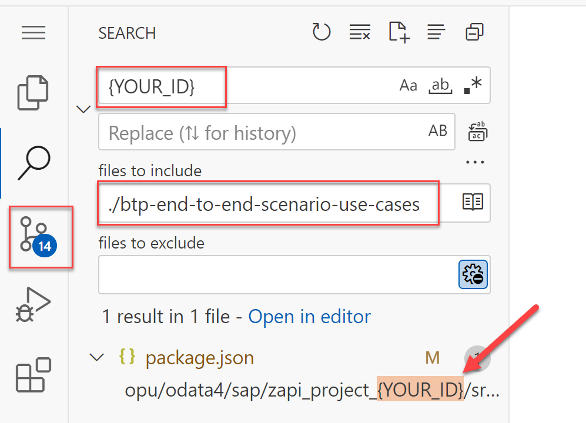

# Adjust CAP Application

## Introduction 

In this exercise, you will adjust your CAP application to be able to consume your new API.

## Task Flow  

In this exercise, you will perform the following tasks:

1. Adjust the code
2. Deploy the application

## Content

### Task 1: Adjust the code

Do the following changes in files (do not forget to replace **{YOUR_ID}** accordingly):

#### package.json

1. Remove unnecessary APIs:

    ~~~json
        "S4HC_API_ENTERPRISE_PROJECT_SRV_0002": {
            "kind": "odata-v2",
            "model": "srv/external/S4HC_API_ENTERPRISE_PROJECT_SRV_0002",
            ...
        },
        "S4HC_ENTPROJECTPROCESSINGSTATUS_0001": {
            "kind": "odata",
            "model": "srv/external/S4HC_ENTPROJECTPROCESSINGSTATUS_0001",
            ...
        },
        "S4HC_ENTPROJECTPROFILECODE_0001": {
            "kind": "odata",
            "model": "srv/external/S4HC_ENTPROJECTPROFILECODE_0001",
            ...
        },
    ~~~

2. Add the destinations for your API by replacing:

    ~~~json
    "Z_PROJECT_{YOUR_ID}_0001": {
        "kind": "odata",
        "model": "srv/external/Z_PROJECT_{YOUR_ID}_0001"
    }
    ~~~

    with

    ~~~json
    "Z_PROJECT_{YOUR_ID}_0001": {
        "kind": "odata",
        "model": "srv/external/Z_PROJECT_{YOUR_ID}_0001",
        "[sandbox]": {
            "credentials": {
            "url": "https://{{S4HC-hostname}}/sap/opu/odata4/sap/zapi_project_{YOUR_ID}/srvd_a2x/sap/z_project_{YOUR_ID}/0001/",
            "authentication": "BasicAuthentication",
            "username": "{{test-user}}",
            "password": "{{test-password}}"
            }
        },
        "[production]": {
            "credentials": {
            "destination": "s4hc",
            "path": "/sap/opu/odata4/sap/zapi_project_{YOUR_ID}/srvd_a2x/sap/z_project_{YOUR_ID}/0001/"
            }
        }
    }
    ~~~

#### srv/service-models.cds

1. Change the old external model to the new API by replacing:
    ~~~js
    // -------------------------------------------------------------------------------
    // Extend service AuthorReadingManager by S/4HANA Projects

    using { S4HC_API_ENTERPRISE_PROJECT_SRV_0002 as RemoteS4HCProject } from './external/S4HC_API_ENTERPRISE_PROJECT_SRV_0002';
    extend service AuthorReadingManager with {
        entity S4HCProjects as projection on RemoteS4HCProject.A_EnterpriseProject
        entity S4HCEnterpriseProjectElement as projection on RemoteS4HCProject.A_EnterpriseProjectElement
    };

    // Extend service AuthorReadingManager by S4HC Projects ProjectProfileCode
    using { S4HC_ENTPROJECTPROCESSINGSTATUS_0001 as RemoteS4HCProjectProcessingStatus } from './external/S4HC_ENTPROJECTPROCESSINGSTATUS_0001';
    extend service AuthorReadingManager with {
        entity S4HCProjectsProcessingStatus as projection on RemoteS4HCProjectProcessingStatus.ProcessingStatus {
            key ProcessingStatus,
            ProcessingStatusText
        }
    };

    // Extend service AuthorReadingManager by S4HC Projects ProcessingStatus
    using { S4HC_ENTPROJECTPROFILECODE_0001 as RemoteS4HCProjectProjectProfileCode } from './external/S4HC_ENTPROJECTPROFILECODE_0001';
    extend service AuthorReadingManager with {
        entity S4HCProjectsProjectProfileCode as projection on RemoteS4HCProjectProjectProfileCode.ProjectProfileCode {
            key ProjectProfileCode,
            ProjectProfileCodeText
        }
    };
    ~~~

    with
    ~~~js
    // -------------------------------------------------------------------------------
    // Extend service AuthorReadingManager by S/4HANA Projects    
    using { Z_PROJECT_{YOUR_ID}_0001 as RemoteS4HCProject } from './external/Z_PROJECT_{YOUR_ID}_0001';
    extend service AuthorReadingManager with {
        entity S4HCProjects as projection on RemoteS4HCProject.A_EnterpriseProject {
            key ProjectUUID,
                ProjectInternalID,
                Project,
                ProjectDescription,
                EnterpriseProjectType,
                ProjectStartDate,
                ProjectEndDate,
                ProcessingStatus,
                ResponsibleCostCenter,
                ProfitCenter,
                ProjectProfileCode,
                CompanyCode,
                ProjectCurrency,
                EntProjectIsConfidential,
                _ProcessingStatus,
                _ProfileCode            
        }
        entity S4HCEnterpriseProjectElement as projection on RemoteS4HCProject.A_EnterpriseProjectElement
        entity S4HCProjectsProcessingStatus as projection on RemoteS4HCProject.A_EntProjProcessingStatus
        entity S4HCProjectsProjectProfileCode as projection on RemoteS4HCProject.A_ProjectProfileCode
    };
    ~~~

#### srv/service-implementation.js

Replace
~~~js
// Implementation of remote OData services (back-channel integration with S4HC)
// Delegate OData requests to S4HC remote project entities
srv.on(["READ","CREATE","UPDATE","DELETE"], 
       ["S4HCProjects","S4HCEnterpriseProjectElement"], 
       async (req) => {
    return await connectorS4HC.delegateODataRequests(req,"S4HC_API_ENTERPRISE_PROJECT_SRV_0002");
    });
srv.on(["READ","CREATE","UPDATE","DELETE"], "S4HCProjectsProcessingStatus", async (req) => {
    return await connectorS4HC.delegateODataRequests(req,"S4HC_ENTPROJECTPROCESSINGSTATUS_0001");
});
srv.on(["READ","CREATE","UPDATE","DELETE"], "S4HCProjectsProjectProfileCode", async (req) => {
    return await connectorS4HC.delegateODataRequests(req,"S4HC_ENTPROJECTPROFILECODE_0001");
});
~~~

with
~~~js
// Implementation of remote OData services (back-channel integration with S4HC)
// Delegate OData requests to S4HC remote project entities
srv.on(["READ","CREATE","UPDATE","DELETE"], 
       ["S4HCProjects","S4HCEnterpriseProjectElement","S4HCProjectsProcessingStatus","S4HCProjectsProjectProfileCode"], 
       async (req) => {
    return await connectorS4HC.delegateODataRequests(req,"Z_PROJECT_{YOUR_ID}_0001");
    });
~~~

#### srv/connector-s4hc.js

1. Replace
    ~~~js
    var generatedStartDate      = moment(authorReadingDate).subtract(30, "days").toISOString().substring(0, 10) + "T00:00:00.0000000Z";
    var generatedEndDate        = moment(authorReadingDate).toISOString().substring(0, 10) + "T00:00:00.0000000Z";
    var generatedTask1EndDate   = moment(authorReadingDate).subtract(4, "days").toISOString().substring(0, 10) + "T00:00:00.0000000Z";
    var generatedTask2StartDate = moment(authorReadingDate).subtract(1, "days").toISOString().substring(0, 10) + "T00:00:00.0000000Z";
    ~~~

    with

    ~~~js
    var generatedStartDate      = moment(authorReadingDate).subtract(30, "days").toISOString().substring(0, 10);
    var generatedEndDate        = moment(authorReadingDate).toISOString().substring(0, 10);
    var generatedTask1EndDate   = moment(authorReadingDate).subtract(4, "days").toISOString().substring(0, 10);
    var generatedTask2StartDate = moment(authorReadingDate).subtract(1, "days").toISOString().substring(0, 10);
    ~~~

2. Replace 
    ~~~js
    const s4hcProject = await cds.connect.to('S4HC_API_ENTERPRISE_PROJECT_SRV_0002');
    const s4hcProjectsProjectProfileCode = await cds.connect.to('S4HC_ENTPROJECTPROFILECODE_0001');
    const s4hcProjectsProcessingStatus = await cds.connect.to('S4HC_ENTPROJECTPROCESSINGSTATUS_0001');
    ~~~

    with
    ~~~js
    const s4hcProject = await cds.connect.to('Z_PROJECT_{YOUR_ID}_0001');
    ~~~

3. Replace
    ~~~js
    const projects = await s4hcProject.run( SELECT.from('AuthorReadingManager.S4HCProjects').where({ Project: projectIDs }) );
    ~~~

    with
    ~~~js
    const projects = await s4hcProject.run( SELECT.from('AuthorReadingManager.S4HCProjects', a => { 
            a`.*`, 
            a._ProcessingStatus (b => { }),
            a._ProfileCode (c => { })
        }).where({ Project: projectIDs }) );
    ~~~

4. Replace
    ~~~js
    if (authorReading.toS4HCProject) {    
        // Get Project Profile Code Text from S4HC 
        var projectProfileCode = authorReading.toS4HCProject.ProjectProfileCode;
        const S4HCProjectsProjectProfileCodeRecords = await s4hcProjectsProjectProfileCode.run( SELECT.from('AuthorReadingManager.S4HCProjectsProjectProfileCode').where({ ProjectProfileCode: projectProfileCode }) );
        for (const S4HCProjectsProjectProfileCodeRecord of S4HCProjectsProjectProfileCodeRecords) {
            authorReading.projectProfileCodeText = S4HCProjectsProjectProfileCodeRecord.ProjectProfileCodeText;
        }
    
        // Get Project Processing Status Text from S4HC 
        var processingStatus = authorReading.toS4HCProject.ProcessingStatus;;
        const S4HCProjectsProcessingStatusRecords = await s4hcProjectsProcessingStatus.run( SELECT.from('AuthorReadingManager.S4HCProjectsProcessingStatus').where({ ProcessingStatus: processingStatus }) );
        for (const S4HCProjectsProcessingStatusRecord of S4HCProjectsProcessingStatusRecords) {
            authorReading.processingStatusText = S4HCProjectsProcessingStatusRecord.ProcessingStatusText;
        }
    }
    ~~~

    with
    ~~~js
    authorReading.processingStatusText = projectsMap[authorReading.projectID]?._ProcessingStatus?.ProcessingStatus_Text;
    authorReading.projectProfileCodeText = projectsMap[authorReading.projectID]?._ProfileCode?.ProjectProfileCode_Text;
    ~~~

#### Check yourself

> It can happen that you still have some **{YOUR_ID}** text in the code. Try to find them by searching the corresponding text in your project:

### Task 2: Deploy the application

1. Repeat the steps described in the [Deploy](../part1/deploy.md) exercise.

## Result

The application has been deployed. You can now check the applications and services created for the app in the Cloud Foundry space.

[Next tutorial: Test the new app](./test.md)
