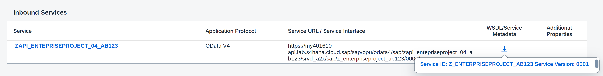
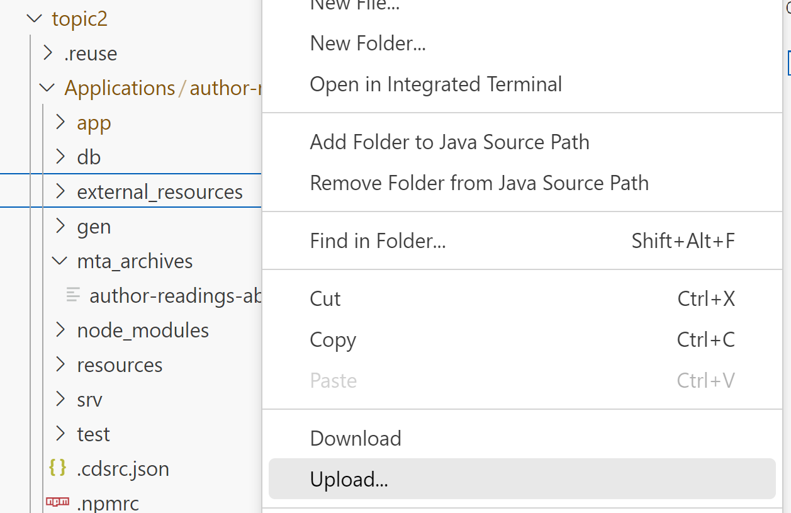
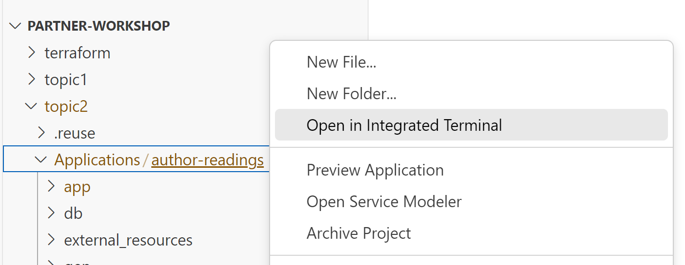

# Adjust CAP Application

## Introduction 

In this exercise, you will adjust your CAP application to be able to consume your new API.

## Task Flow  

In this exercise, you will perform the following tasks:

1. Download API metadata
2. Import the metadata
3. Adjust the code
4. Deploy the application

## Content

### Task 1: Download API metadata

1. In your browser open *S/4HC Customizing Tenant*.

2. Open **Communication Arrangements** application.

   

3. Select your communication arrangement **Z_ENTERPRISEPROJECT_{YOUR_ID}** in the list.

4. In the **Inbound Services** section choose **Download WSDL/Service Metadata** button and select your service from the popup window.

    

5. Save the file somewhere on your laptop.

### Task 2: Import the metadata

1. Open your project in SAP Business Application Studio.

2. Right click on *topic2* &rarr; *Applications* &rarr; *author-readings* &rarr; *external_resources* folder.

3. Choose **Upload** option from the context menu.

    

4. Select your file saved in the previous task.

5. Right click on *topic2* &rarr; *Applications* &rarr; *author-readings* folder.

6. Choose **Open in Integrated Terminal** option from the context menu.

    

7. Enter the following command to convert the file to CDL.

~~~cli
cds import ./external_resources/Z_ENTERPRISEPROJECT_{YOUR_ID}_0001.xml --as cds
~~~

### Task 3: Adjust the code

Do the following changes in files (do not forget to replace **{YOUR_ID}** accordingly):

#### package.json

Add new API:
~~~json
      "MYAPI": {
        "kind": "odata",
        "model": "srv/external/MYAPI",
        "[sandbox]": {
          "credentials": {
            "url": "https://{{S4HC-hostname}}/sap/opu/odata4/sap/zc_{YOUR_ID}/srvd_a2x/sap/zc_{YOUR_ID}/0001/",
            "authentication": "BasicAuthentication",
            "username": "{{test-user}}",
            "password": "{{test-password}}"
          }
        },
        "[production]": {
          "credentials": {
            "destination": "s4hc",
            "path": "/sap/opu/odata4/sap/zc_{YOUR_ID}/srvd_a2x/sap/zc_{YOUR_ID}/0001"
          }
        }
~~~

#### srv/service-models.cds

1. Replace
    ~~~js
    toS4HCProject: Association to RemoteS4HCProject.A_EnterpriseProject on toS4HCProject.Project = $projection.projectID
    ~~~

    with
    ~~~js
    toS4HCProject: Association to MyAPI.A_EnterpriseProject on toS4HCProject.Project = $projection.projectID;
    ~~~

2. Replace
    ~~~js
    // Extend service AuthorReadingManager by S4HC Projects ProjectProfileCode
    using { S4HC_ENTPROJECTPROCESSINGSTATUS_0001 as RemoteS4HCProjectProcessingStatus } from './external/S4HC_ENTPROJECTPROCESSINGSTATUS_0001';

    extend service AuthorReadingManager with {
        entity S4HCProjectsProcessingStatus as projection on RemoteS4HCProjectProcessingStatus.ProcessingStatus {
            key ProcessingStatus as ProcessingStatus,
            ProcessingStatusText as ProcessingStatusText    
        }    
    };

    // Extend service AuthorReadingManager by S4HC Projects ProcessingStatus
    using { S4HC_ENTPROJECTPROFILECODE_0001 as RemoteS4HCProjectProjectProfileCode } from './external/S4HC_ENTPROJECTPROFILECODE_0001';

    extend service AuthorReadingManager with {
        entity S4HCProjectsProjectProfileCode as projection on RemoteS4HCProjectProjectProfileCode.ProjectProfileCode {
            key ProjectProfileCode as ProjectProfileCode,
            ProjectProfileCodeText as ProjectProfileCodeText    
        }    
    };
    ~~~

    with
    ~~~js
    using { MYAPI as MyAPI } from './external/MYAPI';

    extend service AuthorReadingManager with {
        entity S4HCProjectsExt as projection on MyAPI.A_EnterpriseProject
    };
    ~~~

#### srv/service-auth.cds

Replace
~~~js
annotate AuthorReadingManager.S4HCProjectsProjectProfileCode with @(restrict : [
{
    grant : ['*'],
    to    : 'AuthorReadingManagerRole',
},
{
    grant : ['*'],
    to    : 'AuthorReadingAdminRole'
}
]);
annotate AuthorReadingManager.S4HCProjectsProcessingStatus with @(restrict : [
    {
        grant : ['*'],
        to    : 'AuthorReadingManagerRole',
    },
    {
        grant : ['*'],
        to    : 'AuthorReadingAdminRole'
    }
]);
~~~

with
~~~js
annotate AuthorReadingManager.S4HCProjectsExt with @(restrict : [
    {
        grant : ['*'],
        to    : 'AuthorReadingManagerRole',
    },
    {
        grant : ['*'],
        to    : 'AuthorReadingAdminRole'
    }
]);
~~~

#### srv/service-implementation.js

Replace
~~~js
srv.on(["READ","CREATE","UPDATE","DELETE"], "S4HCProjectsProcessingStatus", async (req) => {
    return await connectorS4HC.delegateODataRequests(req,"S4HC_ENTPROJECTPROCESSINGSTATUS_0001");
});
srv.on(["READ","CREATE","UPDATE","DELETE"], "S4HCProjectsProjectProfileCode", async (req) => {
    return await connectorS4HC.delegateODataRequests(req,"S4HC_ENTPROJECTPROFILECODE_0001");
});
~~~

with
~~~js
// Implementation of remote OData services (back-channel integration with S4HC)
// Delegate OData requests to S4HC remote project entities for new APIs
srv.on(["READ","CREATE","UPDATE","DELETE"], 
       ["S4HCProjectsExt","S4HCProjectsProcessingStatus","S4HCProjectsProjectProfileCode"], 
       async (req) => {
    return await connectorS4HC.delegateODataRequests(req,"MYAPI");
    });
~~~

#### srv/connector-s4hc.js

1. Replace 
    ~~~js
    const s4hcProject = await cds.connect.to('S4HC_API_ENTERPRISE_PROJECT_SRV_0002');
    const s4hcProjectsProjectProfileCode = await cds.connect.to('S4HC_ENTPROJECTPROFILECODE_0001');
    const s4hcProjectsProcessingStatus = await cds.connect.to('S4HC_ENTPROJECTPROCESSINGSTATUS_0001');
    ~~~

    with
    ~~~js
    const s4hcProject = await cds.connect.to('MYAPI');
    ~~~

2. Replace
    ~~~js
    const projects = await s4hcProject.run( SELECT.from('AuthorReadingManager.S4HCProjects').where({ Project: projectIDs }) );
    ~~~

    with
    ~~~js
    const projects = await s4hcProject.run( SELECT.from('AuthorReadingManager.S4HCProjectsExt', a => { 
            a`.*`, 
            a._ProcessingStatus (b => { }),
            a._ProfileCode (c => { })
        }).where({ Project: projectIDs }) );
    ~~~

3. Replace
    ~~~js
    // Get Project Profile Code Text from S4HC 
    var projectProfileCode = authorReading.toS4HCProject.ProjectProfileCode;
    const S4HCProjectsProjectProfileCodeRecords = await s4hcProjectsProjectProfileCode.run( SELECT.from('AuthorReadingManager.S4HCProjectsProjectProfileCode').where({ ProjectProfileCode: projectProfileCode }) );
    for (const S4HCProjectsProjectProfileCodeRecord of S4HCProjectsProjectProfileCodeRecords) {
        authorReading.projectProfileCodeText = S4HCProjectsProjectProfileCodeRecord.ProjectProfileCodeText;
    }

    // Get Project Processing Status Text from S4HC 
    var processingStatus = authorReading.toS4HCProject.ProcessingStatus;;
    const S4HCProjectsProcessingStatusRecords = await s4hcProjectsProcessingStatus.run( SELECT.from('AuthorReadingManager.S4HCProjectsProcessingStatus').where({ ProcessingStatus: processingStatus }) );
    for (const S4HCProjectsProcessingStatusRecord of S4HCProjectsProcessingStatusRecords) {
        authorReading.processingStatusText = S4HCProjectsProcessingStatusRecord.ProcessingStatusText;
    ~~~

    with
    ~~~js
    authorReading.processingStatusText = projectsMap[authorReading.projectID]._ProcessingStatus.ProcessingStatus_Text;
    authorReading.projectProfileCodeText = projectsMap[authorReading.projectID]._ProfileCode.ProjectProfileCode_Text;
    ~~~

### Task 4: Deploy the application

1. Repeat the steps described in the [Deploy](../part1/deploy.md) exercise.

## Result

The application has been deployed. You can now check the applications and services created for the app in the Cloud Foundry space.

## Further reading / Reference Links

???