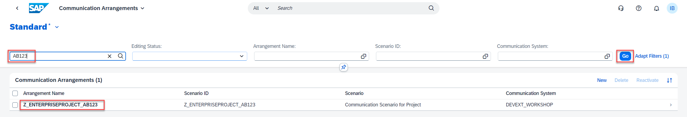

# Adjust CAP Application

## Introduction 

In this exercise, you will import the new API metadata to your CAP project.

## Task Flow  

In this exercise, you will perform the following tasks:

1. Download API metadata
2. Import the metadata

## Content

### Task 1: Download API metadata

1. In your browser open *S/4HC Customizing Tenant*.

2. Open **Communication Arrangements** application.

     

3. Select your communication arrangement **Z_ENTERPRISEPROJECT_{YOUR_ID}** in the list.

    

4. In the **Inbound Services** section choose **Download WSDL/Service Metadata** button and select your service from the popup window.

    

5. Save the file somewhere on your laptop.

### Task 2: Import the metadata

1. Open your project in SAP Business Application Studio.

2. Right click on *btp-end-to-end-scenario-use-cases* &rarr; *external_resources* folder.

3. Choose **Upload** option from the context menu.

    

4. Select your file saved in the previous task.

5. Right click on *btp-end-to-end-scenario-use-cases* folder.

6. Choose **Open in Integrated Terminal** option from the context menu.

    

7. Enter the following command to convert the file to CDL.

~~~cli
cds import ./external_resources/Z_PROJECT_{YOUR_ID}_0001.edmx --as cds
~~~

8. Make sure that you received the similar command response:

~~~cli
[cds] - imported API to srv/external/Z_PROJECT_AB123_0001
~~~

## Result

You have imported the metadata to the CAP application. Now you can work with the new API including IDE code completion.

[Next tutorial: Adjust code of the CAP application](./adjust.md)

## Further reading / Reference Links

- [CAP: Consuming Services](https://cap.cloud.sap/docs/guides/using-services)
