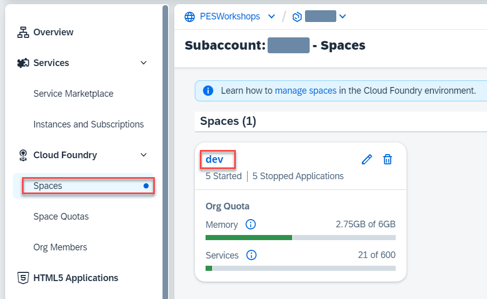
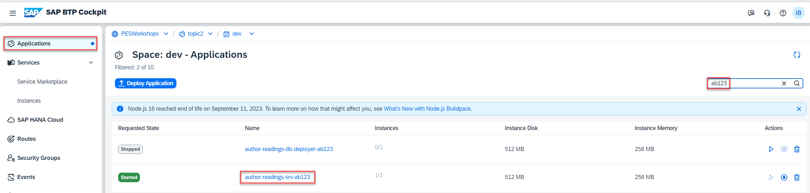
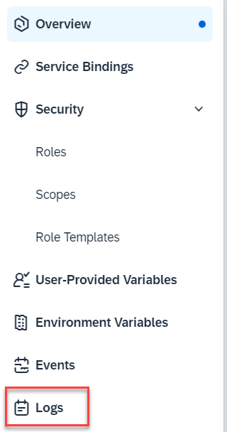

# Test the final app

## Introduction 

In this exercise, you will do the final test of your application and make sure that it uses your own service.

## Content

1. Do the same test as you did in [Explore exercise](../part1/explore.md), but this time use **{YOUR_ID}_2** as the project ID.

2. After the test is successfully done (the project is available in S4HANA Cloud and you can navigate into it), go to your BTP subaccount.

3. In the left menu select *Cloud Foundry* &rarr; *Spaces* option.

4. Select **dev** space.

   

5. In the left menu select **Applications** option.

6. Select **author-readings-srv-{YOUR_ID}** application

   

7. In the left menu select **Logs**.

   

8. Scroll through the logs and make sure that there's no any error. You can also check that the external request goes to the **Z_PROJECT_{YOUR_ID}_0001** API via **s4hc** destination (the one with user propagation).

  

## Result

You have tested your application. Now it works only with your API and have the same functions as the original one. But it has many more advantages:
- Tailored API: Cleaner and easier to understand
- Better performance (no additional fields, data, views, etc.)
- Lower network overhead (no additional requests)
- Custom business logic if necessary
- Custom authentication control (enables OAuth)
- Custom authorization control if necessary
- OData V4 interface with extended functions

