# Integrate the App in SAP Build Work Zone and SAP Mobile Start

In this section you will create a SAP Build Work Zone site and call it on your mobile device using SAP Mobile Start.

## Create a SAP Build Work Zone Site

1. Start SAP Build Work Zone. 
     
     * In the SAP BTP Cockpit select **Instances and Subscriptions**. Open **SAP Build Work Zone, standard Edition**

     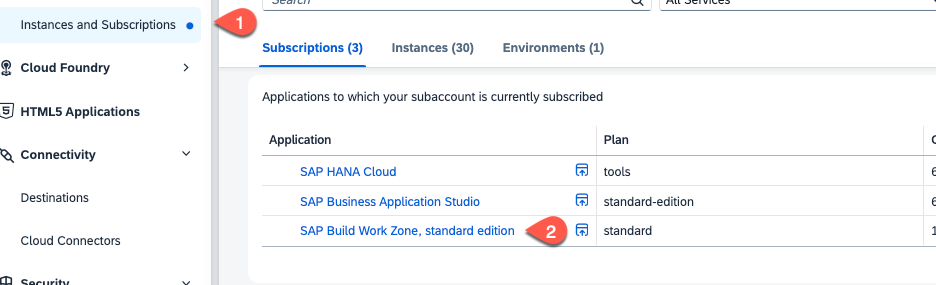

2. Update the Content Channel for your HTML5Apps

   * Select **Channel Manager**
   * Choose the **Update content** action.
   
     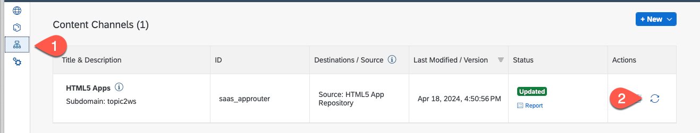

3. Add your application to the Content Manager
   
   * Select the **Content Manager** icon
   * Choose **Content Explorer** 

     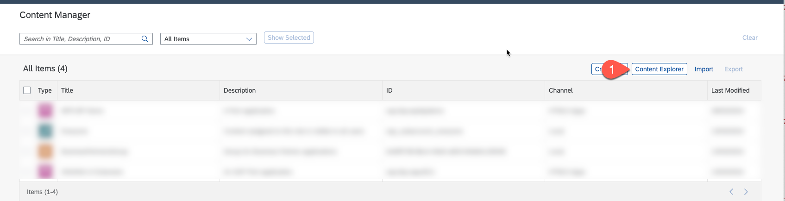
   
   * Select HTML5Apps and search for your application ID.
   * Select the app and activate it. Press **Add**

     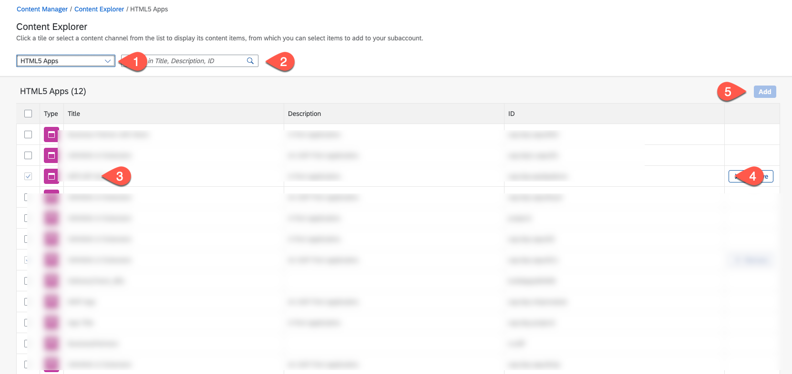

4. Create a new Role
   
      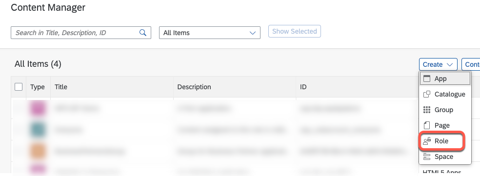

   * Choose **Launchpad_\<YOUR_ID\>** as Title and ID. Assign your application to the role and press **Save**

      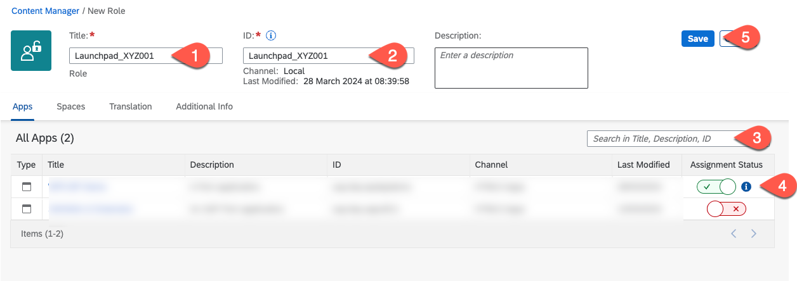

5. Map your user to the new Role Collection. 
    * Go to the SAP BTP Cockpit. Select Security - Role Collection and select the **Launchpad_\<YOUR_ID\>** role collection
   
      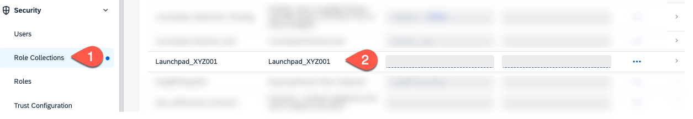

    * Select **Edit**. And add a new user with you email address as ID and E-mail. Select as Identity Provider  **Custom IAS tenant**. Press **Save**
   
      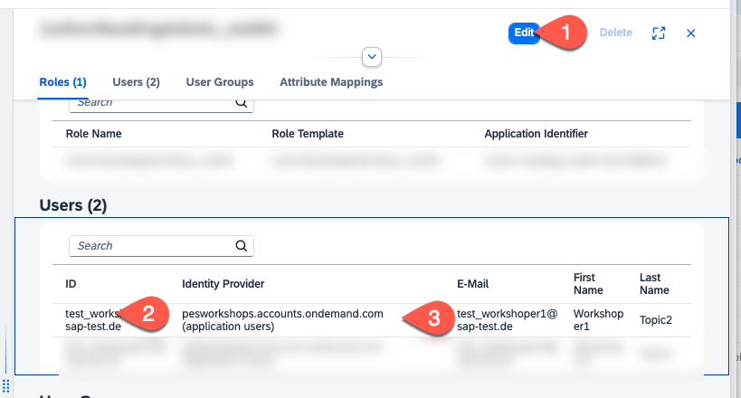

6. Create a new Group 
     * Go back to SAP Build Work Zone. In the Content Manager create a new Group. Call it **group_\<YOUR_ID\>** and assign your application to it. 
  
      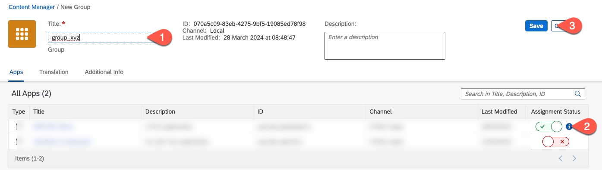

7. Create a new site. 
   
   *  Open the **Site Directory** and choose **Create Site**. Call it **Launchpad_\<YOUR_ID\>**. 
   
      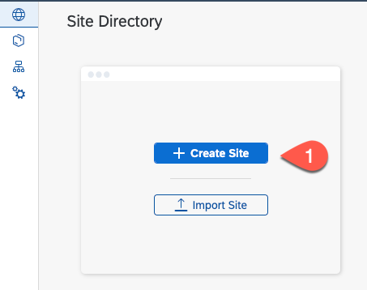

   * At the new site select settings.

      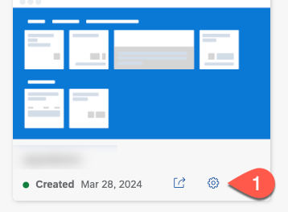

   * Select **Edit** and assign your role to the site. Press **Save**
   
   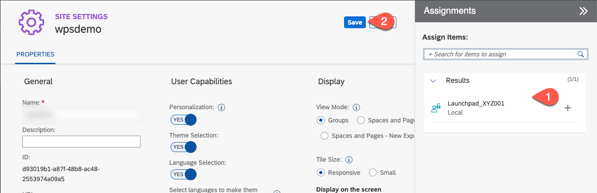

8.  Call the site URL to open the launchpad.

## Call your app with SAP Mobile Start

Now we will install the SAP Mobile Start application on your mobile device and start the application from it.

1. In the launchpad open the settings. 

   

2. Select SAP Mobile Start Application and choose your device type. Select **Install**. Scan the QR code. You can also install the app from the mobile App Store - search for SAP Mobile Start. 
   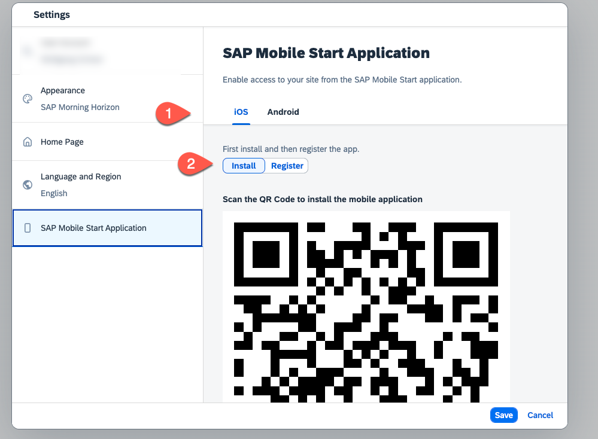

3. Start the SAP Mobile Start app. In the launchpad select **Register** and scan the QR code with the SAP Mobile Start app.
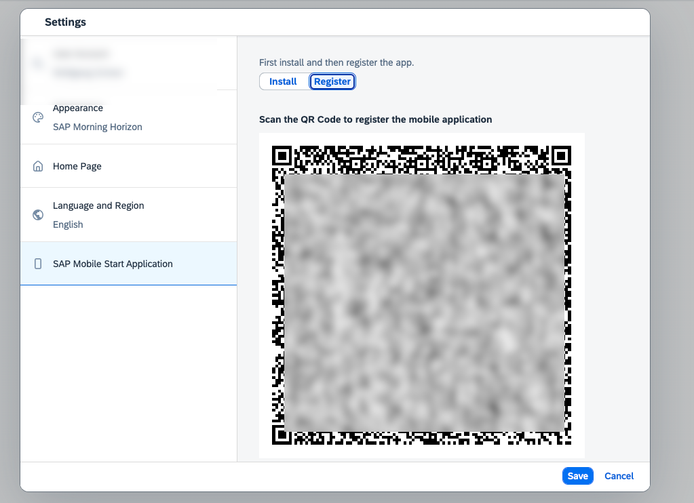

4. Logon with your email and password using pesworkshops.accounts.ondemand.com. Enter a passcode. Test your application.
