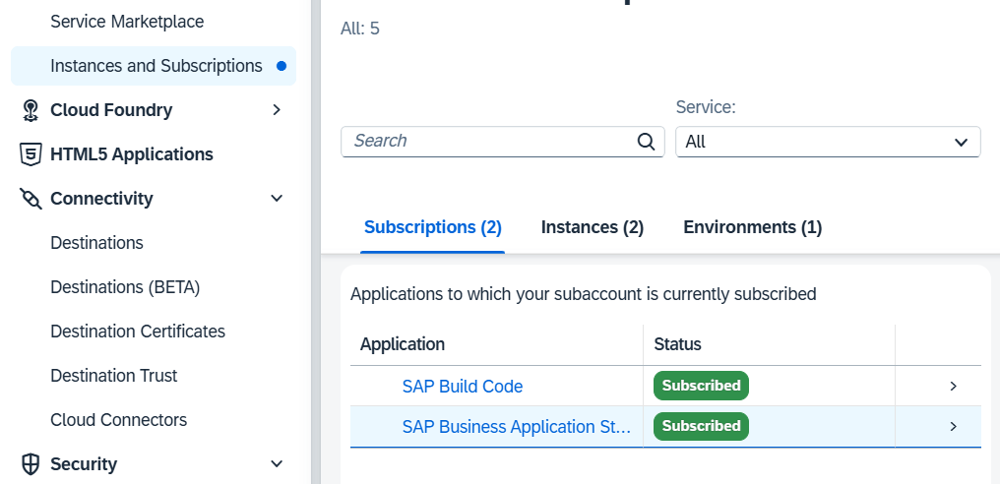
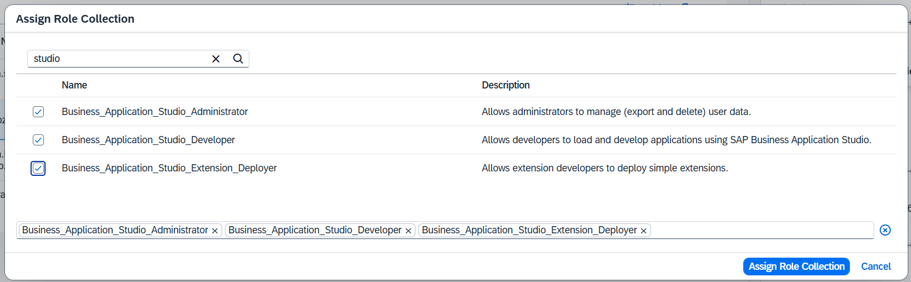
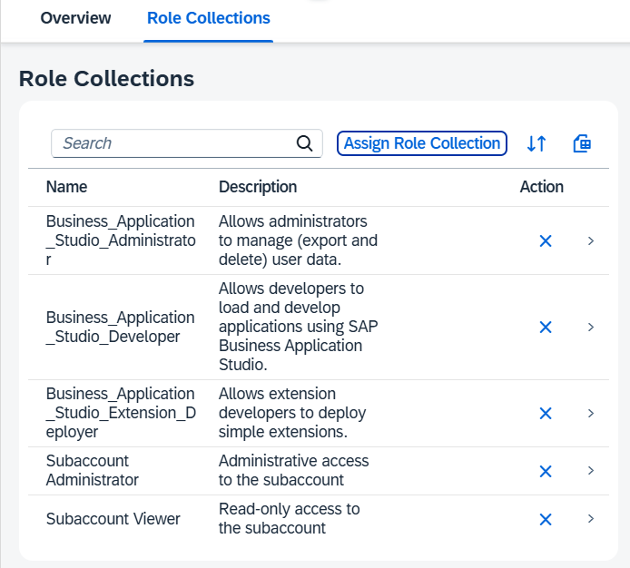

# Prepare Your SAP BTP Account for Development

## Prerequisites 

To start with this tutorial, you need an SAP Business Technology Platform (SAP BTP) global account for development.

## Set Up Your SAP BTP Subaccount

### Create Your Subaccount

1. Go to your SAP BTP global account cockpit.

2. Create a new *Multi-Environment* subaccount (e.g. with the name `PoetrySlams`) and choose a Region with *Amazon Web Services (AWS)* as provider.

   > The subdomain must be unique across the whole region. Therefore, include an abbreviation that uniquely identifies your company. Don't use special characters or capital letters. In addition, keep it short to avoid length restriction issues.

### Enable SAP Business Application Studio

After you've created a new SAP BTP subaccount, only the standard services appear in the *Entitlements* list. To enable SAP Business Application Studio, assign the respective entitlement to the newly created SAP BTP subaccount:

1. Go to the SAP BTP global account.

2. Go to *Entitlements* and *Entity Assignments*. 

3. Open the value help under *Subaccount/Directories* and select the corresponding SAP BTP subaccount, for example, *PoetrySlams*.

4. Choose *Edit* and *Add Service Plans*. 

5. Select the *SAP Business Application Studio* entitlement and choose an available plan.

   

    > If you have already SAP Build Code entitlement, you don't need additionally to entitle SAP Business Application Studio. It's already [included](https://www.sap.com/products/technology-platform/developer-tools.html#faq).

6. Choose *Add 1 Service Plan* and save your changes. 

7. Go back to your SAP BTP subaccount. 

8. *SAP Business Application Studio* is now available in the *Entitlements* list. 

9. To create an instance of this service within the SAP BTP subaccount, go to *Service Marketplace*. As a service, select *SAP Business Application Studio* and choose *Create*.

   

10. The instance appears in the *Subscriptions* list.

    

11. When you first start it, access is denied because the user roles have not yet been assigned to this service instance. To assign them, go to *Security* and *Users*. 

12. Select your user and go to the assigned *Role Collections*. 

13. Select all the role collections of *SAP Business Application Studio* and confirm the assignment.

    

    > If you use SAP Build Code you have to add the roles for SAP Build (e.g. *Build Code - Lobby Developer*)

14. Three role collections have been added.

    

15. Now, you can start SAP Business Application Studio. If access is denied, wait a few seconds and try again. You may need to clear your browser cache. 

    

