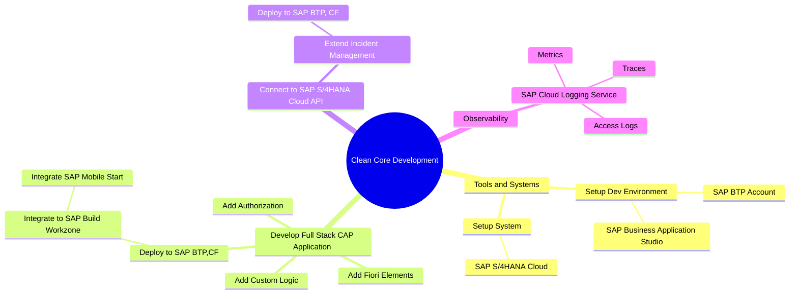

# Clean Core Full Stack Application Development with SAP BTP

## Overview

Welcome to this guidance for application development on **SAP Business Technology Platform (SAP BTP)** following the Golden Path. In the following documentation and tutorials, we provide information and examples on how to develop and deploy a full stack application based on **SAP Cloud Application Programming Model (CAP)** and **SAP Fiori elements** on SAP BTP using different tools and services step by step.

## MindMap

## Exercises

### 1. Develop and Deploy Full-Stack CAP Application

1. [Overview](./overview1.md)
2. [Set Up SAP Business Application Studio](https://developers.sap.com/tutorials/set-up-bas.html)
3. [Build a CAP Application](https://developers.sap.com/tutorials/build-cap-app.html)
4. [Add SAP Fiori Elements UIs](./docs/generate-fiori-ui.md)
5. [Add Custom Logic](https://developers.sap.com/tutorials/add-custom-logic.html)
6. [Add Authorization](https://developers.sap.com/tutorials/add-authorization.html)
7. [Deploy in SAP BTP, Cloud Foundry Runtime](https://developers.sap.com/tutorials/deploy-to-cf.html)
8. [Assign the User Roles](https://developers.sap.com/tutorials/user-role-assignment.html)
9. [Integrate Your Application with SAP Build Work Zone, Standard Edition](https://developers.sap.com/tutorials/integrate-with-work-zone.html)
10. [Access Your Launchpad Site with SAP Mobile Start](./docs/mobilestart.md)

## 2. Implement Remote Connectivity with SAP S/4HANA

1. [Overview](./overview2.md)
1. [Extend the Incident Management аpplication](https://github.com/SAP-samples/btp-developer-guide-cap/blob/main/documentation/remote-service/develop/extend-app-cf.md)
2. [Run a developer test with mock data](https://github.com/SAP-samples/btp-developer-guide-cap/blob/main/documentation/remote-service/develop/test-with-mock.md)
3. [Prepare the app for production](https://github.com/SAP-samples/btp-developer-guide-cap/blob/main/documentation/remote-service/deploy/prep-for-prod/prep-for-prod.md)
4. [Deploy to SAP BTP Cloud Foundry runtime with SAP S/4HANA Cloud](https://github.com/SAP-samples/btp-developer-guide-cap/blob/main/documentation/remote-service/deploy/cf/deploy-to-cf.md)
5. [Run application with SAP S/4HANA Backend](https://github.com/SAP-samples/btp-developer-guide-cap/blob/main/documentation/remote-service/test-the-application/test-the-app.md)

## 3. Add Observability to CAP Application

1. [Overview](./overview3.md)
1. [Setup Custom Log Collection](https://github.com/SAP-samples/btp-developer-guide-cap/blob/main/documentation/observability/2-implement.md)
2. [Set Up Trace Collection](https://github.com/SAP-samples/btp-developer-guide-cap/blob/main/documentation/observability/3-implement-traces.md)
3. [Set Up Metrics Collection](https://github.com/SAP-samples/btp-developer-guide-cap/blob/main/documentation/observability/metrics.md)
4. [Deploy Application in the SAP BTP, Cloud Foundry Runtime](https://github.com/SAP-samples/btp-developer-guide-cap/blob/main/documentation/observability/4-deploy-to-cf-ws.md)
5. [Access Logs, Metrics and Traces Using SAP Cloud Logging Service](https://github.com/SAP-samples/btp-developer-guide-cap/blob/main/documentation/observability/6-test-the-flow.md)

