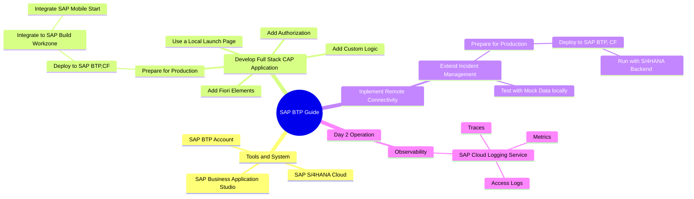
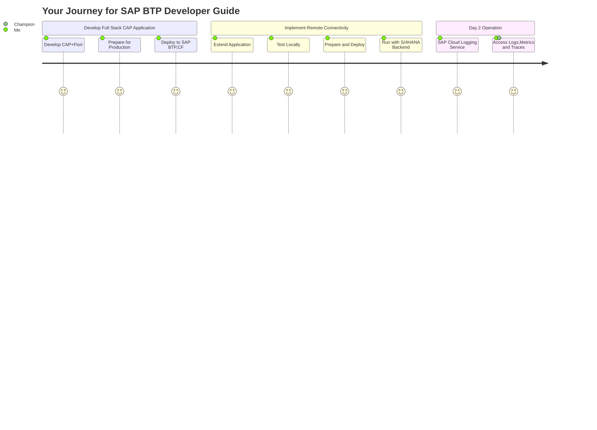
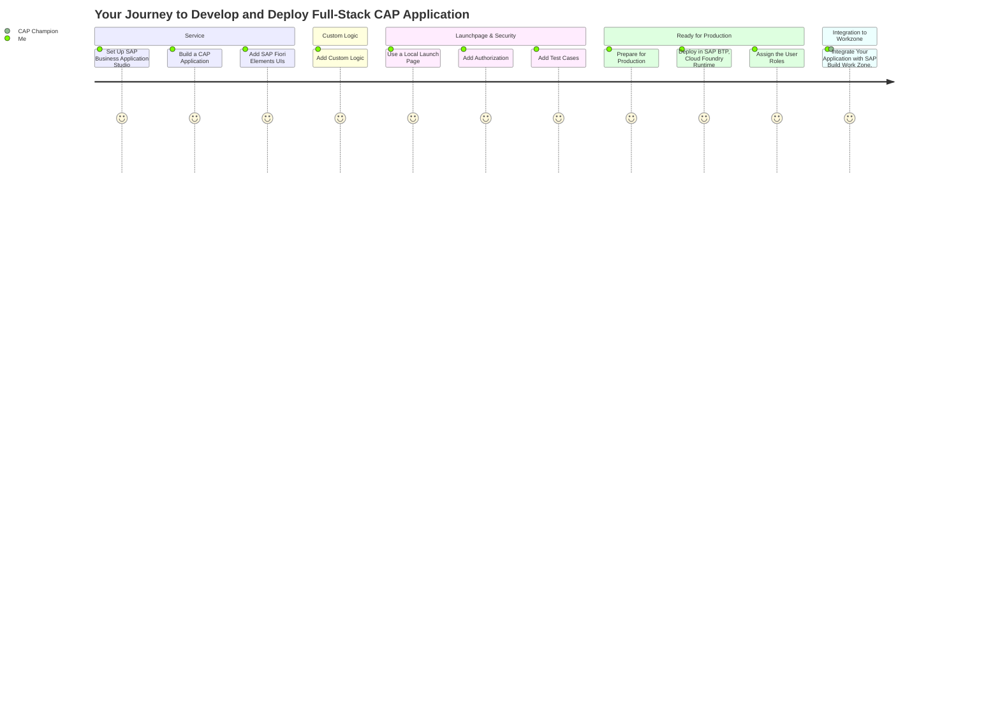
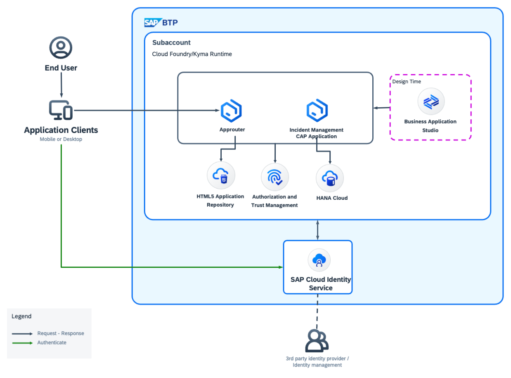
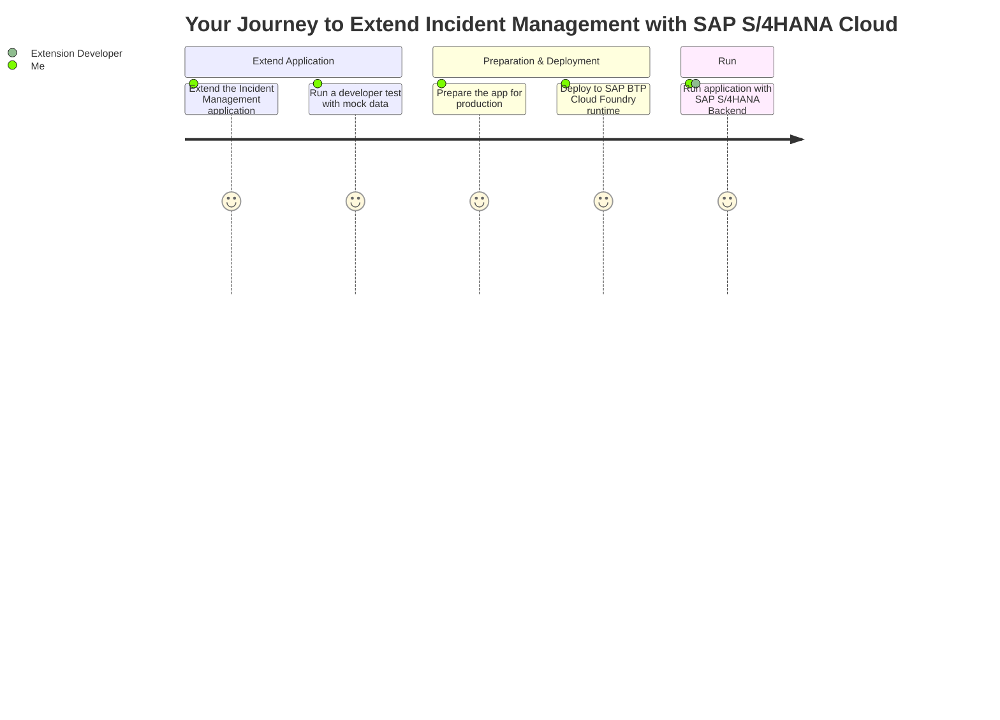
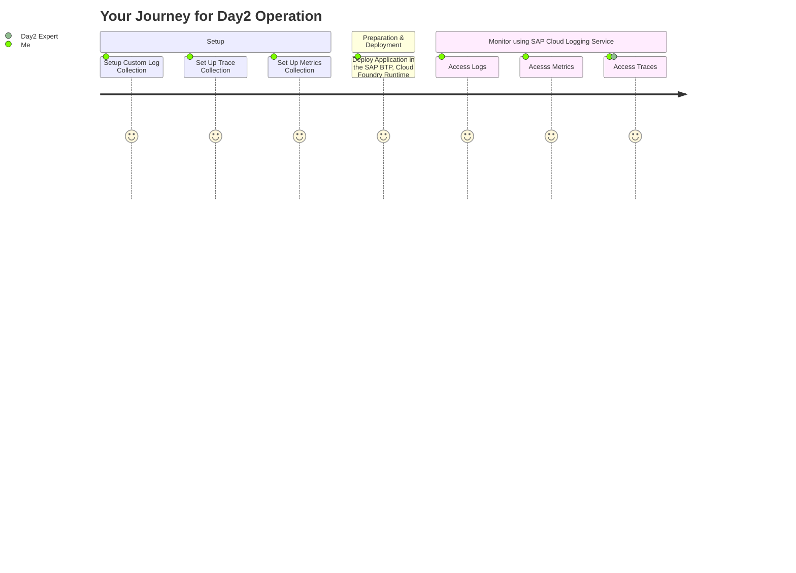

# Clean Core Full Stack Application Development with SAP BTP

## Overview

Welcome to this guidance for application development on **SAP Business Technology Platform (SAP BTP)** following the Golden Path. In the following documentation and tutorials, we provide information and examples on how to develop and deploy a full stack application based on **SAP Cloud Application Programming Model (CAP)** and **SAP Fiori elements** on SAP BTP using different tools and services step by step.

## MindMap

## Understand Your Journey

## 1. Develop and Deploy Full-Stack CAP Application

The Incident Management application uses the following sample business scenario:

ACME is a popular Electronics company. ACME hires call center support representatives to process and manage customer incidents. A call center support representative (Processor) receives a phone call from an existing customer and creates a new incident on behalf of the customer. The newly created incident is based on a customer complaint received during the phone call so the call center support representative also adds the conversation with the customer to the incident

1. [Set Up SAP Business Application Studio](https://developers.sap.com/tutorials/set-up-bas.html)
2. [Build a CAP Application](https://developers.sap.com/tutorials/build-cap-app.html)
3. [Add SAP Fiori Elements UIs](https://developers.sap.com/tutorials/add-fiori-elements-uis.html)
4. [Add Custom Logic](https://developers.sap.com/tutorials/add-custom-logic.html)
5. [Use a Local Launch Page](https://developers.sap.com/tutorials/use-local-launch-page.html)
6. [Add Authorization](https://developers.sap.com/tutorials/add-authorization.html)
7. [Add Test Cases](https://developers.sap.com/tutorials/add-test-cases.html)
8. [Prepare for Production](https://developers.sap.com/tutorials/prep-for-prod.html)
9. [Prepare for Deployment in the SAP BTP, Cloud Foundry Runtime](https://developers.sap.com/tutorials/prepare-btp-cf.html)
10. [Deploy in SAP BTP, Cloud Foundry Runtime](https://developers.sap.com/tutorials/deploy-to-cf.html)
11. [Assign the User Roles](https://developers.sap.com/tutorials/user-role-assignment.html)
12. [Integrate Your Application with SAP Build Work Zone, Standard Edition](https://developers.sap.com/tutorials/integrate-with-work-zone.html)

## 2. Implement Remote Connectivity with SAP S/4HANA

In this tutorial, we will integrate SAP S/4HANA Cloud Business Partner API to the Incident Management application.

The Incident Management application helps call center support representatives process and manage customer incidents. A support representative (processor) receives a phone call from an existing customer and creates a new incident on behalf of the customer.

When a new incident is created by the processor, they have to assign the incident to the respective customer. The option to choose a customer will be given as a value help and the list of customers in the value help will be fetched from the **SAP S/4HANA Cloud system**. For this purpose, we will be using the **SAP S/4HANA Business Partner API**.

1. [Extend the Incident Management аpplication](https://github.com/SAP-samples/btp-developer-guide-cap/blob/main/documentation/remote-service/develop/extend-app-cf.md)
2. [Run a developer test with mock data](https://github.com/SAP-samples/btp-developer-guide-cap/blob/main/documentation/remote-service/develop/test-with-mock.md)
3. [Prepare the app for production](https://github.com/SAP-samples/btp-developer-guide-cap/blob/main/documentation/remote-service/deploy/prep-for-prod/prep-for-prod.md)
4. [Deploy to SAP BTP Cloud Foundry runtime with SAP S/4HANA Cloud](https://github.com/SAP-samples/btp-developer-guide-cap/blob/main/documentation/remote-service/deploy/cf/deploy-to-cf.md)
5. [Run application with SAP S/4HANA Backend](https://github.com/SAP-samples/btp-developer-guide-cap/blob/main/documentation/remote-service/test-the-application/test-the-app.md)

## 3. Day2 Operation: Implement Observability 

**Observability** helps to take data-driven informed decisions based on runtime Observability telemetry data (logs, metrics, traces, events, ...) and provides insights into SAP & customer services and systems to understand and improve efficiency, scalability, resilience, and availability.

Find further SAP internal information on Observability basics, best practices and more on Stack@SAP and on the SAP BTP Observability Website.

BTP Observability Go-To-Services are reusable & cross-consumable across multiple BTP runtimes and are recommended to be included in the CAP specific and service specific Operational procedures.

1. [Setup Custom Log Collection](https://github.com/SAP-samples/btp-developer-guide-cap/blob/main/documentation/observability/2-implement.md)
2. [Set Up Trace Collection](https://github.com/SAP-samples/btp-developer-guide-cap/blob/main/documentation/observability/3-implement-traces.md)
3. [Set Up Metrics Collection](https://github.com/SAP-samples/btp-developer-guide-cap/blob/main/documentation/observability/metrics.md)
4. [Deploy Application in the SAP BTP, Cloud Foundry Runtime](https://github.com/SAP-samples/btp-developer-guide-cap/blob/main/documentation/observability/4-deploy-to-cf.md)
5. [Access Logs, Metrics and Traces Using SAP Cloud Logging Service](https://github.com/SAP-samples/btp-developer-guide-cap/blob/main/documentation/observability/6-test-the-flow.md)

