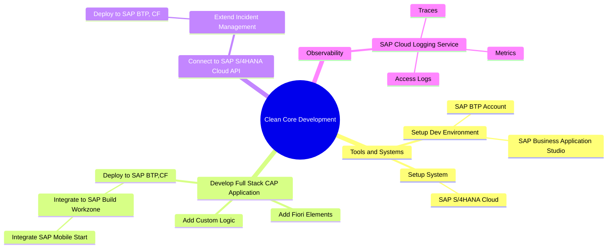

# Clean Core Full Stack Application Development with SAP BTP

## Overview

Welcome to this guidance for application development on **SAP Business Technology Platform (SAP BTP)** following the **SAP BTP Developer Guide**. In the following documentation and tutorials, we provide information and examples on how to develop and deploy a full stack application based on **SAP Cloud Application Programming Model (CAP)** and **SAP Fiori elements** on SAP BTP using different tools and services.

## MindMap

## Prerequisites

1. Logging on to SAP BTP Cockpit
2. [Create Cloud Foundry Space](./space.md)
1. [Set Up SAP Business Application Studio](./bas.md)

## Exercises

### 1. Develop and Deploy Full-Stack CAP Application

1. [Overview](./overview1.md)
2. [Build a CAP Application](https://developers.sap.com/tutorials/build-cap-app.html)
3. [Add SAP Fiori Elements UIs](./docs/generate-fiori-ui.md)
4. [Add Custom Logic](./docs/custom.md)
5. [Prepare for Production](./production.md)
6. [Deploy in SAP BTP, Cloud Foundry Runtime](https://developers.sap.com/tutorials/deploy-to-cf.html)
> [!CAUTION]
> Please don't tryout the next steps **Assign the User Roles** which you may find inside **Deploy in SAP BTP, Cloud Foundry Runtime** as Next Steps. Directly jump to **Integrate Your Application with SAP Build Work Zone, Standard Edition**.
7. [Integrate Your Application with SAP Build Work Zone, Standard Edition](https://developers.sap.com/tutorials/integrate-with-work-zone.html)
> [!WARNING]
> Use **SAP BTP Cockpit** option for SAP Build Work Zone integration
8. [Access Your Launchpad Site with SAP Mobile Start](./docs/mobilestart.md)

## 2. Implement Remote Connectivity with SAP S/4HANA

1. [Overview](./overview2.md)
2. [Extend the Incident Management аpplication](./docs/extend-app.md)
3. [Run a developer test with mock data](./docs/test-with-mock.md)
4. [Prepare the app for production](./docs/prep-for-prod.md)
5. [Deploy to SAP BTP Cloud Foundry runtime with SAP S/4HANA Cloud](./docs/deploy-to-cf.md)
6. [Run application with SAP S/4HANA Backend](https://github.com/SAP-samples/btp-developer-guide-cap/blob/main/documentation/remote-service/test-the-application/test-the-app.md)

## 3. Add Observability to CAP Application

1. [Overview](./overview3.md)
2. [Setup Custom Log Collection](https://github.com/SAP-samples/btp-developer-guide-cap/blob/main/documentation/observability/2-implement.md)
3. [Set Up Trace Collection](https://github.com/SAP-samples/btp-developer-guide-cap/blob/main/documentation/observability/3-implement-traces.md)
4. [Set Up Metrics Collection](https://github.com/SAP-samples/btp-developer-guide-cap/blob/main/documentation/observability/metrics.md)
5. [Deploy Application in the SAP BTP, Cloud Foundry Runtime](https://github.com/SAP-samples/btp-developer-guide-cap/blob/main/documentation/observability/4-deploy-to-cf-ws.md)
6. [Access Logs, Metrics and Traces Using SAP Cloud Logging Service](https://github.com/SAP-samples/btp-developer-guide-cap/blob/main/documentation/observability/6-test-the-flow.md)

