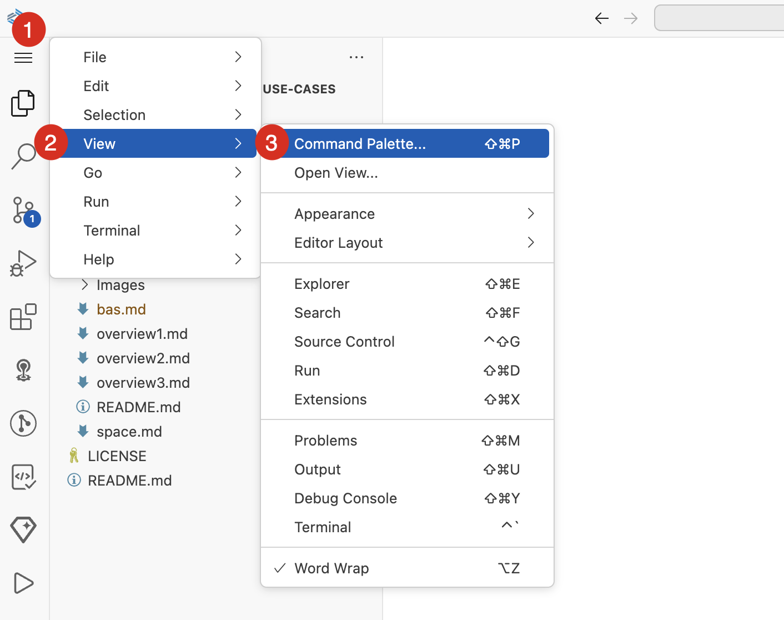
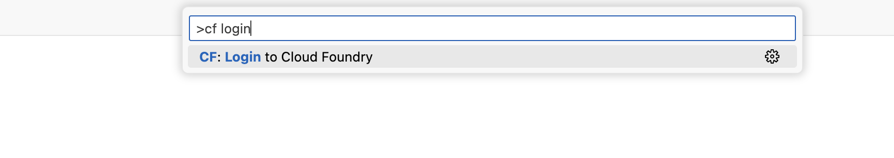
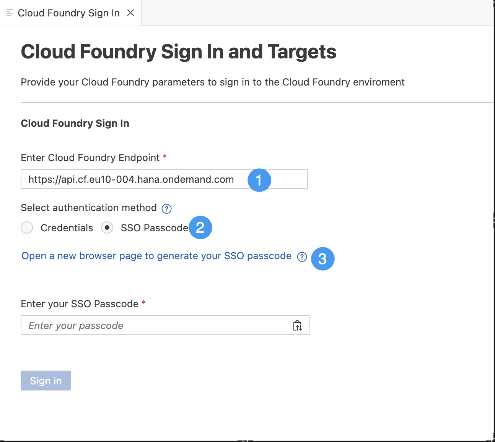
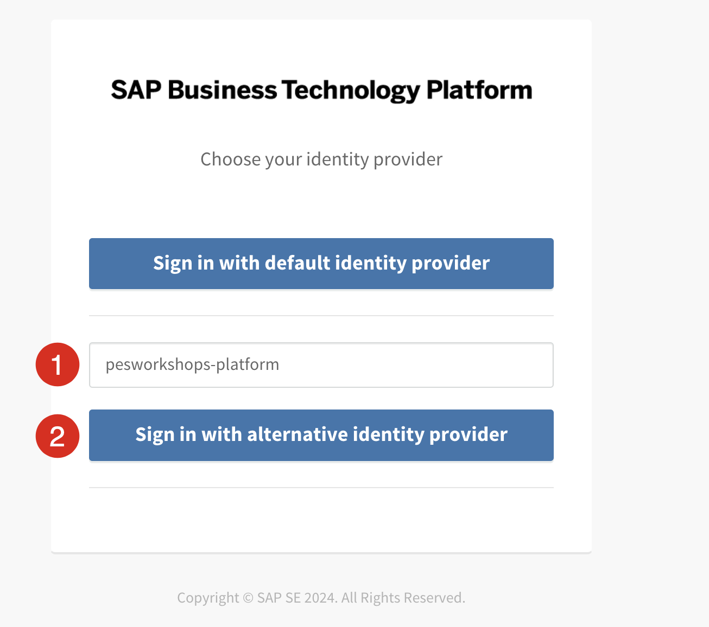
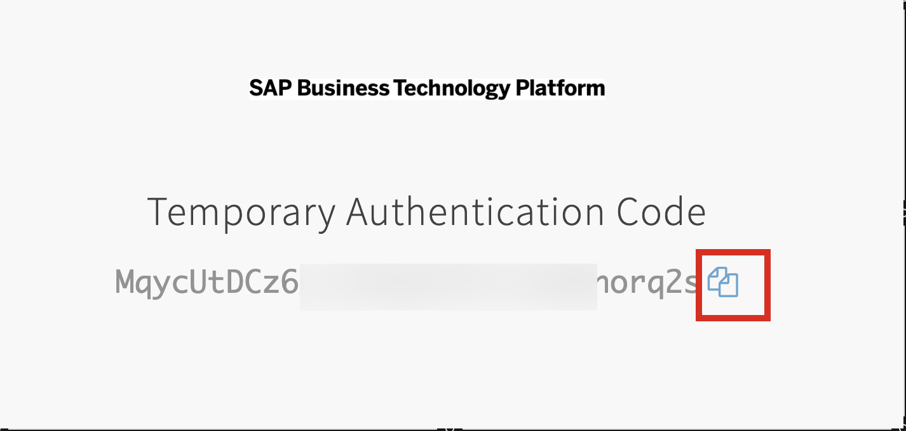
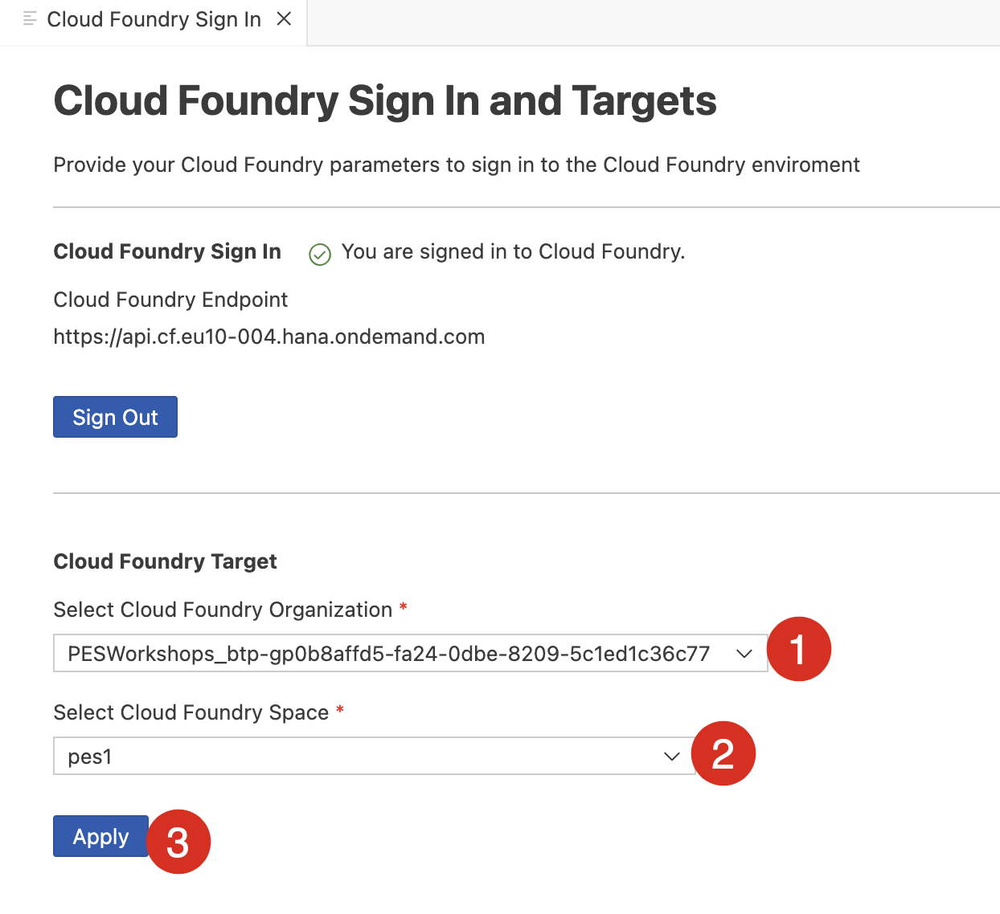

# Set Up SAP Business Application Studio

## 1. Create Dev Space

1. Navigate to your subaccount and choose **Services → Instances and Subscriptions**
2. Choose the **SAP Business Application Studio** subscription. SAP Business Application Studio opens in a new tab of the browser.

	

3. Choose **Create Dev Space**.

	

4. Enter a **Dev Space Name**. For example, **IncidentManagement**.
5. Choose the **Full Stack Cloud Application template and then choose **Create Dev Space**.

	

6. As soon as your dev space is in status **Running**, you can click its name to open it.

	

With this, you’ve successfully completed the setup of SAP Business Application Studio.

## Login to BTP Cloud Foundry using SSO

1. Choose on icon .
2. Choose **View** and then choose **Command Palette**.

	

3. In the Palette, Search for **cf login**. 
4. Choose **CF: Login to Cloud Foundry**.

	

> [!NOTE]  
> You will be navigated to Cloud Foundry Sign In Page.

4. In **Enter Cloud Foundry Endpoint**, enter **https://api.cf.eu10-004.hana.ondemand.com**.
5. In **Select authentication method**, choose **SSO Passcode**.
6. Choose **Open a new browser page to generate your SSO passcode**.

	

> [!NOTE]  
> You will be navigated to account signin page.

7. In the origin key space, enter **pesworkshops-platform**.
8. Choose **Sign in with alternative identity provider**

	

> [!NOTE]  
> You will be navigated to the Passcode Page.

9. Copy the **Temporary Authentication Code**. 

	

10. Come back to **Cloud Foundry Sign In Page**.
11. In **Enter your SSO Passcode**, enter the **Temporary Authentication Code**
12. Choose **Sign in**

	

> [!NOTE]
> You will get signed in Successfully. 

13. In **Select Cloud Foundry Organization**, choose **PESWorkshops_btp-gp0b8affd5-fa24-0dbe-8209-5c1ed1c36c77**.
14. Choose your **space** from dropdown.
15. Choose **Apply**.

	

You are now connected with Cloud Foundry Organization. 

