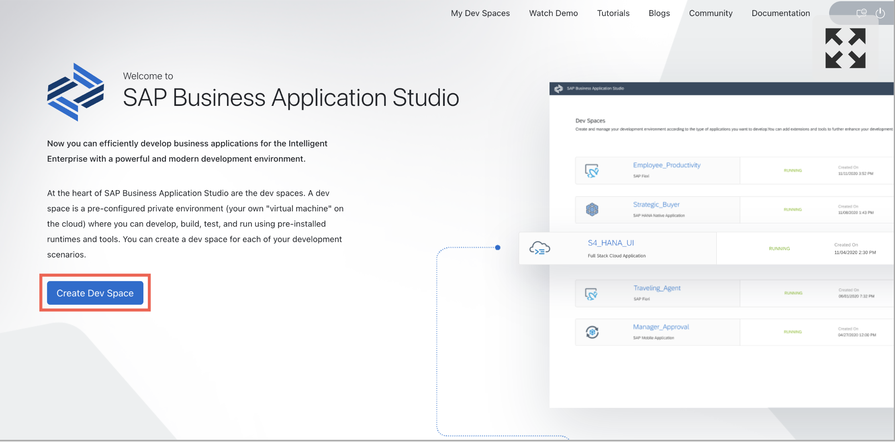
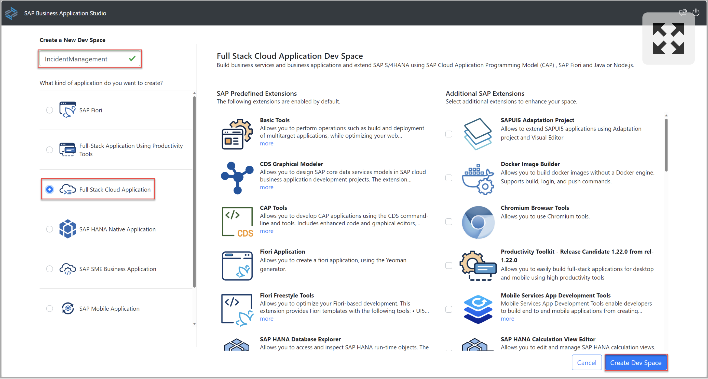
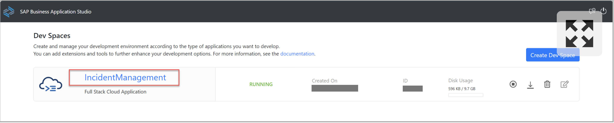

# Set Up SAP Business Application Studio

1. Navigate to your subaccount and choose **Services → Instances and Subscriptions**
2. Choose the **SAP Business Application Studio** subscription. SAP Business Application Studio opens in a new tab of the browser.

	

3. Choose **Create Dev Space**.

	

4. Enter a **Dev Space Name**. For example, **IncidentManagement**.
5. Choose the **Full Stack Cloud Application template and then choose **Create Dev Space**.

	

6. As soon as your dev space is in status **Running**, you can click its name to open it.

	

With this, you’ve successfully completed the setup of SAP Business Application Studio.
