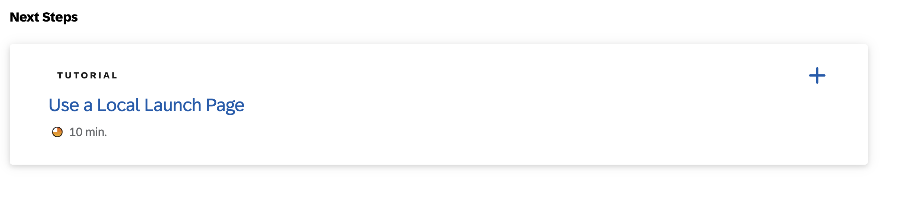

# Add Custom Logic

In this tutorial, you add some custom code to the CAP application. Depending on the contents of the title property, the custom code changes the value of the urgency property.

[**Link to tutorial - Add Custom Logic**](https://developers.sap.com/tutorials/add-custom-logic.html)

> [!CAUTION]
> Please don't navigate to the tutorials under the next steps **Use a Local Launch Page** which you may find at the end of tutorials **Add Custom Logic** . After completing the tutorials **Add Custom Logic**, revert to [main page](https://github.com/SAP-samples/btp-end-to-end-scenario-use-cases/tree/main/topic3#exercises) and start with the tutorial **Prepare for Production**.

	

