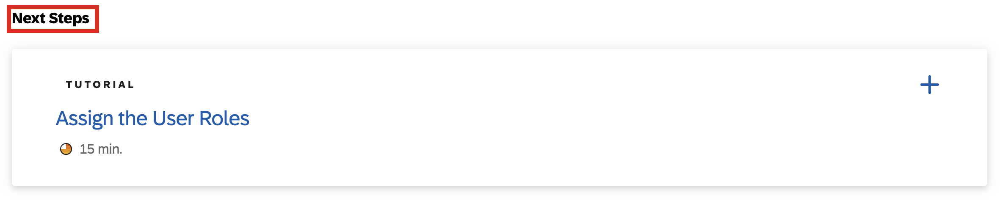

# Deploy in SAP BTP, Cloud Foundry Runtime

The SAP BTP, Cloud Foundry environment allows you to create polyglot cloud applications in Cloud Foundry. It contains the SAP BTP, Cloud Foundry runtime, which is based on the open-source application platform managed by the Cloud Foundry Foundation.

[**Link to tutorial - Deploy in SAP BTP, Cloud Foundry Runtime**](https://developers.sap.com/tutorials/deploy-to-cf.html)

> [!CAUTION]
> Please don't navigate to the tutorials under the next steps **Assign the User Roles** which you may find at the end of tutorials **Deploy in SAP BTP, Cloud Foundry Runtime** . After completing the tutorials **Deploy in SAP BTP, Cloud Foundry Runtime**, revert to [main page](https://github.com/SAP-samples/btp-end-to-end-scenario-use-cases/tree/main/topic3#exercises) and start with the tutorial **Integrate Your Application with SAP Build Work Zone, Standard Edition**.

	

