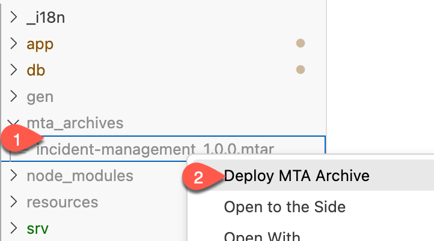
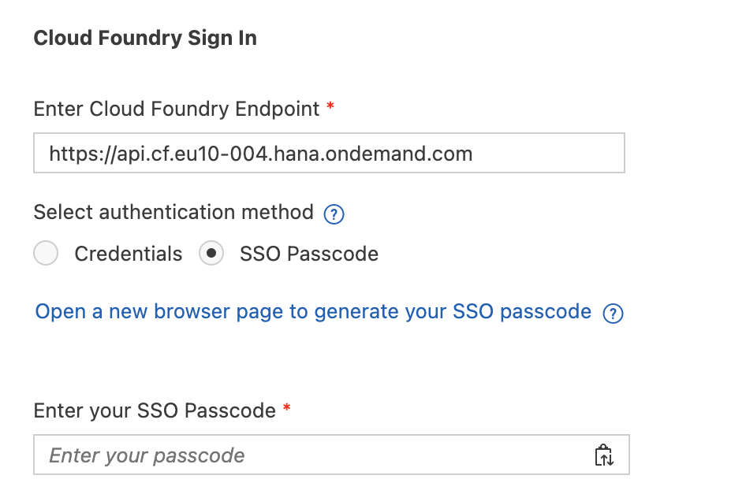
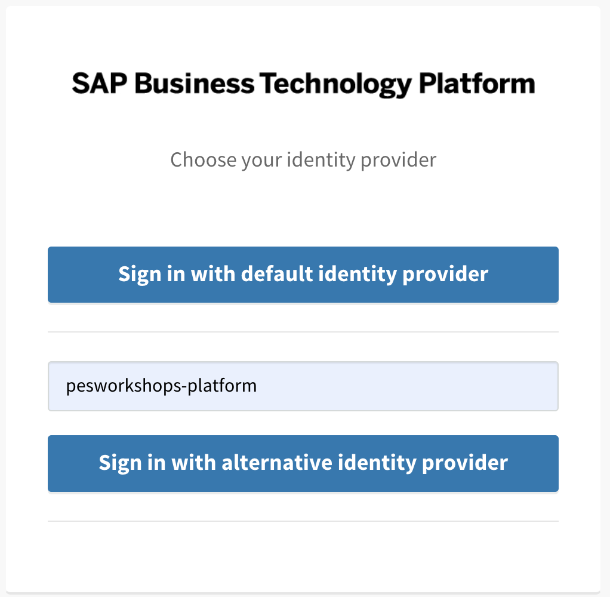
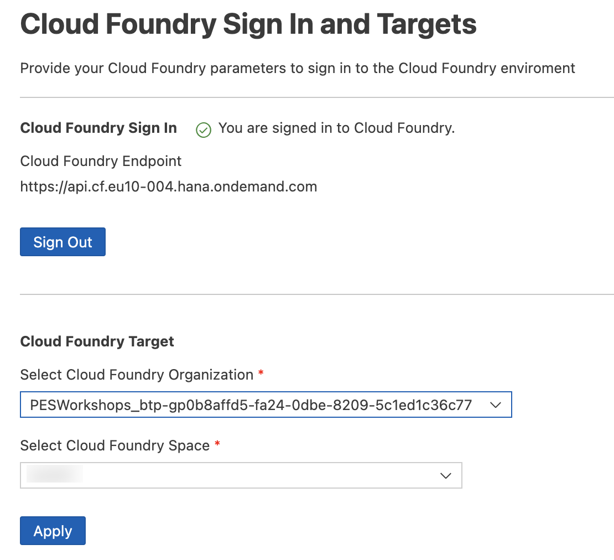

# Deploy and Run the Application on Cloud Foundry with SAP S/4HANA Cloud Backend

## Usage Scenario

Deploy the project to Cloud Foundry using the MTA build file.

## Prerequisites

* You have prepared the project for productive usage.

## Content
Extend the existing MTA build file with the settings for SAP S/4HANA Cloud extension service.


### Deploy the Application

1. In the *incident-management-srv* module, in the *requires* section, add **- name: incident-management-destination-service**
   
    ```yaml
    - name: incident-management-srv
      type: nodejs
      path: gen/srv
      requires:
      - name: incident-management-auth
      - name: incident-management-db
      - name: incident-management-destination-service
    ....
    ```

2. Right-click on the *mta.yaml* file and choose **Build MTA Project**
   
   

3. If the build was successful, you find the generated file in the *mta_archives* folder. Right-click on *incident-management_1.0.0.mtar* and choose **Deploy MTA Archive**.
   
   

4. Login to your SAP BTP subaccount and space to start the deployment.
   
   

   

    
