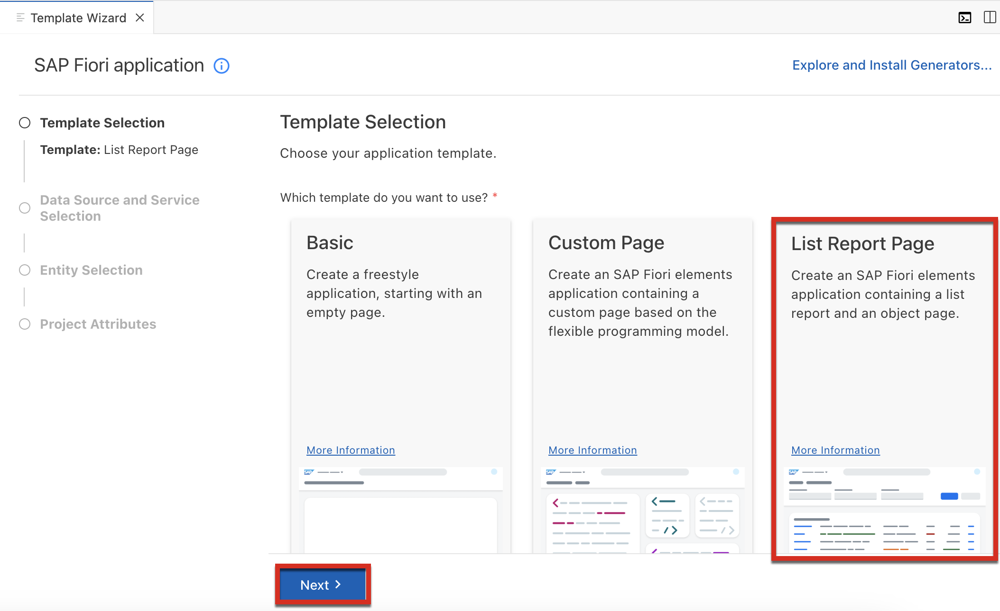
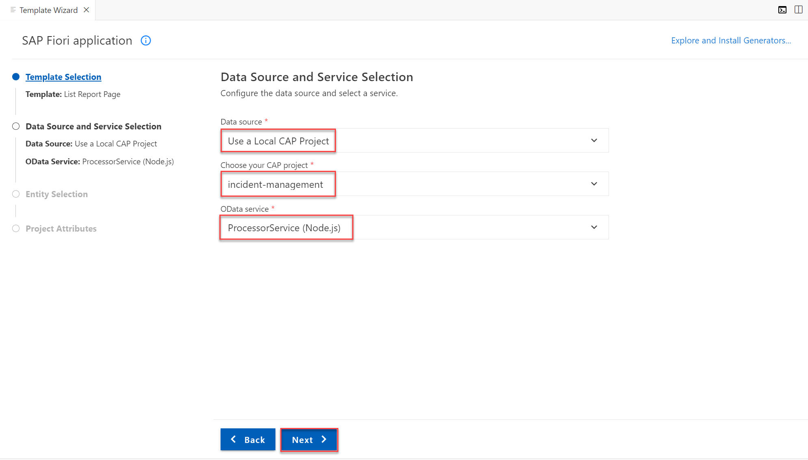
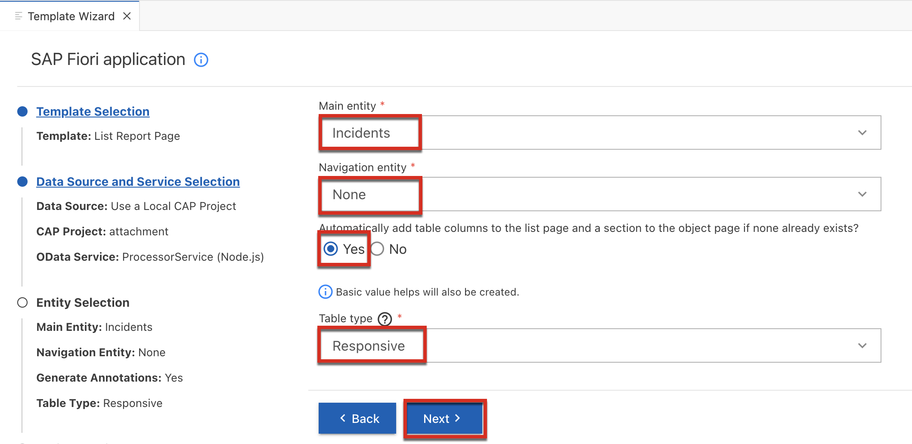
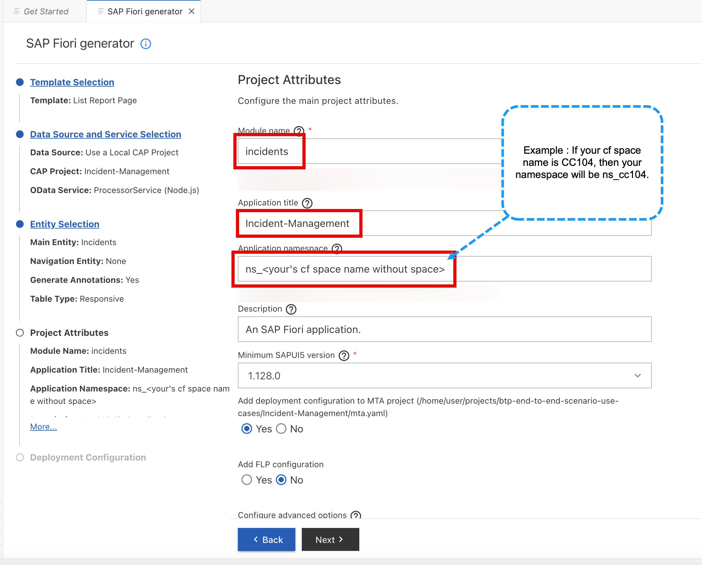
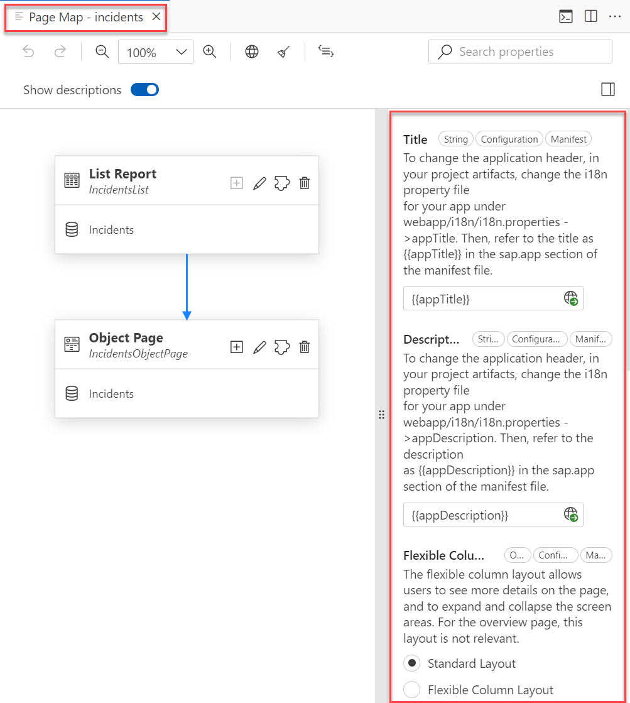
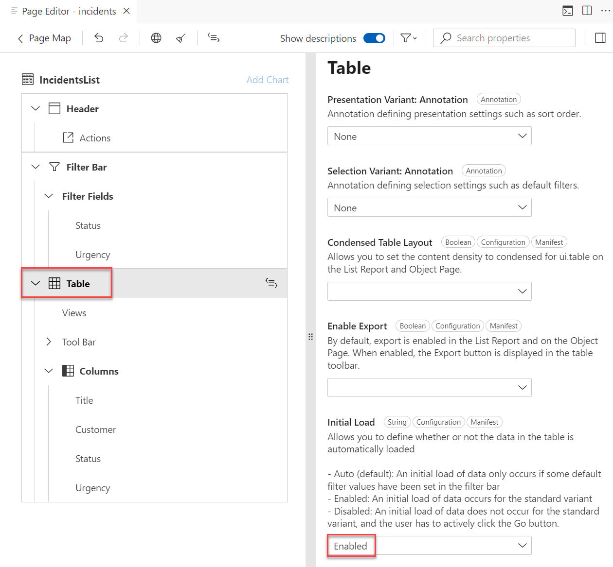

# Overview

SAP Fiori elements provides designs for UI patterns and predefined floorplans for common application use cases. Application developers can use SAP Fiori elements to create SAP Fiori applications based on OData services and annotations that don’t need JavaScript UI coding. The resulting application uses predefined views and controllers that are provided centrally. This means no application-specific view instances are required. SAPUI5 interprets the metadata and the annotations of the underlying OData service and uses the corresponding views for the SAP Fiori application at startup.

# Generate the UI with an SAP Fiori Elements Template

1. In SAP Business Application Studio, go to your **IncidentManagement** dev space.

    > Make sure the **IncidentManagement** dev space is in status **RUNNING**.

2. Choose the burger menu and then choose **View** &rarr; **Command Palette**.

    > You can also invoke the Command Palette quickly using the following key combination:
    >
    > - For macOS: <kbd>Command</kbd> + <kbd>Shift</kbd> + <kbd>P</kbd>
    > - For Windows: <kbd>Ctrl</kbd> + <kbd>Shift</kbd> + <kbd>P</kbd>

3. Type **Fiori: Open Application Generator** in the field and select this entry from the list.

4. In the **Template Selection** select the **List Report Page** template tile. Then Choose **Next**.

    <!-- border; size:540px -->
    

<div class="impl node">

5. In the **Data Source and Service Selection** step:

    - In the **Data source** dropdown menu, select **Use a Local CAP Project**.

    - In the **Choose your CAP project** dropdown menu, select the **incident-management** project.

    - In the **OData service** dropdown menu, select the **ProcessorService (Node.js)**.
    
    - Choose **Next**.

        <!-- border; size:540px --> 
        

</div>

   > tip
   >In case you get the error: `Node module @sap/cds isn't found. Please install it and try again`, you have to install the corresponding CAP module which is >also required   by the app generator as described in [Add CAP Tooling](https://cap.cloud.sap/docs/tools/#command-line-interface-cli)
   > If not already done, please open a command line and run the following command:

   > ```bash
   > npm install --global @sap/cds-dk --@sap:registry=https://registry.npmjs.org/
   > ```

   >See the [CAP Troubleshooting guide](https://cap.cloud.sap/docs/advanced/troubleshooting#npm-installation) for more details.


6. In the **Entity Selection** step:

    - In the **Main entity** dropdown menu, select **Incidents**.
    - Leave the **Navigation entity** value as **none**.
    - Leave  **Yes** selected to add table columns automatically.
    - Leave the **Table Type** value as **Responsive**.   
    - Choose **Next**.

        <!-- border; size:540px --> 
        

7. In the **Project Attributes** step:

   - In the **Module name** field, enter **incidents**.

    - In the **Application title** field, enter **Incident-Management**.

    - In the **Application namespace** field, enter a unique value.
> [!CAUTION]
> Application Namespace value should be unique and it's suggested to use **Cloud Foundry Space name** without any space. For example if your cf space name is **CC104**, then your application namespace shall be **cc104**. 

- Leave the default values for all the other settings and choose **Finish**.

  <!-- border; size:540px --> 
  

    The application is now generated and in a few seconds you can see the application's **incidents** folder in the **app** folder of your **incident-management** project. It contains a **webapp** folder with a **Component.js** file that is typical for an SAPUI5 application. However, the source code of this application is minimal. It inherits its logic from the **sap/fe/core/AppComponent** class. This class is managed centrally by SAP Fiori elements and provides all the services that are required (routing, edit flow) so that the building blocks and the templates work properly.


# Add List and Report Page

1. The tutorials to generate [List and Object page](https://developers.sap.com/tutorials/add-fiori-elements-uis.html#f9446c7a-810d-4c8f-a00b-b146386dd8bd) to be followed to generate list and report pages. Inorder to save time we will be now copying the annotations and pasting it into the project's folder.

2. Create a folder `_i18n` into root of your project, Create a file `i18n.properties` inside folder `_i18n` and paste the content of [i18n.properties](./files/_i18n/i18n.properties) into `i18n.properties`. 

3. Navigate to `app/incidents` folder from the projects root directory.
    Copy the contents of the file [annotations.cds](./files/annotations.cds) to `annotations.cds` in the working directory

4. Lets do the below to get a flavor of how the generation of annotations looks like with Fiori Elements

5. Invoke the Command Palette - **View** &rarr; **Command Palette** or <kbd>Command</kbd> + <kbd>Shift</kbd> + <kbd>P</kbd> for macOS / <kbd>Ctrl</kbd> + <kbd>Shift</kbd> + <kbd>P</kbd> for Windows. 

6. Select **Fiori: Open Application Info**.

7. In the **Application Info - incidents** tab, click the **Open Page Map** tile. 

    <!-- border; size:540px --> 
    

    The page map of the **incidents** application opens in a new tab within SAP Business Application Studio. You will see the properties on the right side of the page map. You can edit these properties to update the UI of the application.

    <!-- border; size:540px --> 
    

8. In the **List Report** tile, click the **Pencil** icon next to the title. The page editor is opened.

    <!-- border; size:540px --> 
    

9. Select **Table** in the left pane of the page editor. In the **Initial Load** dropdown menu, select **Enabled** to load the data automatically.

    <!-- border; size:540px --> 
    


# Enable draft with `@odata.draft.enabled`

SAP Fiori supports editing business entities with draft states stored on the server, so users can interrupt editing and continue later on, possibly from different places and devices. CAP, as well as SAP Fiori elements, provide out-of-the-box support for drafts. We recommend that you always use draft when your SAP Fiori application needs data input by end users.

   >For more details, see the SAP Fiori Design Guidelines for [Draft Handling](https://experience.sap.com/fiori-design-web/draft-handling/).

   >Read more about [Draft Support](https://cap.cloud.sap/docs/advanced/fiori#draft-support) in the CAP documentation.

Enabling a draft for an entity allows the users to edit the entities. To enable a draft for an entity exposed by a service, follow these steps:

1. Open the **srv/services.cds** file.

2. Annotate the file with @odata.draft.enabled like this:

    > ```bash
    > service ProcessorService { 
    >...
    >}
    >...
    >annotate ProcessorService.Incidents with @odata.draft.enabled;
    > ```
    

