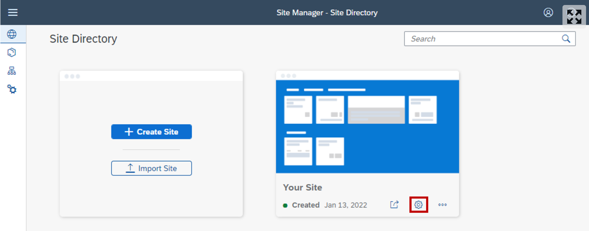
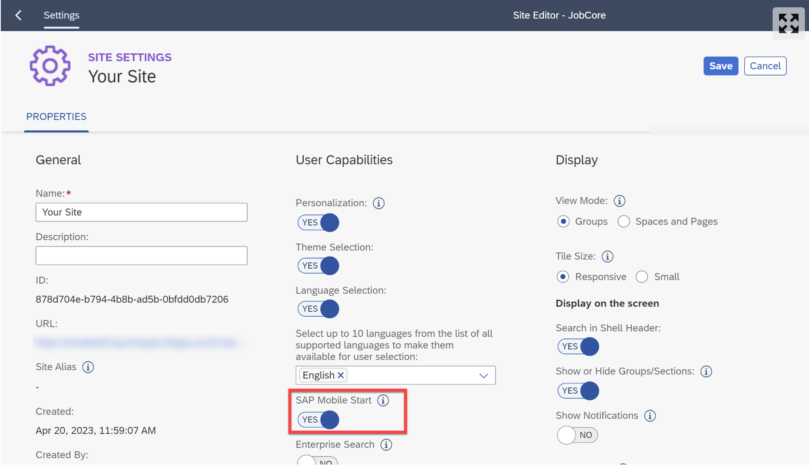

# Access Your Launchpad Site with SAP Mobile Start

# 1. Enable SAP Mobile Start in Site Settings

1. In the Site Manager - Site Directory click the settings icon on your Site’s tile to open the Site Settings.

<!-- border; size:540px -->

2. Within the Site Settings click the Edit button on the top right & make sure the toggle for SAP Mobile Start is enabled.

<!-- border; size:540px -->

2. ˇ
