## You will learn

- How to integrate your application with SAP Build Work Zone, standard edition

###  Integrate your application with SAP Build Work Zone, standard edition

#### Update content

1. Open your subaccount and navigate to **Instances and Subscriptions**.

2. Choose the application **SAP Build Work Zone, standard edition**.

    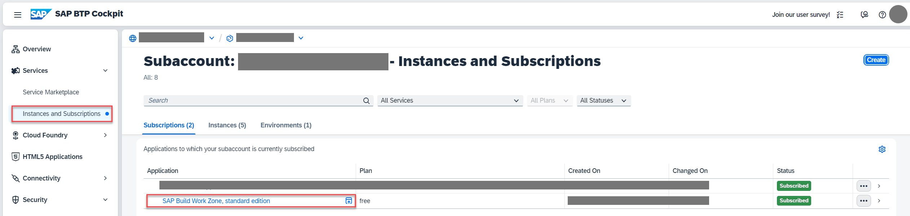

3. In the menu on the left side, choose the icon for **Channel Manager**.

4. Choose the refresh icon to fetch the updated content.

    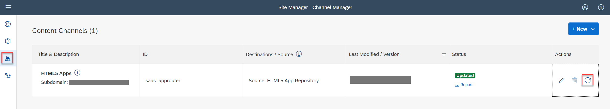

#### Add application to Content Explorer

5. Choose **Content Manager** in the menu on the left and choose the **Content Explorer** button.

    < 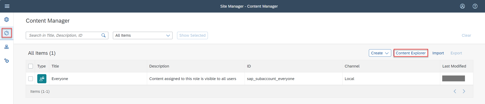

6. Select the tile **HTML5 Apps** with your respective subdomain name.

     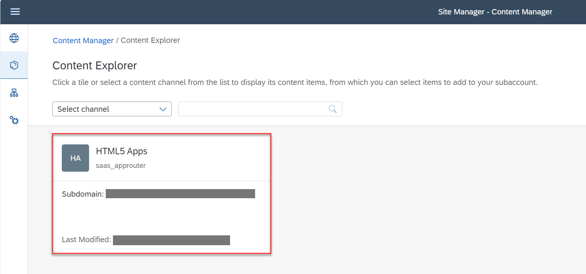

7. In the items table, set checkmark for the app **Incidents** and choose the button **Add**.

    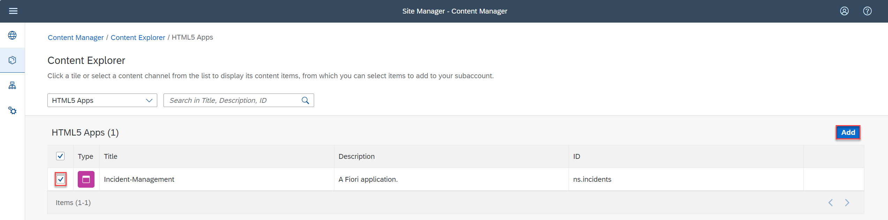

#### Create a group

8. Go back to the **Content Manager**, choose **Create** &rarr; **Group**.

     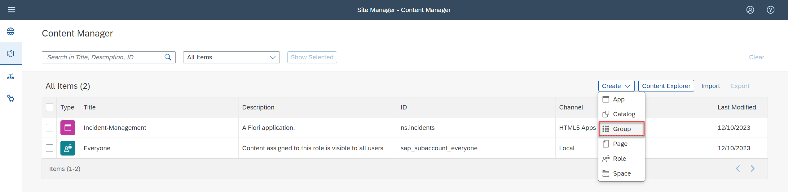

9. Add the title **Incident Management Group-enter a unique value eg.,ns01.**.

10. In the **Assignment Status**, choose the slider to assign the **Incident-Management** app to the group.

11. Choose **Save**.

     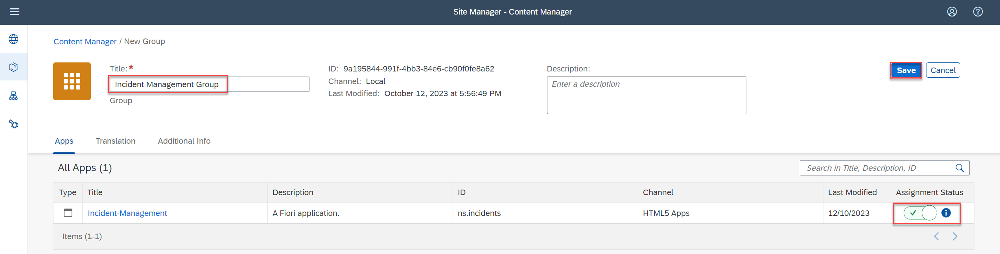

#### Add application to the Everyone role

12. Back in the **Content Manager**, choose role **Everyone** and choose **Edit**.

13. In the **Assignment Status**, choose the slider to assign the **Incident-Management-<unique id>** app to the role.

14. Choose **Save**.

    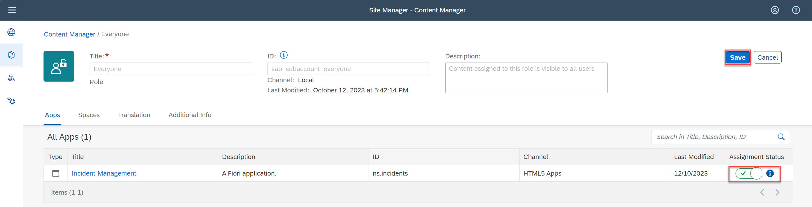

#### Create site

15. Navigate to **Site Directory** and choose **Create Site**.

     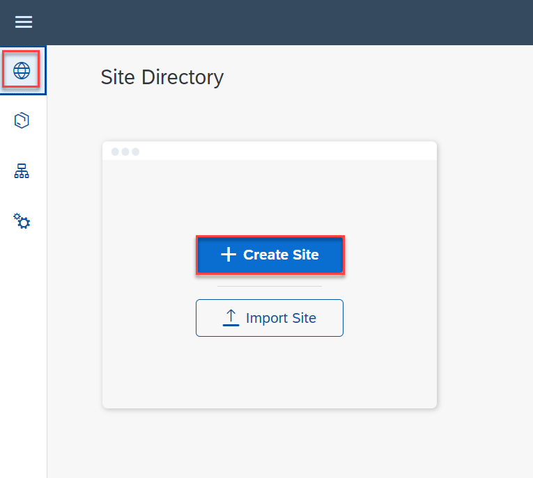

17. Enter the site name as **Incident Management Site-<enter a unique value eg.,ns01>** and choose **Create**.

     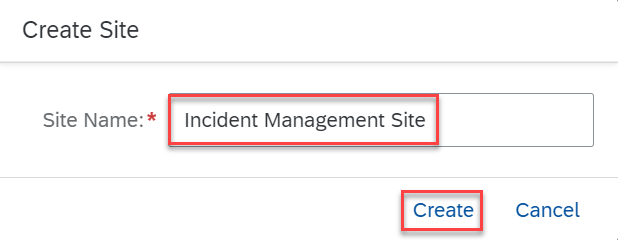

18. Now, you are forwarded to your created site.

### Test your site

19. Navigate to **Site Directory** and find your site.

     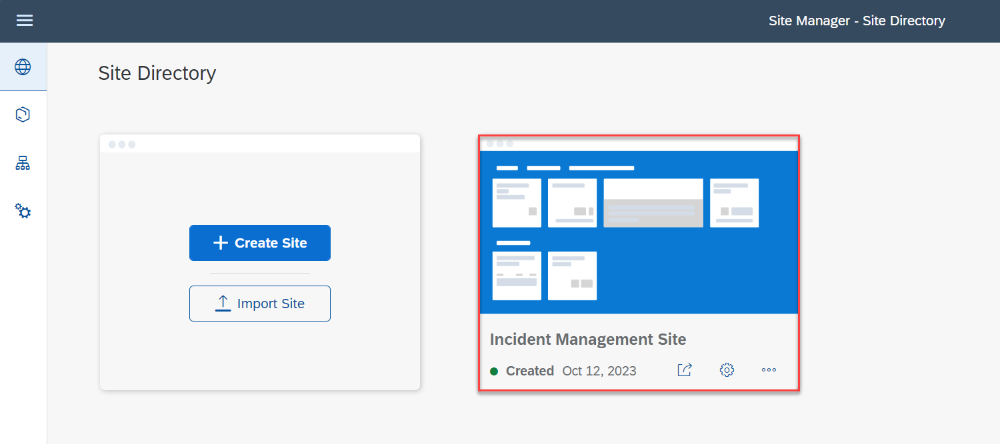

21. Choose **Go to site**. 

     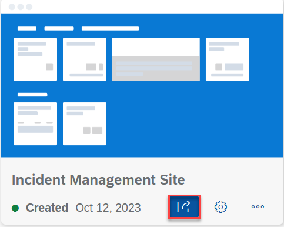

3. Choose the Incident Management application from the launch page. 

    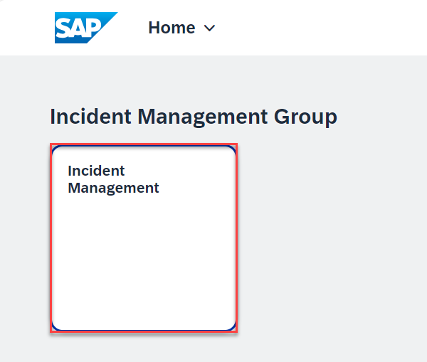

    You should be able to see the list report page.

     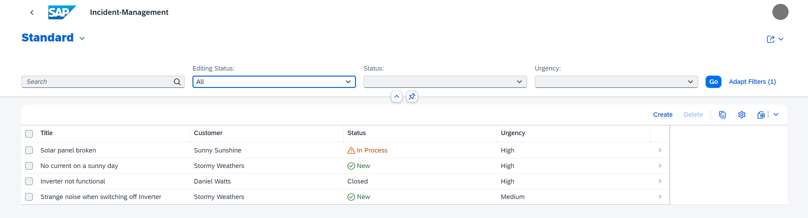

### Summary

Congratulations! You now have finished the development of your application and you have integrated SAP Build Work Zone, standard edition service, to have one central entry point to show all of your SAP BTP applications.
