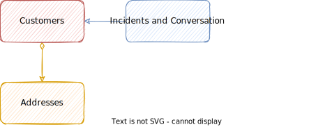
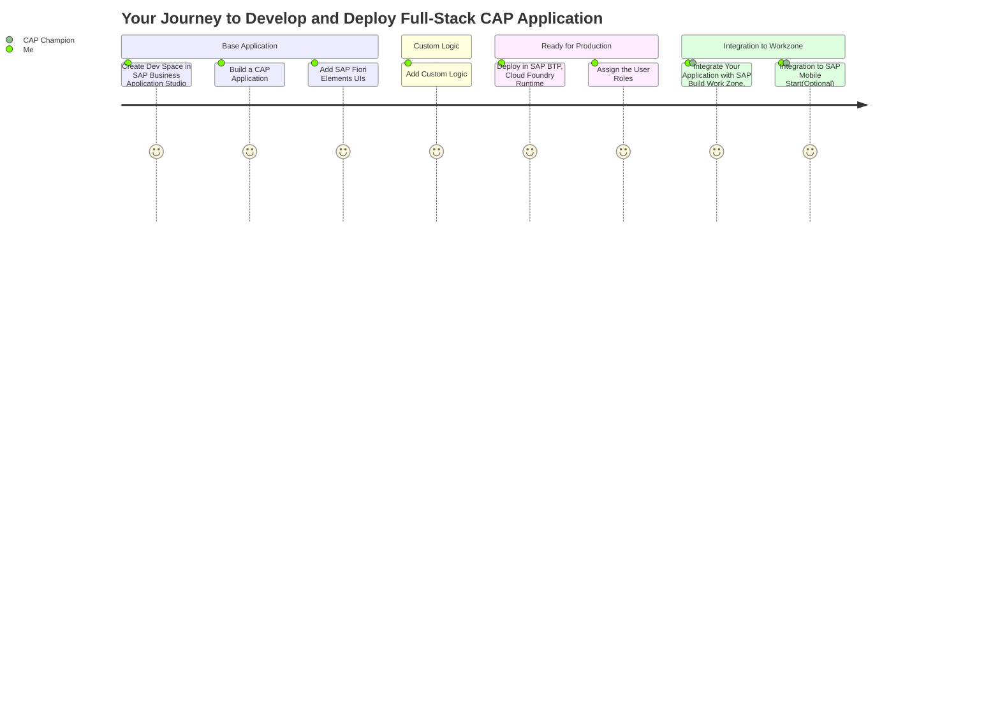

# Develop and Deploy Full-Stack CAP Application

## Solution Diagram

	

The Incident Management application uses the following sample business scenario:

ACME is a popular Electronics company. ACME hires call center support representatives to process and manage customer incidents. A call center support representative (Processor) receives a phone call from an existing customer and creates a new incident on behalf of the customer. 

	

The newly created incident is based on a customer complaint received during the phone call so the call center support representative also adds the conversation with the customer to the incident.

