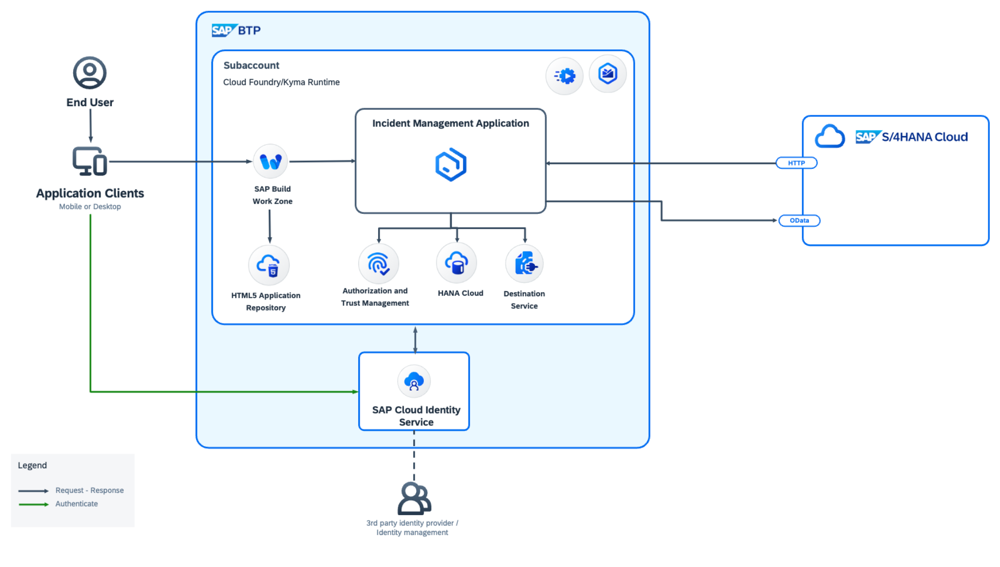
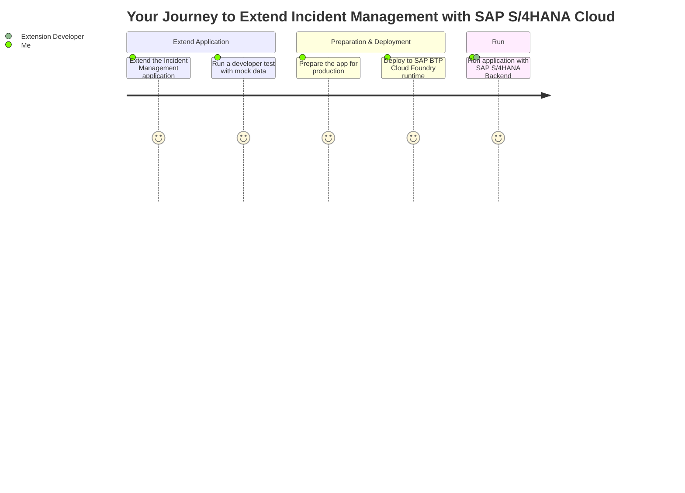

# Implement Remote Connectivity with SAP S/4HANA

## Solution Diagram

	

In this tutorial, we will integrate SAP S/4HANA Cloud Business Partner API to the Incident Management application.

The Incident Management application helps call center support representatives process and manage customer incidents. A support representative (processor) receives a phone call from an existing customer and creates a new incident on behalf of the customer.

	

When a new incident is created by the processor, they have to assign the incident to the respective customer. The option to choose a customer will be given as a value help and the list of customers in the value help will be fetched from the **SAP S/4HANA Cloud system**. For this purpose, we will be using the **SAP S/4HANA Business Partner API**.

