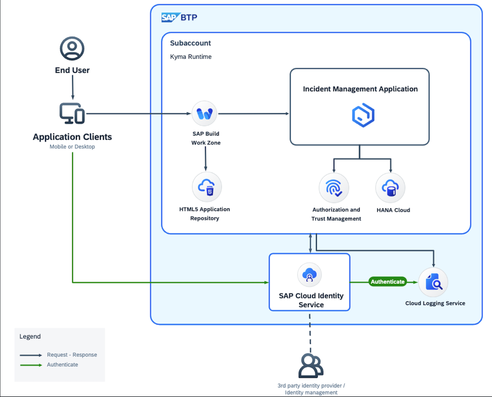
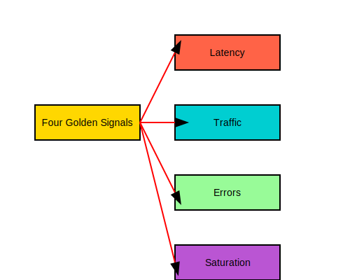
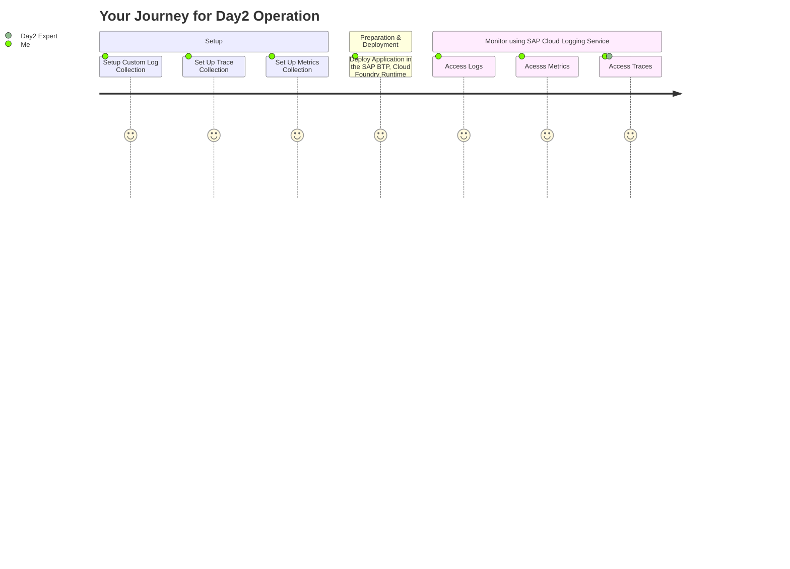

# Add Observability to CAP Application

## Solution Diagram

	

**Observability** helps to take data-driven informed decisions based on runtime Observability telemetry data (logs, metrics, traces, events, ...) and provides insights into SAP & customer services and systems to understand and improve efficiency, scalability, resilience, and availability.

	

