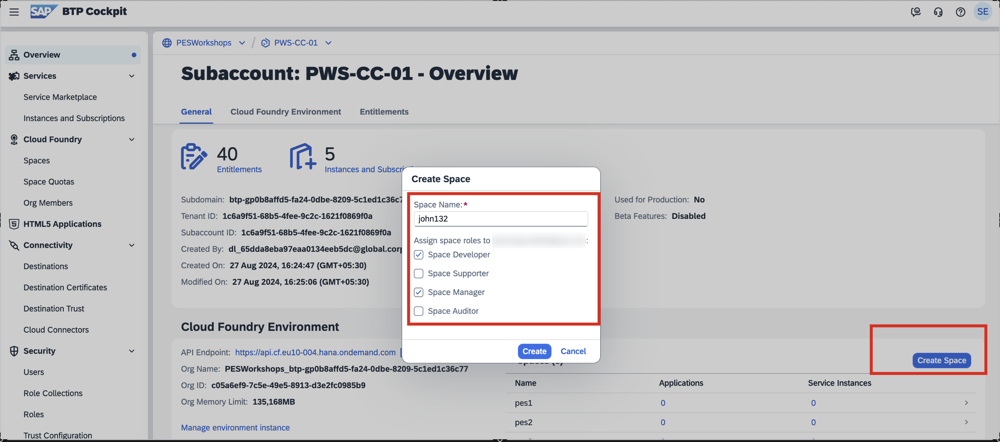

# Create Cloud Foundry Space

1. On the subaccount Overview page, you have a **Spaces** table. Choose **Create Space** from the top right hand-side corner of that table.

2. Enter a space name, assign space roles, as required, and save your changes.

	

> [!IMPORTANT]  
> You space name should be unique. You can have your first name followed by random 3-digit number. example John132

