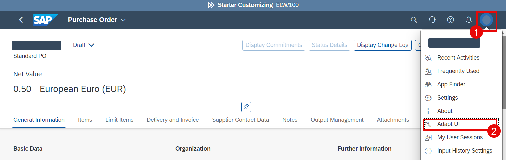
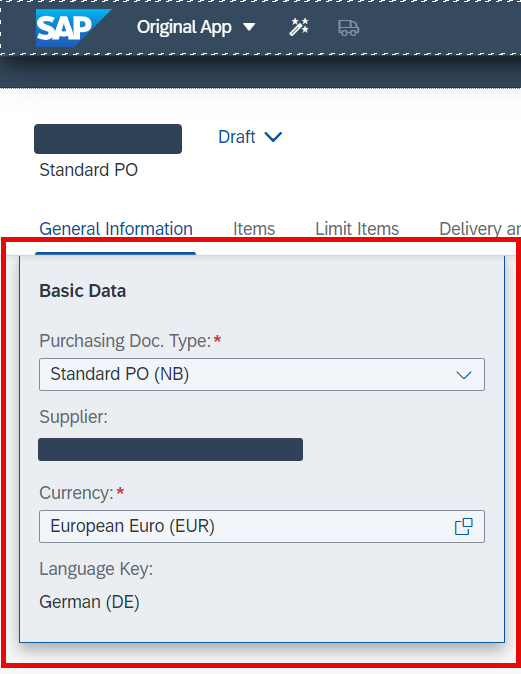
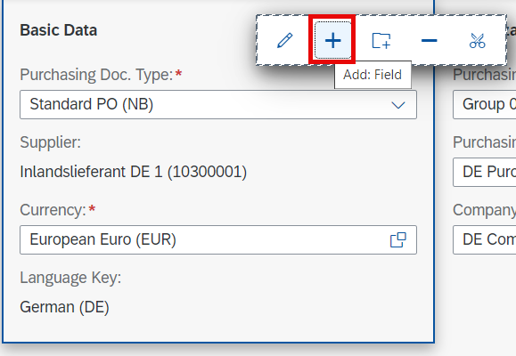
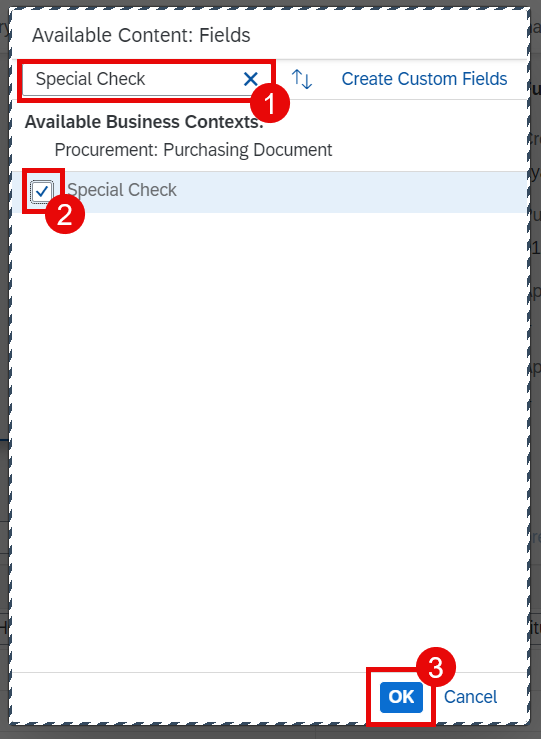
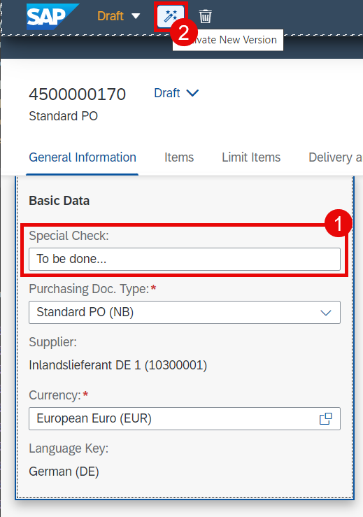
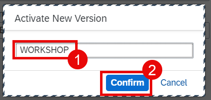

# Adapt UI

This section will be demonstrated. It is not part of the hands-on exercise.

## Overview

1. Now it's time to add the new custom field to the Purchase Order UI. Open **Manage Purchase Orders** app and go into any purchase order.

2. Select **Adapt UI** from the user menu.

  

3. Move your cursor into the **Basic Data** section so that the section looks elevated. Click it.

  

4. Select **+** icon to add the field.

  

5. Search for your field (in this case **Special Check**) and mark it. Choose **OK**.

  

6. Now you can see your field in the UI. Choose **Activate New Version** button.

  

7. Enter the name of the version and choose **Confirm**.

  

8. After the version is created, you can **Publish** it. Then cancel from the UI adaptation mode.

  

9. You can find more information [here](https://help.sap.com/docs/ABAP_PLATFORM_NEW/a7b390faab1140c087b8926571e942b7/d868950a1e8c4b0f9b9453176939a19b.html?version=202310.002).

## Next Step

[Communication Management](./communication-management.md)
