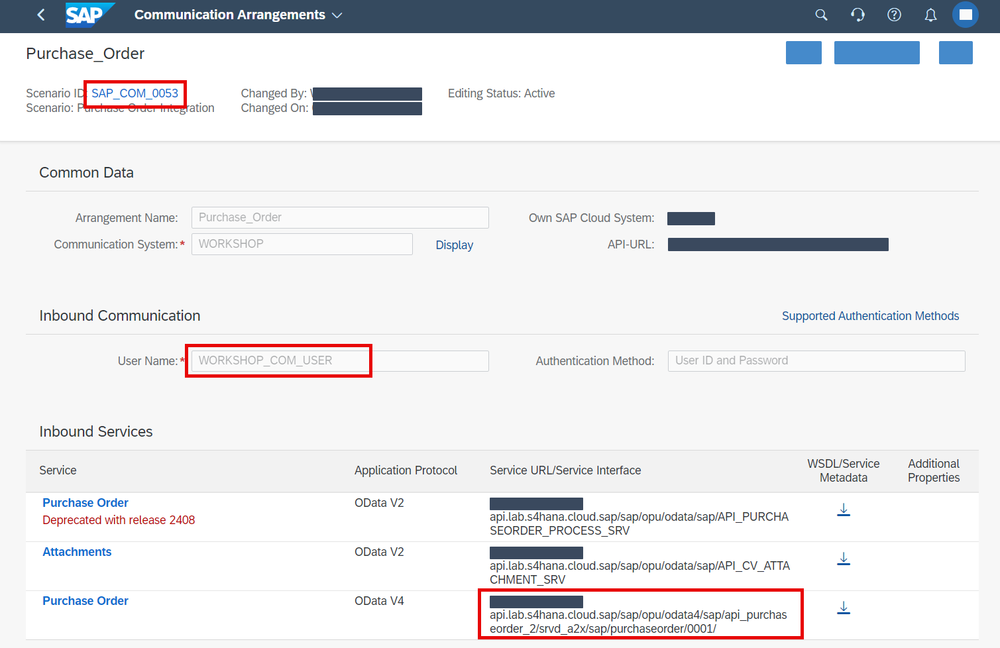

# Communication Management

This section will be demonstrated. It is not part of the hands-on exercise.

## Overview

1. The communication management is necessary to reach the API from SAP BTP. You can check more for example in this [learning journey](https://learning.sap.com/learning-journeys/extending-sap-s-4hana-with-sap-build-apps-and-key-user-extensibility/establishing-connectivity-between-sap-s-4hana-cloud-and-sap-btp_f3d6df41-c36c-450b-8ae8-79534e043fa1).

2. The finally created communication arrangement contains the scenario name (defines the scope of communication), the authentication details (basic authentication in our case) and the API endpoints (will be used later to create a destination).

  

## Next Step

[Create SAP BTP Destination](./destination.md)
