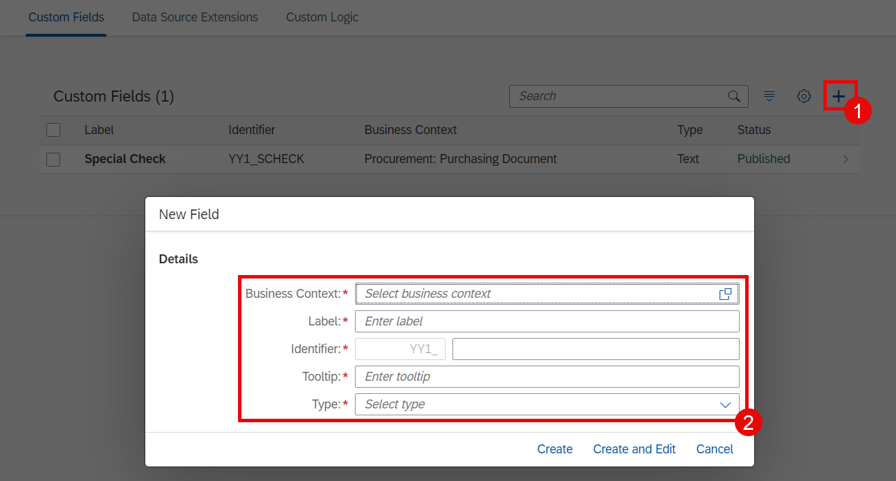
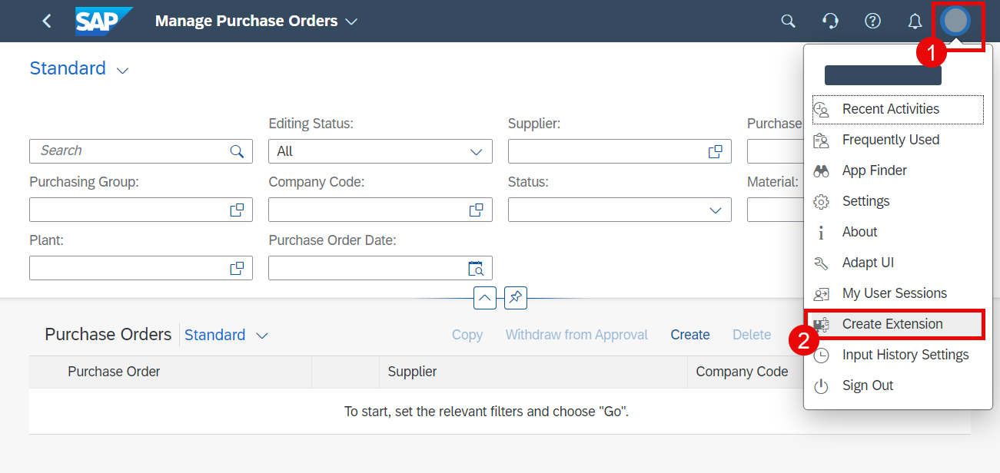
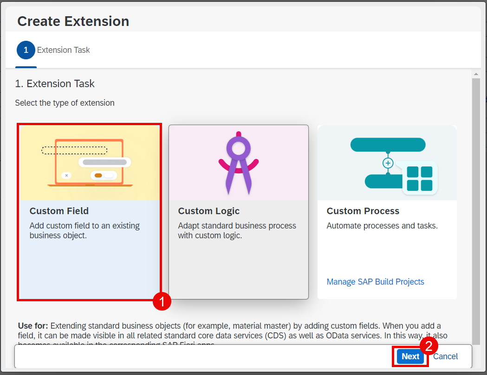
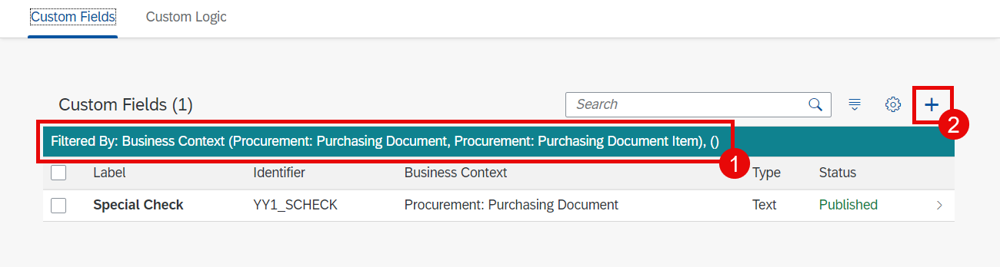
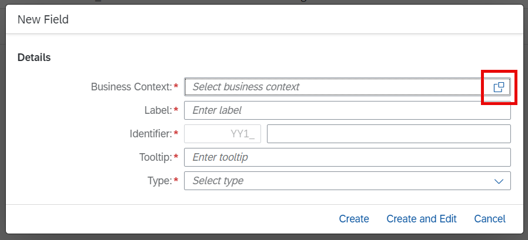
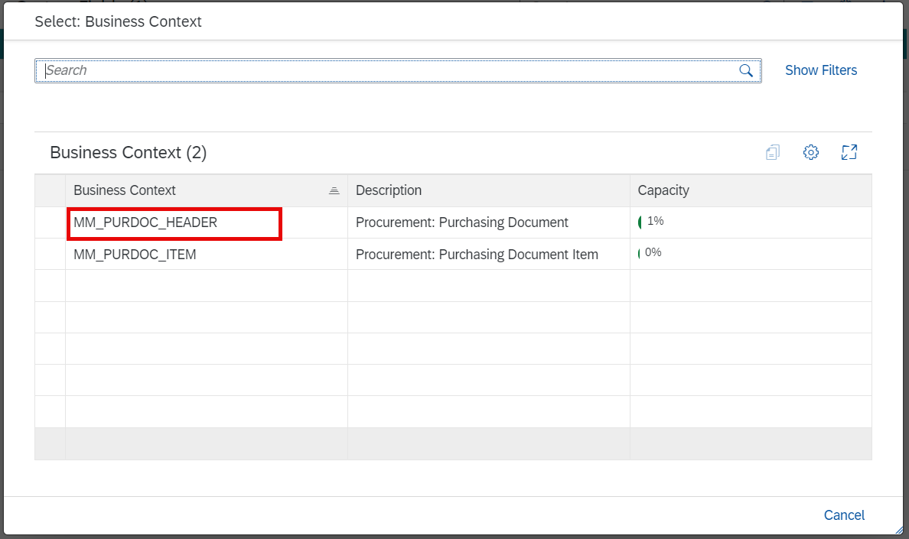
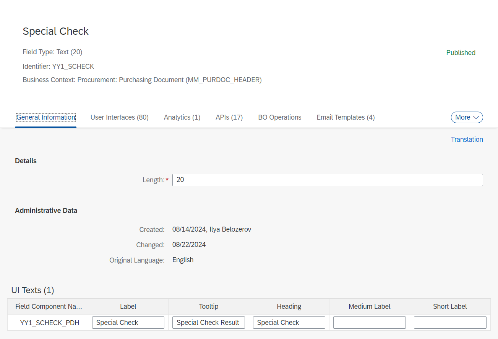
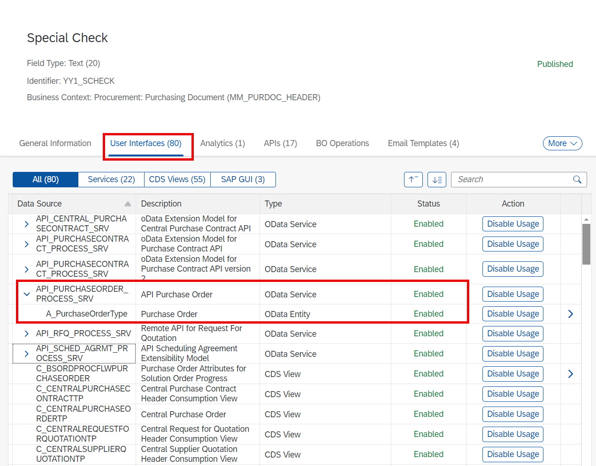
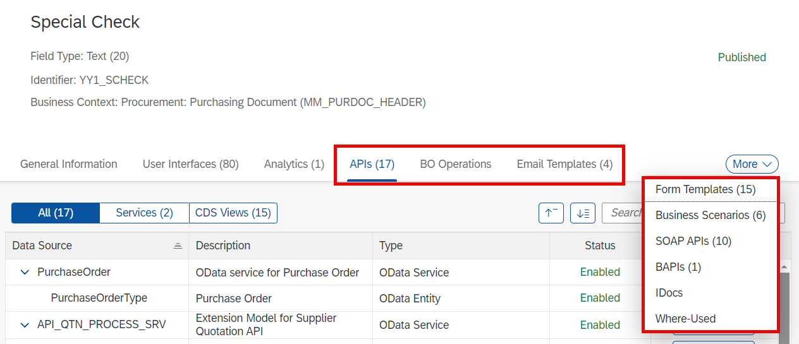
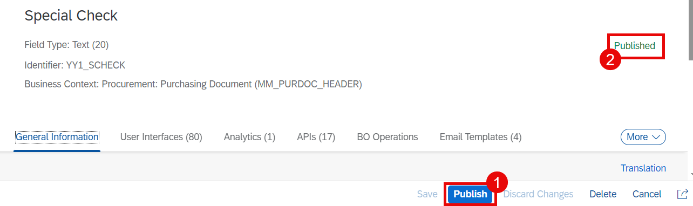

# Custom Field

This section will be demonstrated. It is not part of the hands-on exercise.

## Overview

1. You can start to create a custom field using the application **Custom Fields**. In this case you have to fill the Business Context manually.

  

2. Our recommendation is to use if from the Extensibility Wizard. Go to the specific business application. In this scenario we use **Manage Purchase Orders**. Then select **Create Extension** from the user menu.

  

3. In the popup wizard window select **Custom Field** and then choose **Next**.

  

4. The same **Custom Fields** application will be opened, but in a context-aware mode. You will see that the content is filtered based on the context of the initial business application. You can click **+** button.

  

5. Choose the value help button in the business context field.

  

6. Now you can choose the context from the restricted amount of options. In this case we want add the field to the header data of the purchase order. So, choose **MM_PURDOC_HEADER**.

  

7. As it is not a hands-on exercise, we won't provide here the further steps. The general data of the custom field for this scenario will look like this:

  

8. It is important to enable this field for the main APIs and CDS views. If you don't know which CDS/APIs are relevant for you scenario you might try to activate all (not recommended).

  

9. Check other structures and interfaces. Enable if necessary.

  

10. Don't forget to publish the custom field. It may take quite some time.

  

11. You can find more information [here](https://help.sap.com/docs/SAP_S4HANA_CLOUD/0f69f8fb28ac4bf48d2b57b9637e81fa/ce819b8557194ae0aa180ba4ac6a04de.html?version=2502.VAL).

## Next Step

[Create custom logic](./custom-logic.md)
