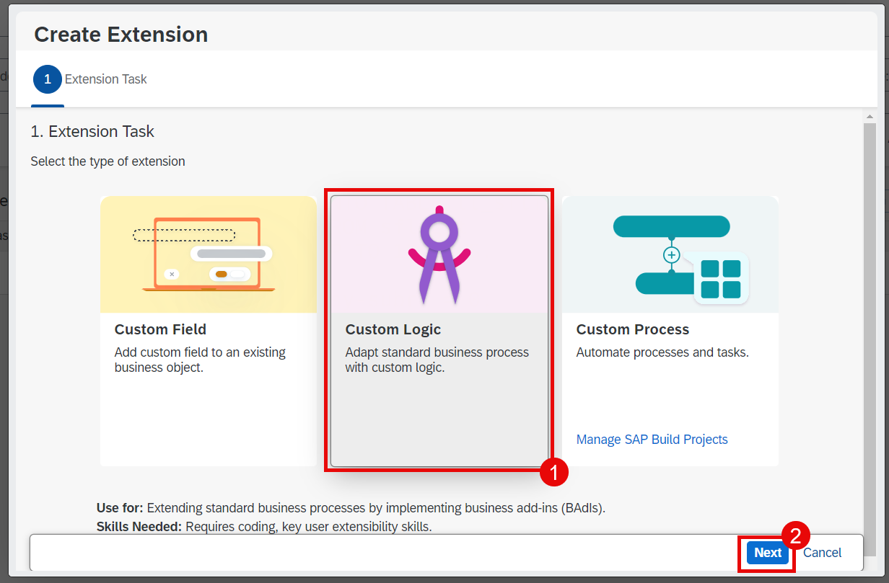
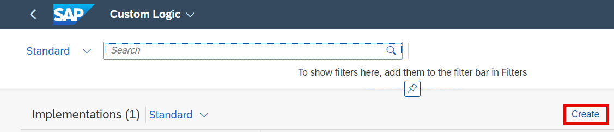
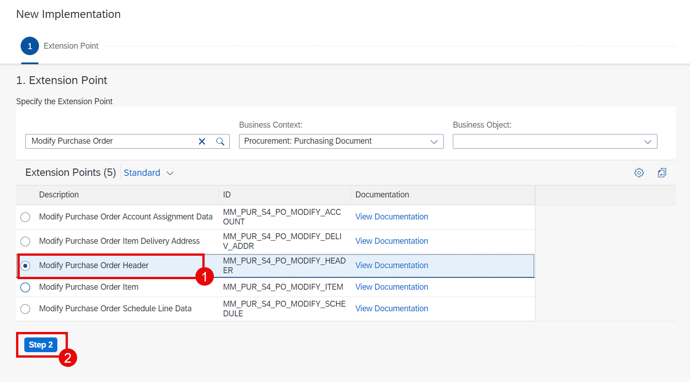
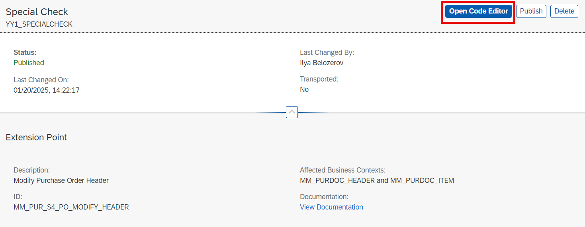
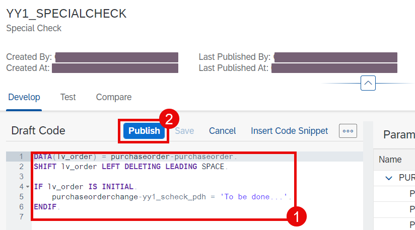

# Custom Logic

This section will be demonstrated. It is not part of the hands-on exercise.

## Overview

1. The custom logic can be created in a similar way as the custom field. Open the **Manage Purchase Orders** app. Then select **Create Extension** from the user menu.

  

2. This time in the popup wizard window select **Custom Logic** and then choose **Next**.

  
  
3. Choose **Create**.

  

4. Choose an extension point. In this scenario we use **Modify Purchase Order Header**. Then choose **Step 2**.

  

5. In further steps, you should provide an ID and a description for the future implementation followed by a review and create.

6. Choose **Publish**.

  
  
7. Now you can choose **Open Code Editor**.

  

8. Enter some ABAP code. Then choose **Publish**.

  

> Here's the code we used in the example:
> ~~~abap
> DATA(lv_order) = purchaseorder-purchaseorder.
> SHIFT lv_order LEFT DELETING LEADING SPACE.
>
> IF lv_order IS INITIAL.
>    purchaseorderchange-yy1_scheck_pdh = 'To be done...'.
> ENDIF.
> ~~~

9. You can find more information [here](https://help.sap.com/docs/SAP_S4HANA_CLOUD/0f69f8fb28ac4bf48d2b57b9637e81fa/3aa57e5b9a9f46218ef8cc38d703c8f4.html?version=2502.VAL)

## Next Step

[Adapt UI](./adapt-ui.md)
