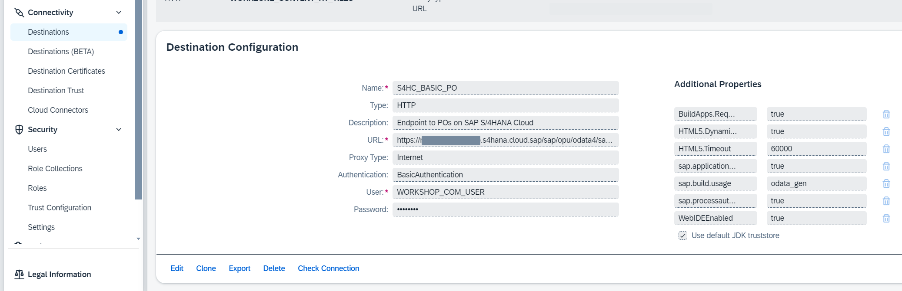

# Create SAP BTP Destination

This section will be demonstrated. It is not part of the hands-on exercise.

## Overview

1. SAP BTP Destination will be used by SAP Build Process Automation in runtime to access the data of purchase order and changing the custom field value. This destination will also be used in the design mode to get the Purchase Order API Metadata for creating actions. An example of such destination can be found in this [learning journey](https://learning.sap.com/learning-journeys/extending-sap-s-4hana-with-sap-build-apps-and-key-user-extensibility/establishing-connectivity-between-sap-s-4hana-cloud-and-sap-btp_f3d6df41-c36c-450b-8ae8-79534e043fa1).

2. The destination used in the workshop looks like this:

  

## Next Step

[Hands-on: Introduction](../handson/intro.md)
