# Create Actions

## Introduction

In this scenario we want to call APIs on the S/4HANA Cloud side (for example, to get the purchase order data or change the purchase order). To do this you need to create an Action Project to encapsulate APIs as actions in your business scenarios.

## Tutorial

1. Open your SAP BTP Subaccount. Go to **Services** > **Instances and Subscriptions**. Select three-dots-button in the **SAP Build Process Automation** line. Then choose **Go To Application** in the popup menu.

    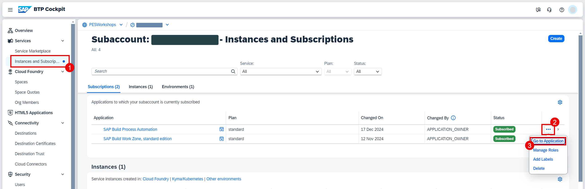

2. Choose **Actions** and then choose **Create**.

    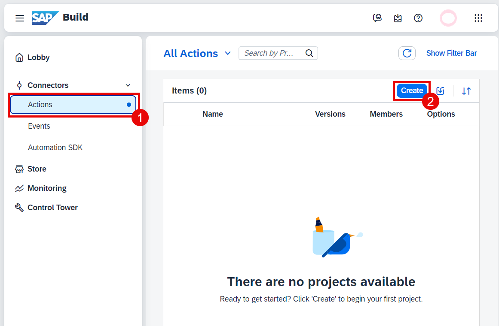

3. Choose **OData Destinations**.

    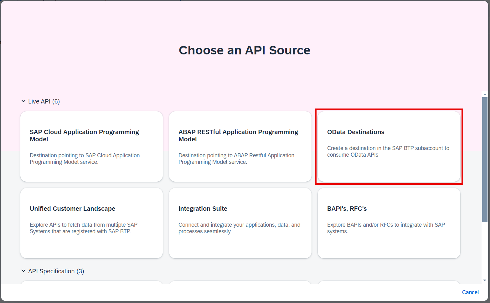

4. On the next screen you will see the list of available APIs. Just choose **Next**.

    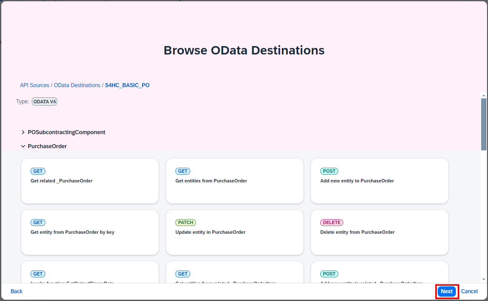

> The list of APIs comes from the only destination we have in the SAP BTP Subaccount. If we would have several destinations you had to select the necessary one as shown on the screenshot below. More details can be found [here](https://help.sap.com/docs/build-process-automation/sap-build-process-automation/using-other-sap-btp-destinations?version=Cloud).
>
>   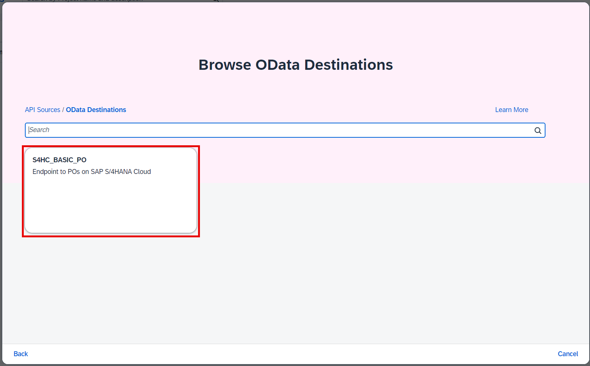

5. Enter the following information and then choose **Create**.

  - Enter **PO-API-{YOUR_ID}** in the **Project Name** field.
  - Enter some description in the **Description** field.

    Use the same unique ID instead of `{YOUR_ID}` as it was done in the exercises before.

    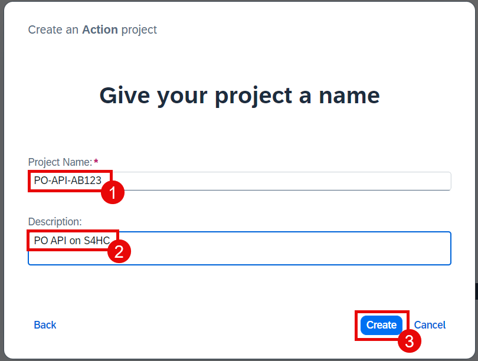

6. On the next screen select the two following actions in the **PurchaseOrder** section and then choose **Add**:

  - **Get entity from PurchaseOrder by key**
  - **Update entity in PurchaseOrder**

    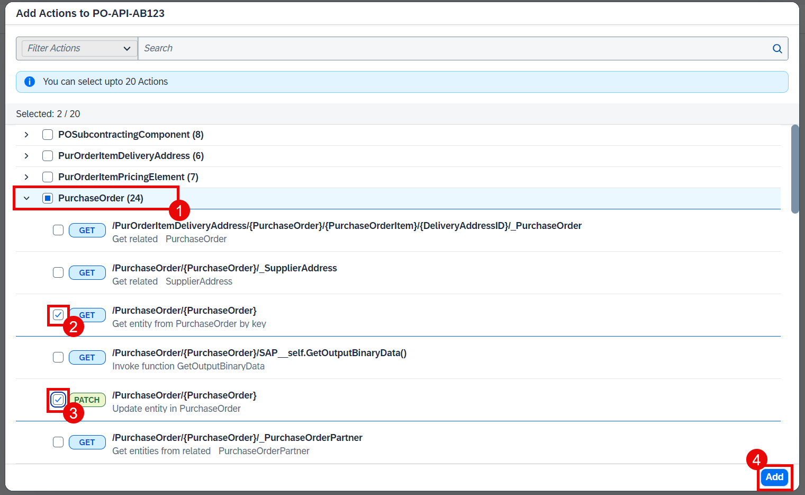

7. Choose **Settings** button with the gear icon in the right top corner. Go to **CSRF** section and choose **Enable CSRF**. Then choose **Save**.

    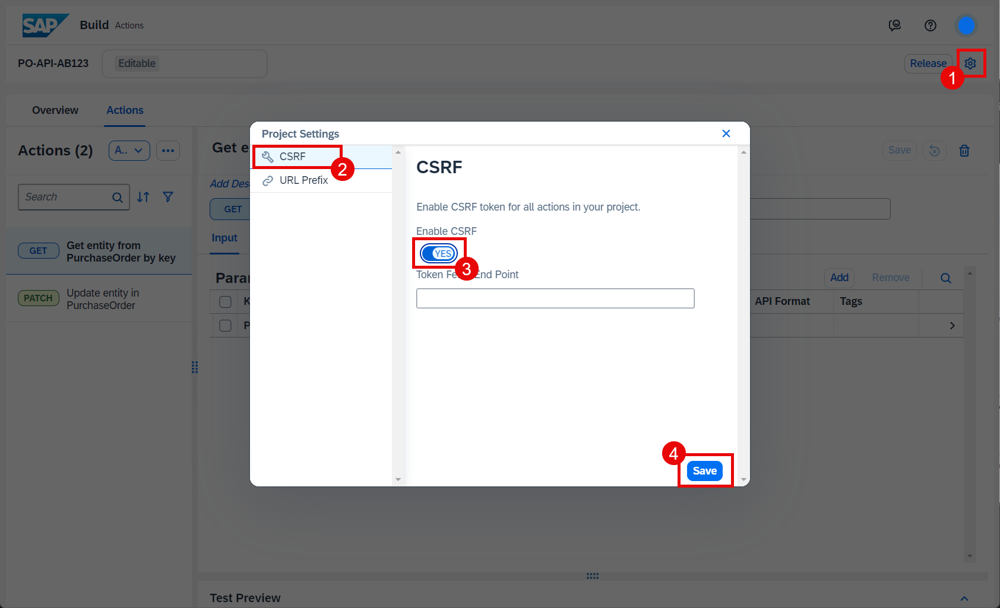

8. Select the first action (`GET`) and select the **Test** tab. Make sure that the destination **S4HC_BASIC_PO** is selected in the **Destination** listbox. Enter **4500000151** in the **PurchaseOrder** field and then choose **Test**.

    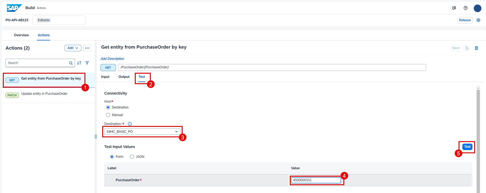

9. If everything is ok you will see the response payload with the status code **200**. Make sure that the payload contains the custom field **YY1_SCHECK_PDH**.

    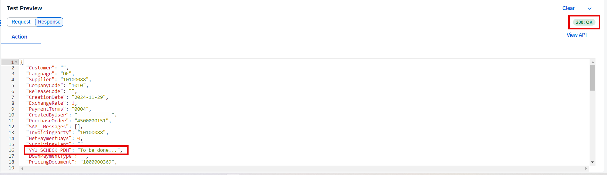

10. Choose **Release** button.

    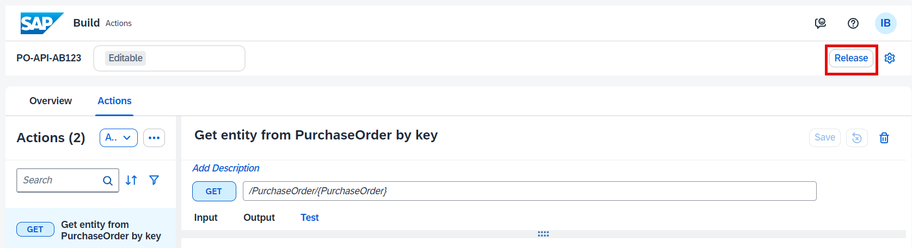

11. On the next screen choose **Release** button.

    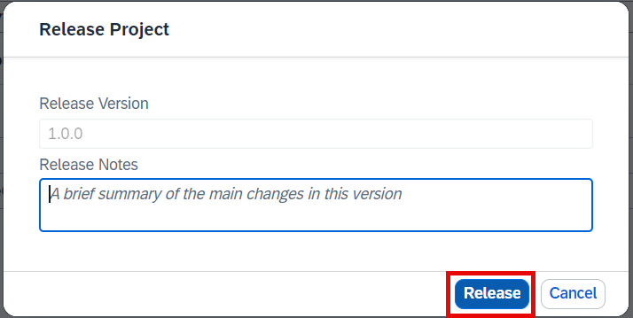

12. After the actions are released make sure that you have the released version open in the dropdown list at the top of the screen. Then choose **Publish**.

    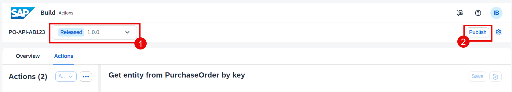

13. Confirm publishing by choosing **Publish**.

    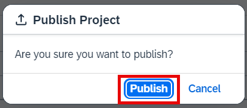

14. Now you can use the new actions in the extension project.

    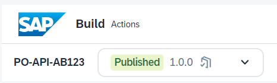

## Further Reading

[Create an Action Project](https://help.sap.com/docs/build-process-automation/sap-build-process-automation/create-actions-project?version=Cloud)

## Next Step

[Adjust the Process Automation Project](./adjust-project.md)
