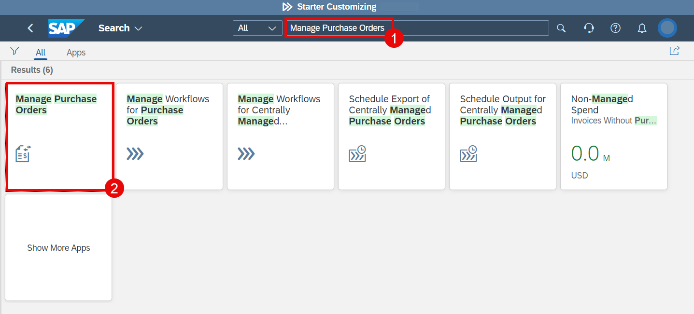
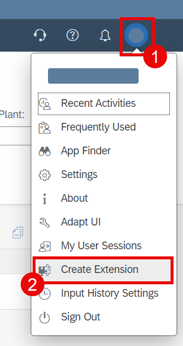
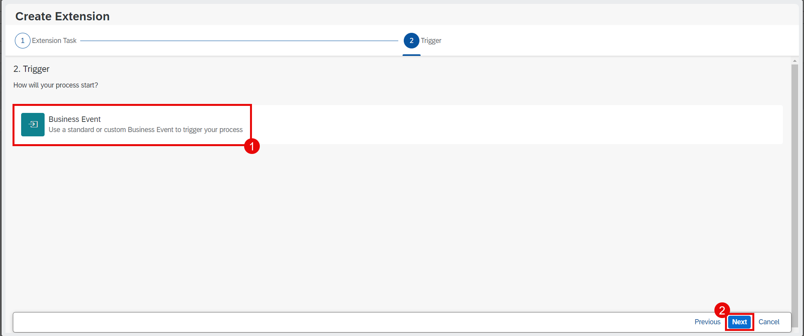
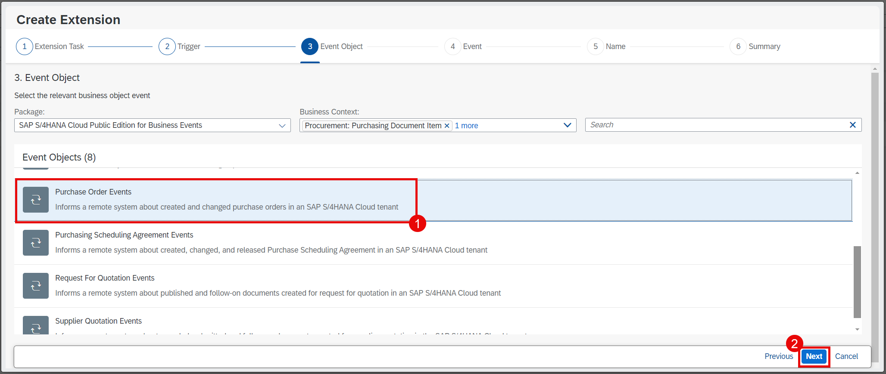
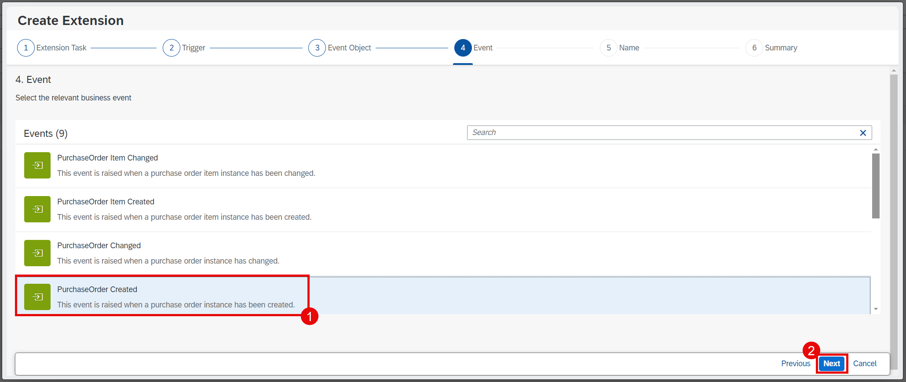
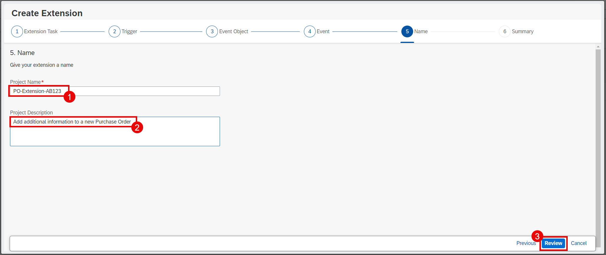
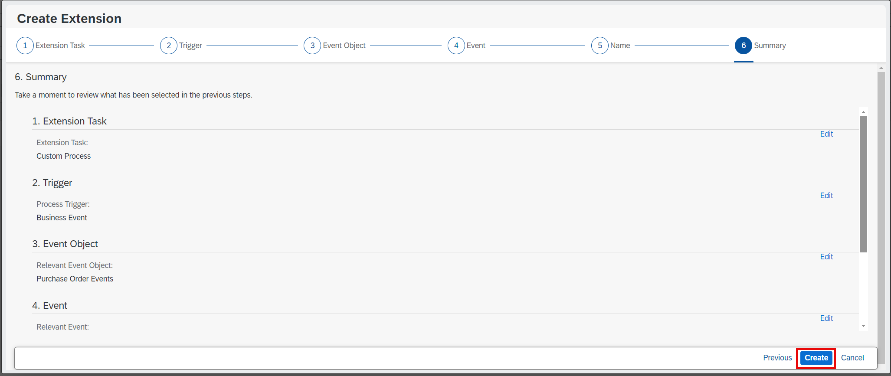
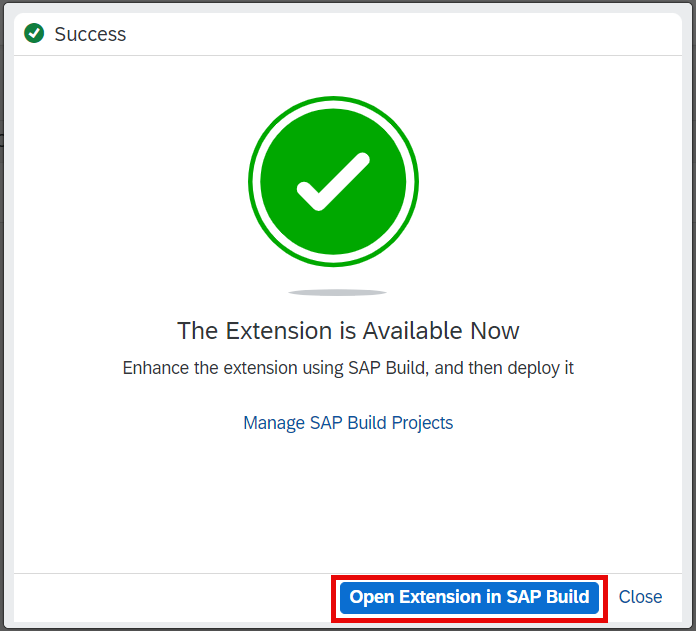
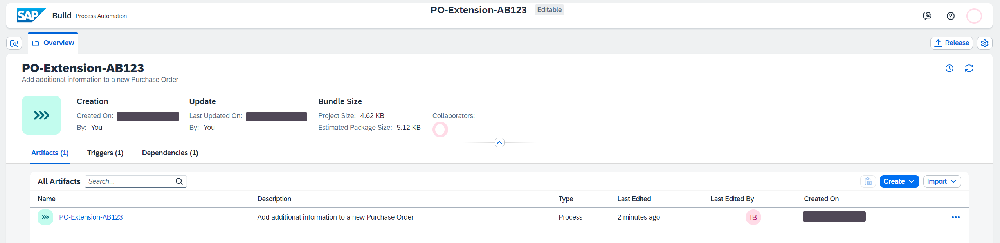

# Create an Extension Project

## Introduction

In this exercise, you will create a project in Process Automation right from within the S/4HANA Application. It enables the extension wizard to be context-aware and hides the technical complexity from the key user.

## Tutorial

1. Login to the S/4HANA Cloud cockpit and open the **Manage Purchase Orders** application.

    

2. In the right top corner, select an icon with your user initials. Choose the menu item **Create Extension** in the popup menu.

    

> If you get a `refuse to connect` error, open the application **Create Extension**. If that opens without error, repeat this tutorial from the beginning and you should be able to proceed.

3. Select the **Custom Process** tile and then choose **Next**.

    

4. Select **Business Event** as a trigger and then choose **Next**.

    

5. Select **Purchase Order Events** and then choose **Next**.

   On this screen you will see that some information (Package and Business Content) is already pre-filled. It comes as a context from the application where you started the extension process (in this tutorial - `Manage Purchase Orders` application). You only need to select a correct event object. 

    

6. Select **PurchaseOrder Created** event and then choose **Next**.

   That means that the extension process will be triggered every time when a new purchase order is created.

    

7. Enter the following information and then choose **Review**:

  - Enter `PO-Extension-{YOUR_ID}` in the **Project Name** field.
  - Enter any description in the **Project Description** field.

    Here and later in the tutorial you need to replace `{YOUR_ID}` with a unique ID. It's needed because all participants work in the same namespace. We recommend that you use your initials and some unique numbers (e.g. AB123 would give PO-Extension-AB123). Please use the same unique ID throughout the workshop.
   
    

8. On the next screen just choose **Create**.

    

   The creation process takes around 1 minute. Be patient and don't close your browser window.

9. On the next screen choose **Open Extension in SAP Build**. You will be navigated to SAP BTP.

    

10. Your new extension project in Process Automation will be shown on the screen.

    

## Next Step

[Create Actions](./create-actions.md)
