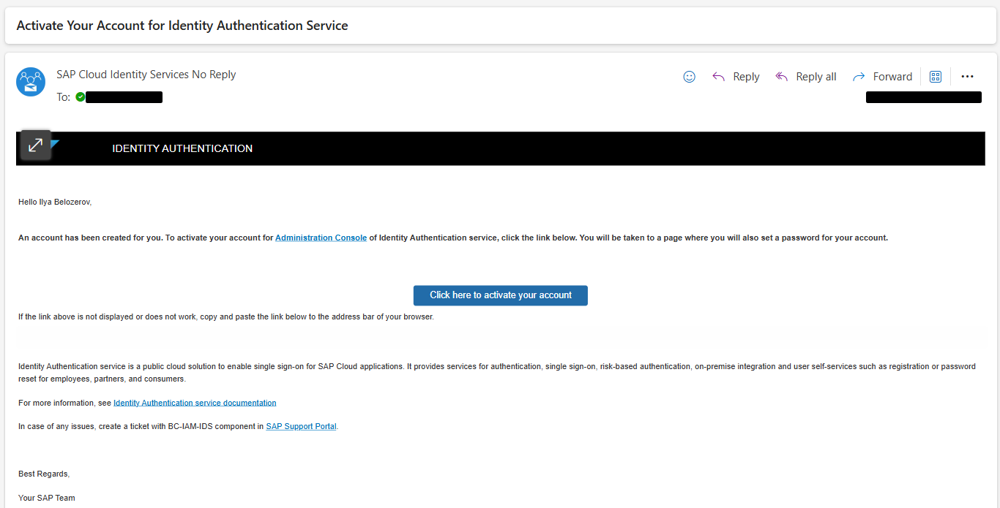

# Introduction

In the course of the next exercises you will sometimes find the placeholder **{YOUR_ID}**. You should come up with some unique user number (e.g. your initials and favorite number: James Bond would get JB007). All the screenshots will showcase an example for the ID *AB123*.

At the beginning of the workshop you got the links to SAP S/4HANA System and the SAP BTP subaccount owned by SAP. Don't try to use your own systems during the workshop.

Some time ago you received an email with account activation.

Follow the instructions mentioned there. You will create the credentials which will be used throughout the workshop. If you didn't get any email - contact the workshop administrators.

## Next Step

[Create an Extension Project](./create-extension.md)