# Test the Extension

## Introduction

The extension scenario is implemented. Let's test the whole process from the beginning. We will do the following steps:

- Create a purchase order
- Make sure that the custom logic works
- Make sure that the event is triggered
- Check that no queue messages have been stuck
- Check that the event reached the process automation instance
- Process the workflow item in the SAP Build Workzone
- Check that the process instance has been successfully processed
- Check that the purchase order has been updated

## Tutorial

1. In the SAP BTP subaccount, go to **Instances and Subscriptions** and select **SAP Build Work Zone, standard edition**.

    

2. Enter **{YOUR_ID}** (for example, *AB123*) in the search field at the top of the page. Then open your site with the **Go to site** button.

    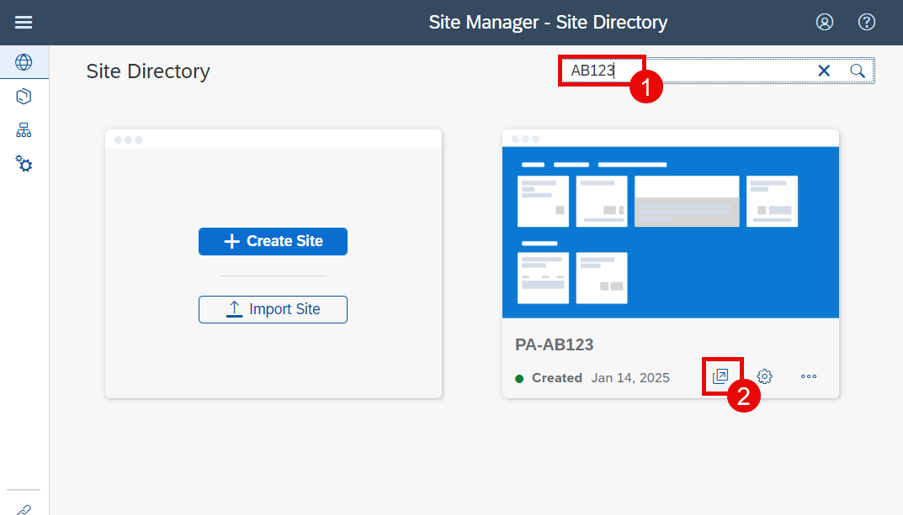

3. In the **Workshop for {YOUR_ID}** (for example, *Workshop for AB123*) space, select the **Manage Purchase Orders** application.

    

> If you don't see the space, reopen the browser completely. Must probably the role is cached wrong after you have assigned it in the previous exercise.

4. Choose **Create**.
  
    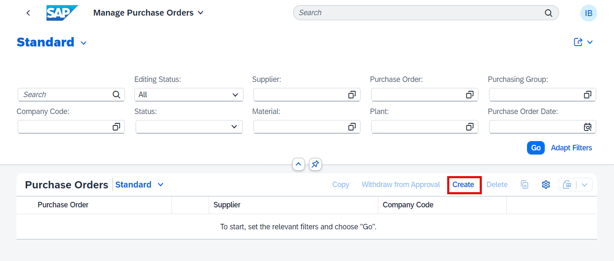

5. Enter the relevant data in the **General Information** section. 

    a. **Purchasing Doc. Type**: *Standard PO (NB)*
     
    b. **Supplier**: *10300001* 

    c. **Currency**: *EUR*

    d. **Purchasing Group**: *001*

    e. **Purchasing Organisation**: *1010*

    f. **Company Code**: *1010*

    

6. Press **Enter** on the keyboard. You will see that the custom field is filled by the custom logic code.

    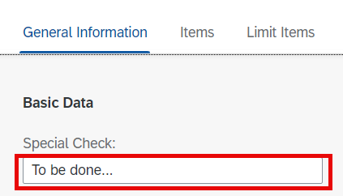

7. Create a new purchase order item.
   
    a. Go to the **Items** section

    b. Choose **Create**

    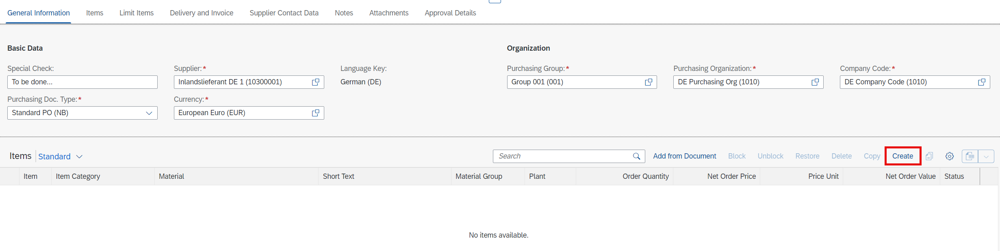

8. Enter the following data: 
   
    a. **Material**: *WORKSHOP*
   
    b. **Plant**: *1010*
   
    c. **Order Quantity**: *1 PC*
   
    d. **Net Order Price**: *0.50*
   
    e. **Price Unit**: *1 PC*
      
    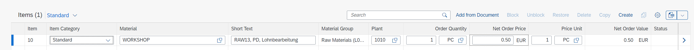

9. At the bottom of the Purchase Order application, choose **Order**.
   
    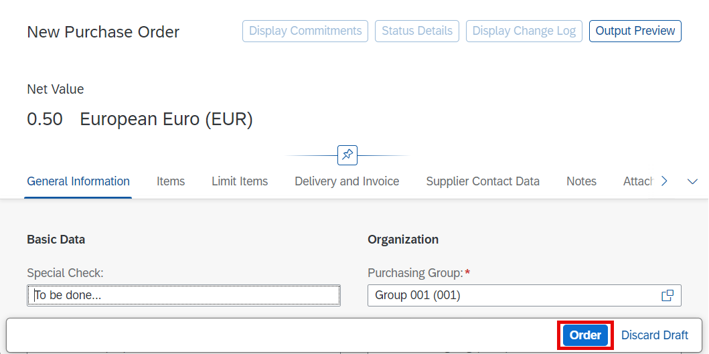

10. The purchase order will be created. Note the order number somewhere to check later in SAP Build Process Automation. Then choose the **SAP** logo icon to go back to the first screen of your site.

    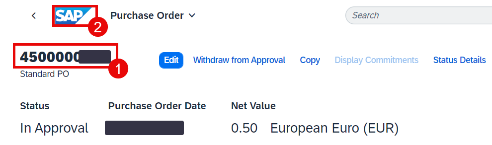

11. After the order is created the event should be triggered. Let's check it on S/4HANA side. Open the application **Enterprise Event Enablement - Event Monitor**.

    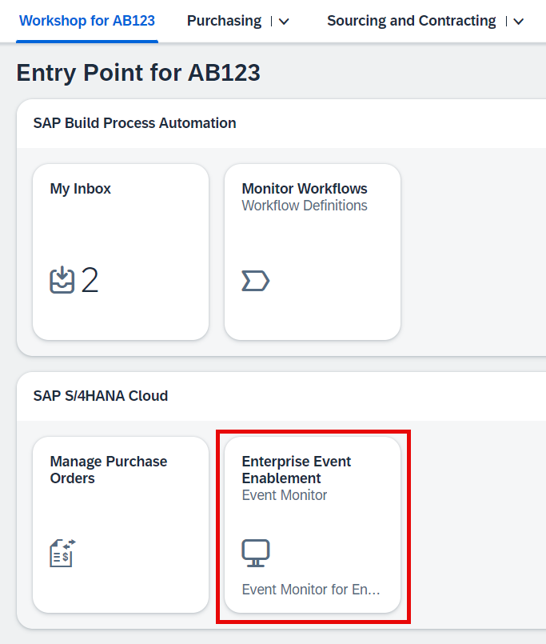

12. Select channel **SAP_CP_XF_PES4**.

    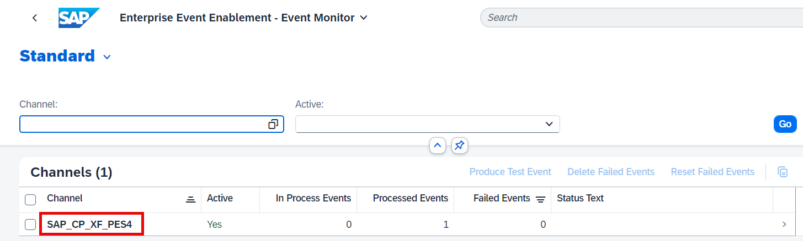

13. Here you can see the events with different statuses. If you don't see your event - then it's must probably processed already. Once the processing of an event is finalized, it is deleted from the queue after a certain time period. If want to analyse events do the following steps:

    a. Select the outbound queue for created purchase orders.

    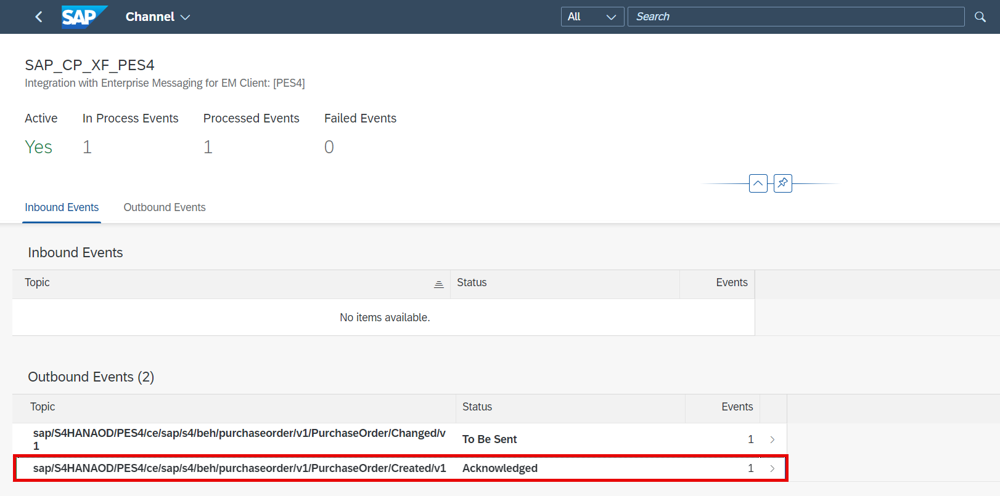

    b. Select an event.

    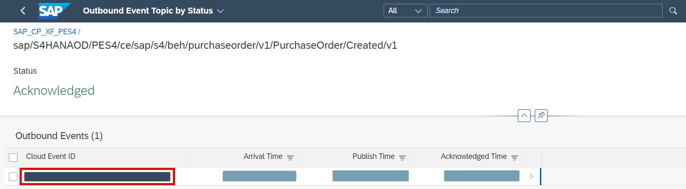

    c. You can analyze the payload. For example, find out which purchase order this event belongs to.

    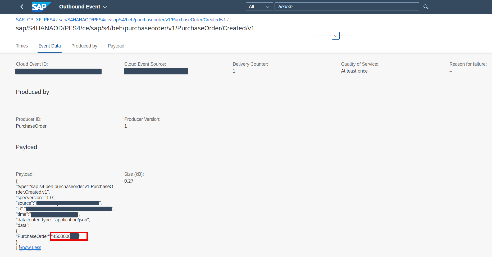

    d. When you finished, select the **SAP** logo icon to go back to the home screen of you website.

    

14. After the event reached the queue on the SAP BTP Event Mesh instance, the webhook will dispatch it to the SAP Build Process Automation. Let's check it. Open your SAP BTP subaccount and go to **Instances and Subscriptions**. Select **SAP Build Process Automation**.

    

15. Choose **Monitoring** on the left pane and then select **Acquired Events** tile.

    

16. Choose **Business Events** tab. Check that the event for your purchase order is in the list.

    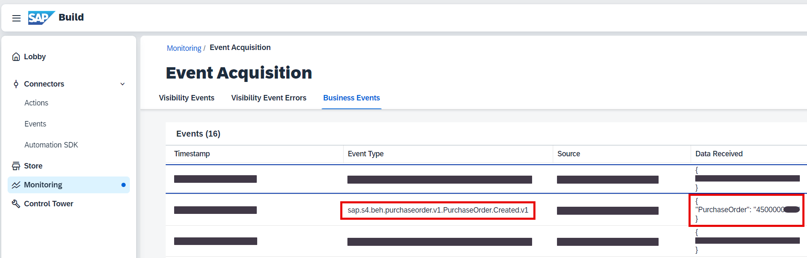

    Now the event will trigger your process and the workitem should reach your inbox. 

17. Go back to your workzone website (as described in the steps 1 and 2). Choose **My Inbox** app.

    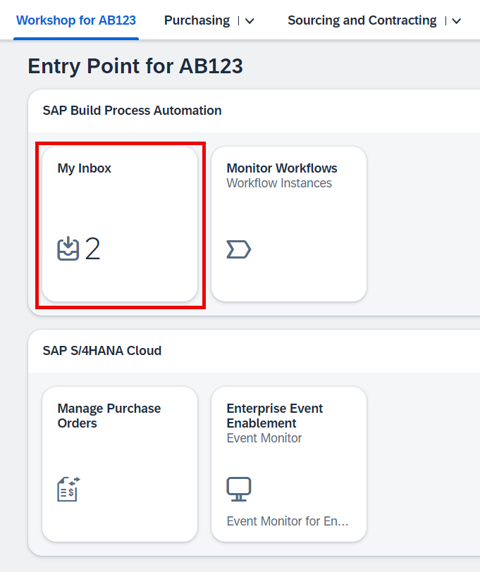

18. Find the workitem with your purchase order number. Enter **ok** in the form and then shoose **Submit**.

    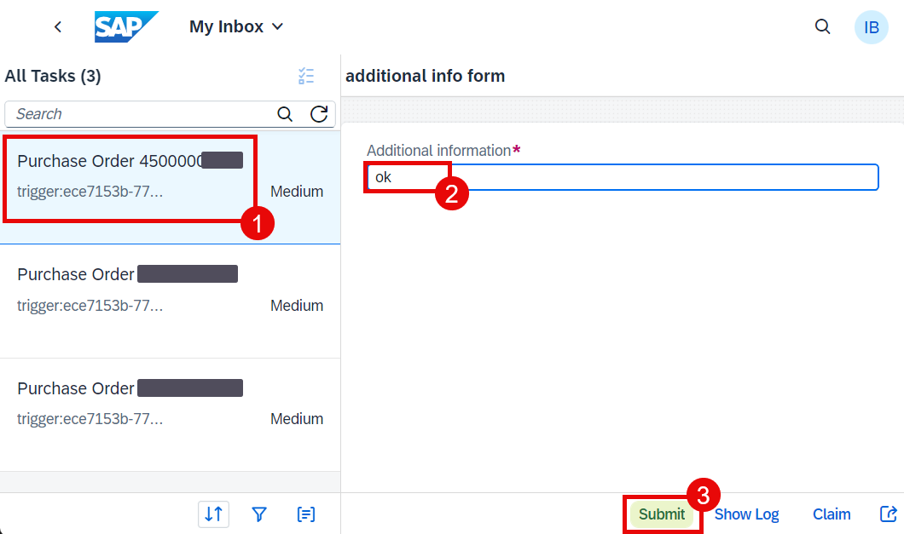

19. The custom field will be updated in the purchase order. Let's check it. Open application **Manage Purchase Orders** again. In the search field enter the number of your purchase order and then choose **Go**. Afterwards choose the found order.

    

20. You should see now that the custom field has been updated.

    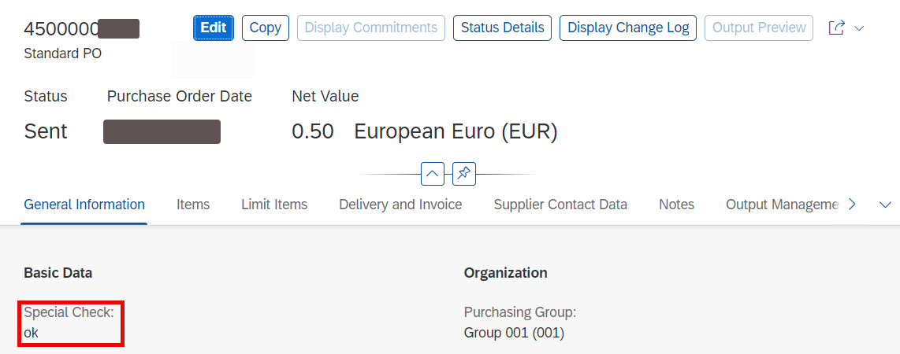

> If the custom field hasn't been changed, then there was something wrong with the process. Open application **Monitor Workflows** on your SAP Build Workzone website.
>
>    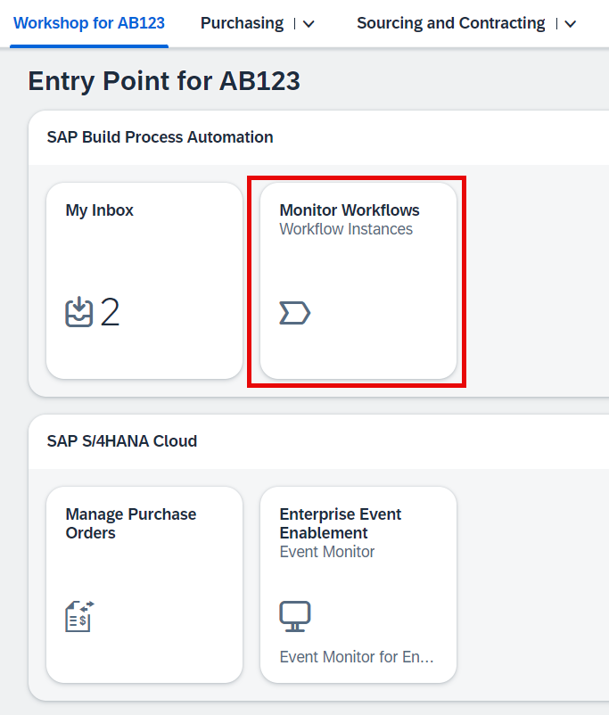
>
> Must probably you will see the error workitem. Select it.
>
>    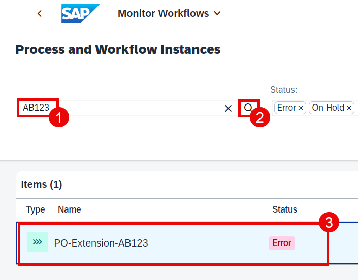
>
> You can check the log or retry the process step.
>
>    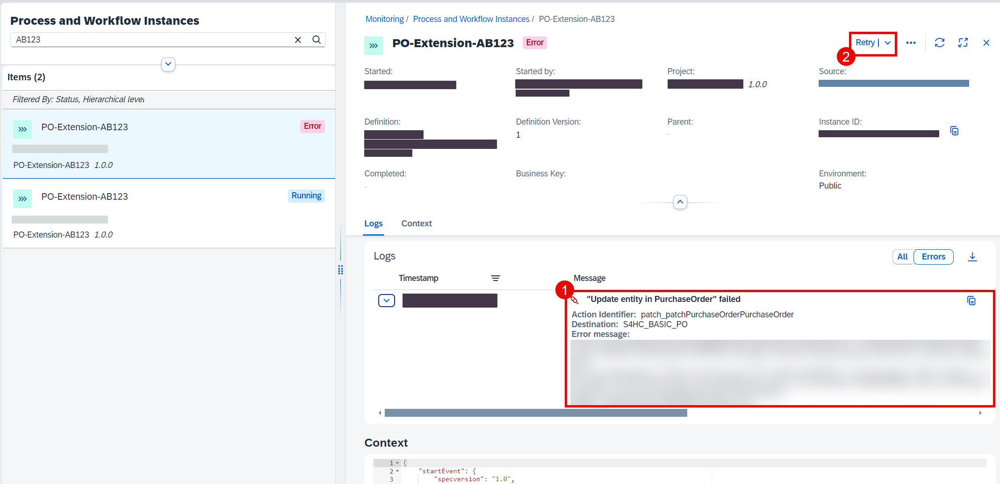

## Next Step

Congratulations! That was the last step for the hands-on part of this workshop. You've created a side-by-side extension without any coding right from the S/4HANA Cloud interface.

[System preparation: Introduction](../admin/intro.md)