# Workzone Setup

## Introduction

As we want to have a seamless environment for all the apps in the business process, we will create a central entry point using SAP Build Workzone. It allows to manage purchase orders, access the inbox with workitems, and monitor the whole process.

## Tutorial

1. Go to your SAP BTP Subaccount and choose **Instances and Subscriptions**. Then select **SAP Build Work Zone, standard edition**.

    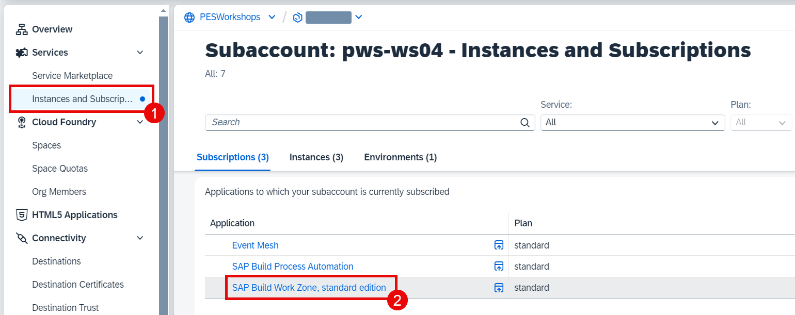

2. Choose the **Content Manager** icon on the left side. Select **Create** > **Page**.

    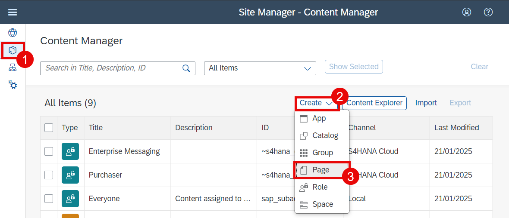

3. Enter **Entry Point for {YOUR_ID}** (for example, *Entry Point for AB123*) to the **Page Title** field. Then choose **Add Section**.

    

4. Choose the **Hide Header** icon. Then choose **Add Widget**.

    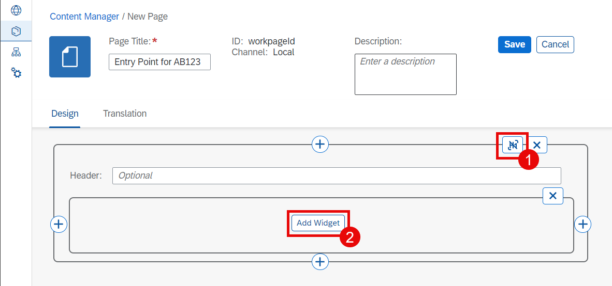

5. Choose **Tiles**.

    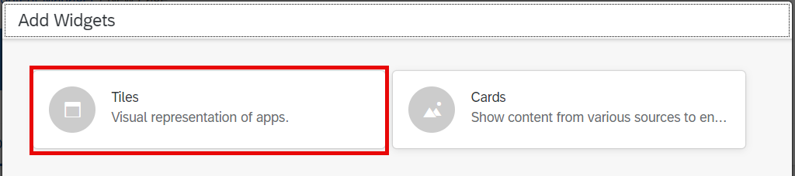

6. Switch to the list mode with the **List** icon. Then find **My Inbox** and **Monitor Workflows** (Workflow Instances) apps and choose them (only one of each if duplicates exist). Afterwards choose **Add (2)**.

    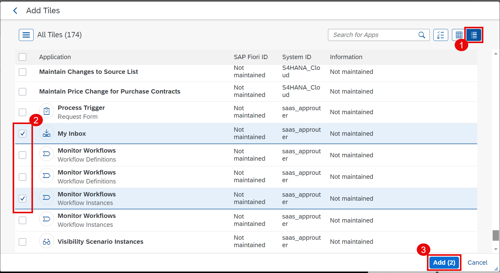

7. Enter **SAP Build Process Automation** in the **Header** field and then choose **Add Widget**.

    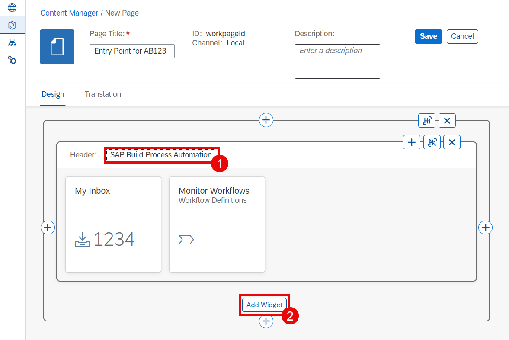

8. Choose **Tiles**.

    

9. Select **Tiles** mode icon. In the search field enter **Manage Purchase Orders** and choose **Search** icon. Select the found app.

    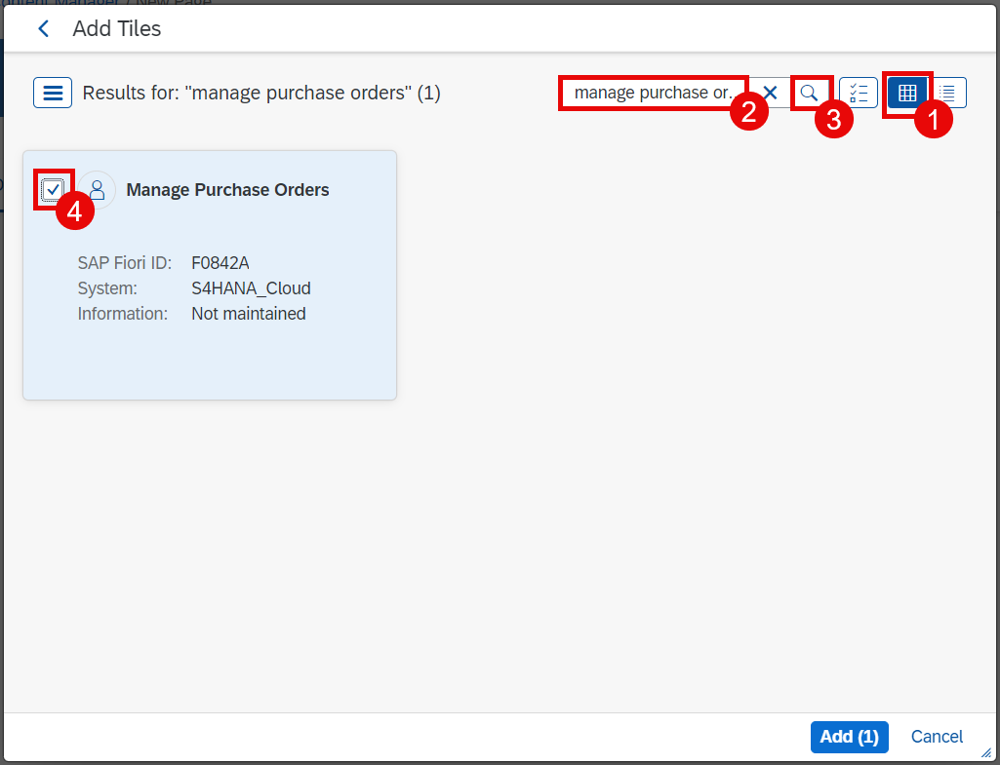

10. In the search field enter **Event Monitor** and choose **Search** icon. Select the found app. Then choose **Add (2)**.

    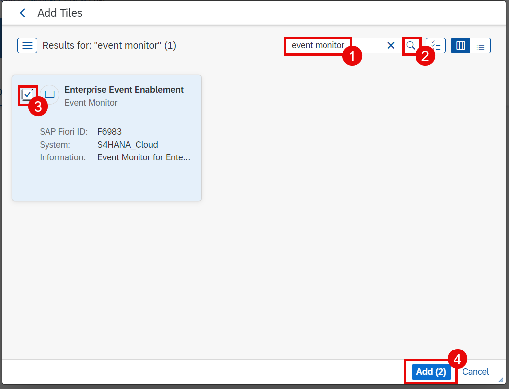

11. Enter **SAP S/4HANA Cloud** in the second **Header** field. Then choose **Save**.

    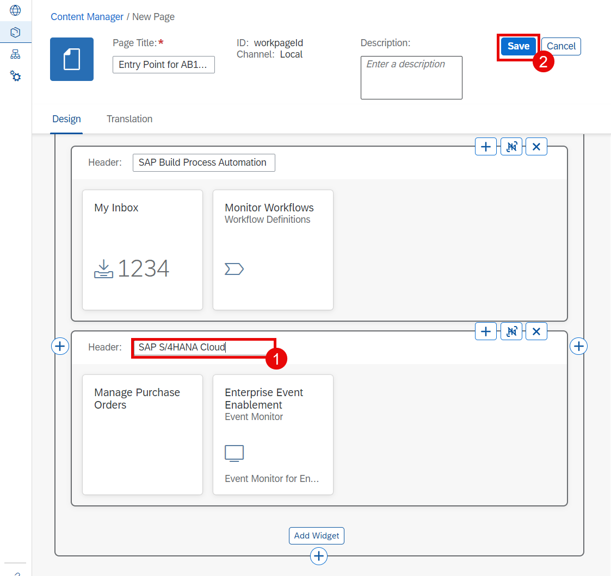

12. Choose the **Content Manager** icon on the left side. Select **Create** > **Space**.

    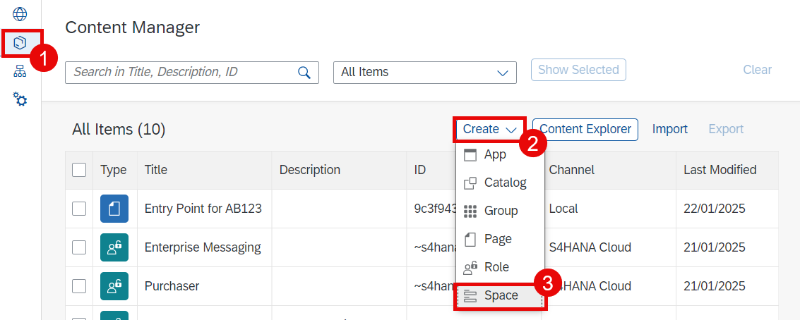

13. Enter **Workshop for {YOUR_ID}** (for example, *Workshop for AB123*) in the **Space Title** field. Then search for **{YOUR_ID}** and select the **Assignment Status** for the found page **Entry Point for {YOUR_ID}** (for example, *Entry Point for AB123*). Afterwards choose **Save**.

    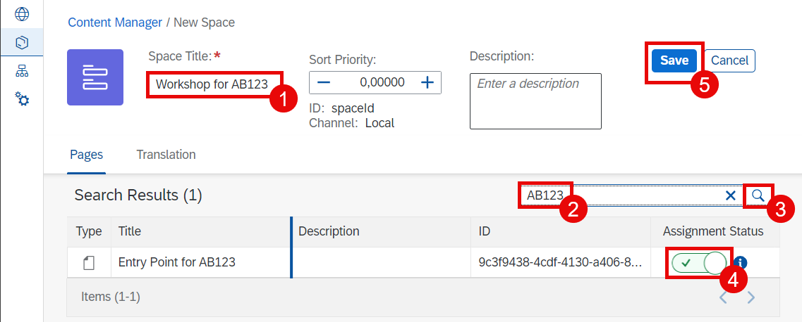

14. Choose the **Content Manager** icon on the left side. Select **Create** > **Role**.

    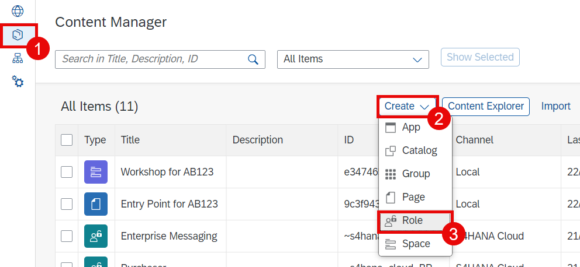

15. Enter **Workzone for {YOUR_ID}** (for example, *Workzone for AB123*) in the **Role Title** field. Select the **Assignment Status** for the **My Inbox** and **Monitor Workflows** apps. Afterwards choose **Spaces** tab.

    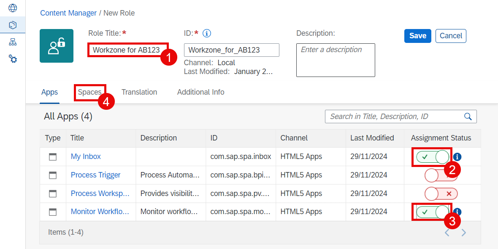

16. Search for **{YOUR_ID}** (for example, *AB123*) and then select the **Assignment Status** for the found space **Workshop for {YOUR_ID}** (for example, *Workshop for AB123*). Afterwards choose **Save**.

    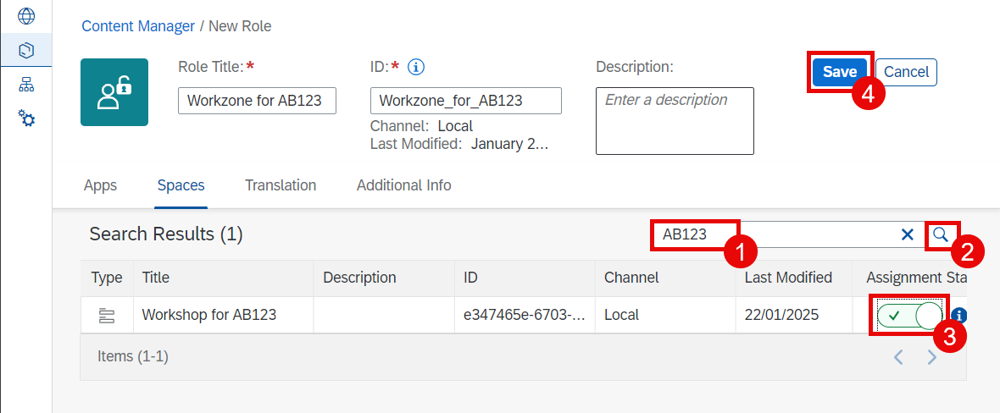

17. Choose the **Site Directory** icon on the left side. Select **Create Site**.

    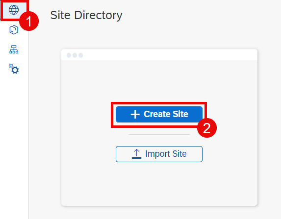

18. Enter **PA-{YOUR_ID}** (for example, *PA-AB123*) in the **Site Name** field. Then choose **Create**.

    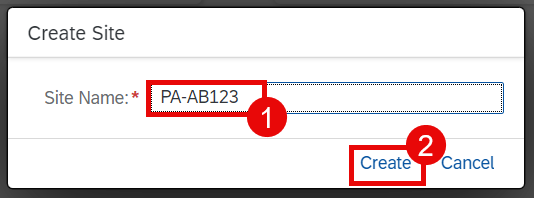

19. Choose **Edit**.

    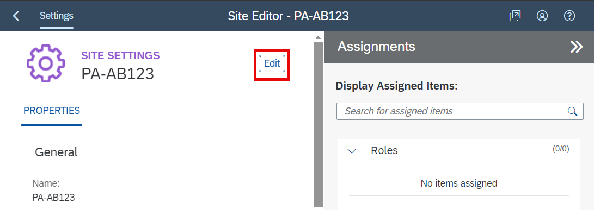

20. Select **Spaces and Pages - New Experience** checkbox in the **View Mode** group at the **Display** section. Then choose the field **Assign Items** in the **Assignments** right pane. Choose the following roles: **Enterprise Messaging**, **Purchaser**, and **Workzone for {YOUR_ID}** (for example, *Workzone for AB123*). You can use search field above. Afterwards choose **Save**.

    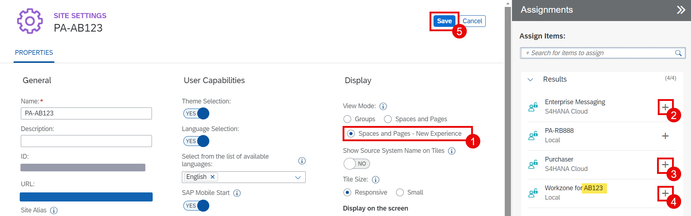

21. The site is ready now. You need to assign the role to your user. Go to the SAP BTP Subaccount. Choose **Security** > **Role Collections**. In the search field enter **{YOUR_ID}** and then choose the search icon. Select the found role collection **Workzone_for_{YOUR_ID}** (for example, *Workzone_for_AB123*).

    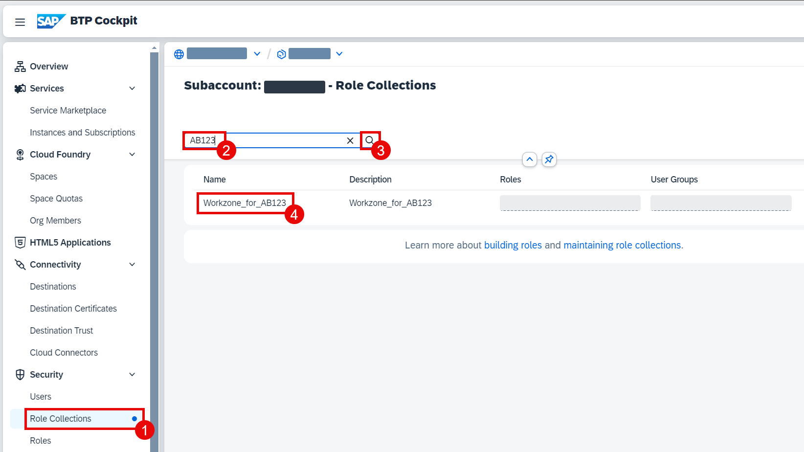

22. Choose **Edit**.

    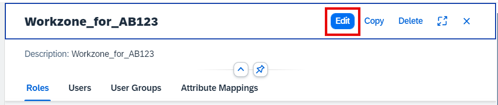

23. Enter your email address in the **ID** field under the **Users** section. You will get a popup with the user details. Select the line with your address, making sure that the identity provider is for application users, and then choose **Save**.

    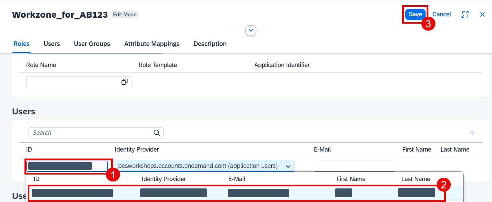

## Next Step

The workzone site is now ready and the roles are assigned. Let's proceed with the tests.

[Test the Extension](./test.md)
