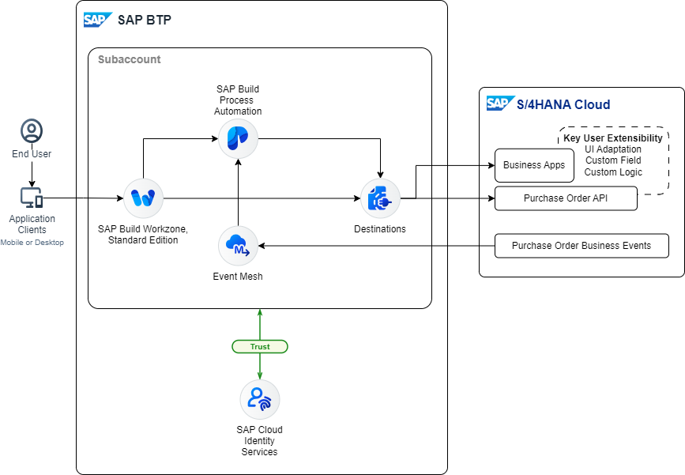

# Solution Architecture

The proposed solution consists of the several components:

1. End user works in a standard procurement business application in S/4HANA Cloud. This application was enhanced with the Key User Extensibility feature. A custom field was added.

2. When a purchase order is created, a business event is generated. It goes to the queue of the Event Mesh instance on SAP BTP.

3. A webhook in the queue triggers a process in SAP Build Process automation. 

4. The process gets the purchase order data via an SAP BTP destination.

5. If the purchase order data corresponds to some condition, then the workflow starts.

6. Via SAP Build Workzone website the processor can check all the workitems in the *My Inbox* application. The processor can put some comment for the workitem and this data goes back to the S/4HANA Cloud system.

7. The end user can also check the purchase order directly from the SAP Build Workzone website.

## Next Step

The theory is over. Now it's time to see how to implement the solution in the system.

[Extend Purchase Order Business Object: Important information](../extend/README.md)