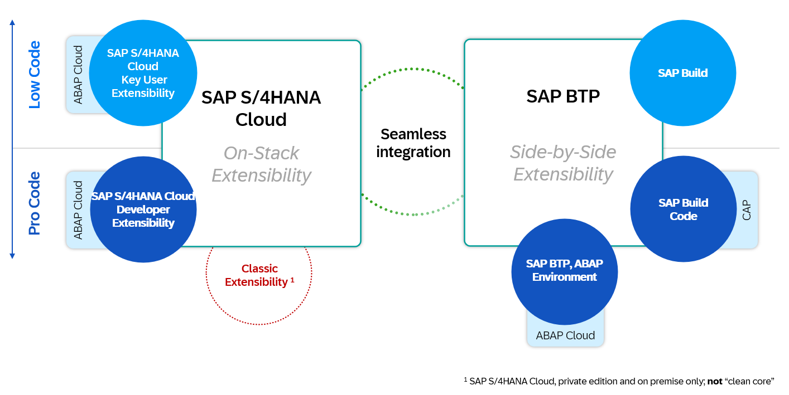
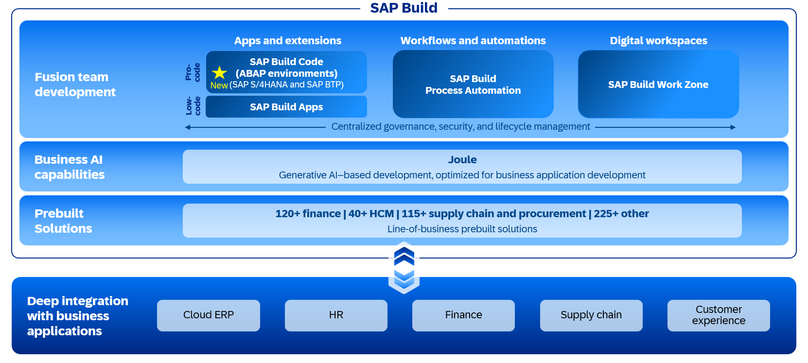
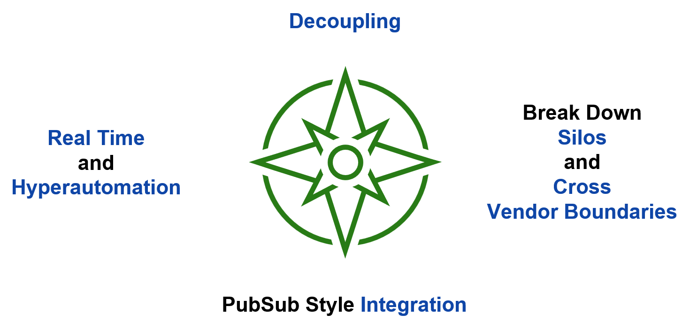
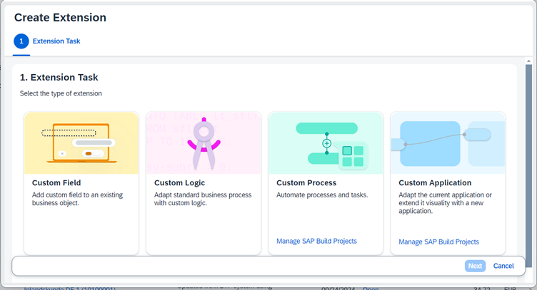

# Introduction

Extensibility covers a broad spectrum of topics that allow customers and partners to adapt standard business software to their business needs. This includes business configuration, integration, custom fields, and logic, layout adaptation of user interface (UI), forms, and reports. It also covers custom terminology and translation for customer-specific applications.

Extensibility in SAP S/4HANA Cloud can be divided into three parts:
* Side-by-side extensibility through SAP Business Technology Platform
* Key User extensibility through built-in capabilities
* Developer extensibility through custom ABAP code

SAP Build is a business application development and automation solution with a comprehensive suite of low-code, pro-code, and generative AI tools. SAP Build is comprised of:
* SAP Build Code for application development with generative AI, optimized for Java and JavaScript application development.
* SAP Build Apps for creating and augmenting enterprise applications quickly and visually with low-code development.
* ABAP environments for developing applications and extensions, offering the flexibility of side-by-side deployment on SAP BTP or on-stack integration with SAP S/4HANA Cloud.
* SAP Build Process Automation for building process flows and automating manual tasks with drag-and-drop simplicity.
* SAP Build Work Zone for designing digital workspaces to connect and collaborate across enterprise applications in one place. 

An event-driven architecture (EDA) is an integration model built to publish, capture, process, and respond to events across distributed systems in real time. When an event occurs in one application, a message is automatically sent to all the other applications that need to know about it, so they can act on it in turn.

Event-based architectures are decoupled – meaning applications don’t need to be aware of each other to share information and complete tasks. Event information, or messages, can flow freely and automatically between apps. As a result, the EDA model is much faster than the traditional request/response model, where one application must request the specific information it needs from another and wait for a response before moving on to the next task. Also due the decoupled nature of an EDA, they are widely considered best practice for microservice communication.

The set of available tools may be overwhelming at first sight, so how to find the right one? And – if you found the right tool, how do you find the right API or extension point to extend the application you are interested in? SAP has introduced an Extensibility Wizard. Use the S/4HANA Cloud Public Edition extensibility wizard to easily create on-stack extensions, like custom fields and custom logic, as well as side-by-side extensions, such as custom processes, in SAP Build Process Automation.

## Next Step

[Business Use Case](./use-case.md)