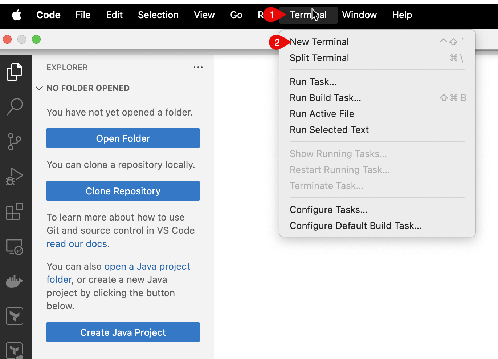

 # Set up Project

 You need to have the base CAP application to begin with. You can quickly generate the CAP application by using the notebook by following these steps:

1. Click [Here](https://github.com/SAP-samples/incidents-app/archive/refs/heads/main.zip) to download the base Incident Management application.

2. Create a new folder **Handson** in the **desktop**, if the folder is already there, create a new folder with a unique name like **Handson-firstname**.

3. Copy the downloaded archive **incident-management** to the **Handson** directory and unzip the archive.

4. Open **incident-management** folder in the VSCode

5. Go to **Terminal - New Terminal**.
 
    

6. Run the command

    ```sh
    npm install
    ```
7. Run the command

    ```sh
    cds watch
    ```

7. Open the application in browser: `http://localhost:4004`
