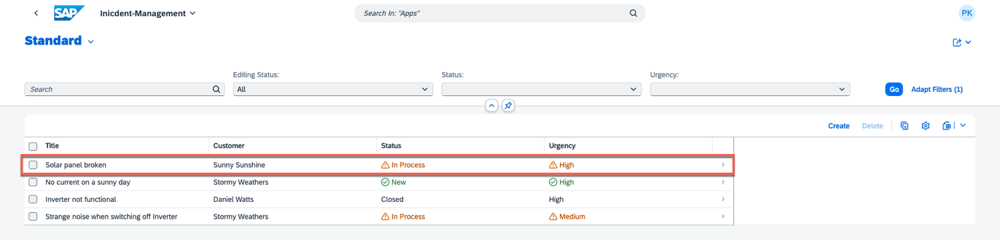
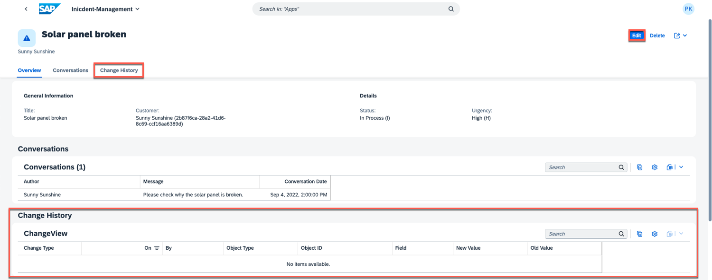
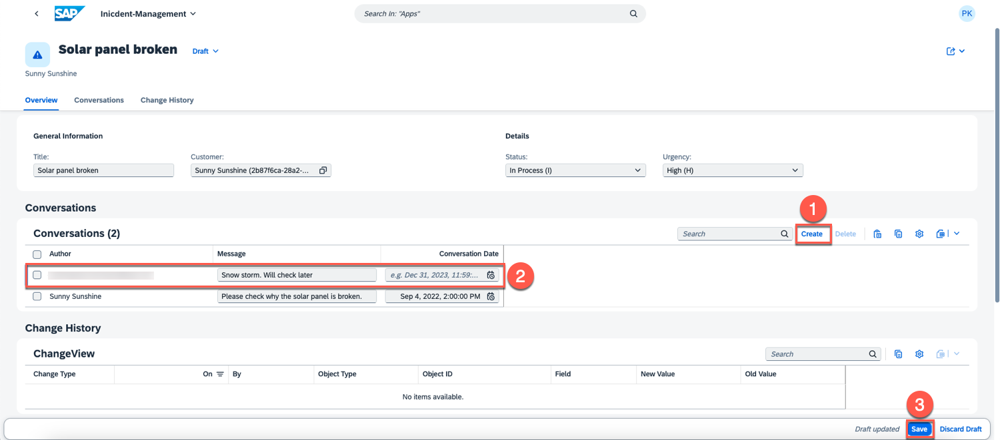
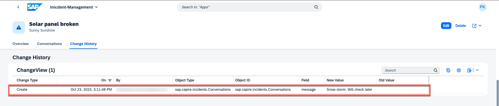
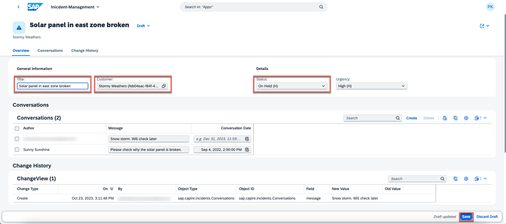
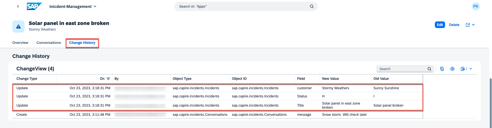

# Change Tracking

The Change Tracking feature is designed to help you monitor and manage modifications to your data and content. It empowers you to manage changes effectively and make informed decisions. The  change tracking is implemented using [@cap-js/change-tracking](https://www.npmjs.com/package/@cap-js/change-tracking) package.  `@cap-js/change-tracking` is a [CDS plugin](https://cap.cloud.sap/docs/node.js/cds-plugins#cds-plugin-packages) providing out-of-the box support for automatic capturing, storing, and viewing of the change records of the modeled entities.

## Add Change Tracking Plugin
Since you already have the Incident Mnagement application set up in your preferred IDE, let's include the following *npm* dependency.

1. Open **Terminal** -> **New Terminal**
2. Run the following command

```sh
npm add @cap-js/change-tracking
```

The package is a *cds-plugin*, which means it automatically handles many aspects, reducing the need for extensive configurations and annotations.

## Annotate the Models

Once you've included the *cds-plugin*, proceed to insert the `@changelog` annotations into the entities that you want to track changes for in the `services.cds` file.

Navigate to `srv/processor-service.cds` from the project's root directory and add the below annotations to it.

```cds
annotate ProcessorService.Incidents with @changelog: {
  keys: [ customer.name, createdAt ]
} {
  title    @changelog;
  status   @changelog;
  customer @changelog: [ customer.name ];
};

annotate ProcessorService.Incidents.conversation with @changelog: {
  keys: [ author, timestamp ]
} {
  message  @changelog;
}
```

In this context, the entities **Incidents** and **Conversations** have been annotated to monitor changes, specifying key fields and attributes to be tracked selectively. For instance, we have chosen to track modifications for the **title**, **status**, and **customer** attributes specifically, rather than monitoring all fields.

## Test the Flow

To test the functionality and flow of our change tracking feature, we will go through a simple scenario. In this section, we will make changes to a sample dataset, track those changes using the feature, and then explore the change history to observe how it captures and records modifications. 
Let's get started!


1. Open the Incident Management application locally by running `cds watch` in the terminal.

2. Open `http://localhost:4004` and open the incidents web application.
3. If it asks for login, enter username as `alice` and password field should be left blank.

4. It displays a list of incidents. Open an incident and modify its details.



3. Upon opening an incident, you can see an additional tab called **Change History**. This tab displays details about modifications made to the fields marked for change tracking during the **implementation** phase. To add a new conversation, choose **Edit**.



4. Create a new conversation and choose **Save**.



5. Since the **message** field of the **conversation** entity has been marked for change tracking, it should be visible in **Change History**. To see the change history, choose **Show More** and choose the **search icon**. This will load the change tracking data. 



Both the old and updated values of the message field are shown, along with the type of the change, user ID and the timestamp of the modification.

6. In **Change History**, you have the option to modify the incident's title, status, or customer, and view the changes.





# Summary

Congratulations, you have successfully implemented and tested the change tracking feature in your application.
