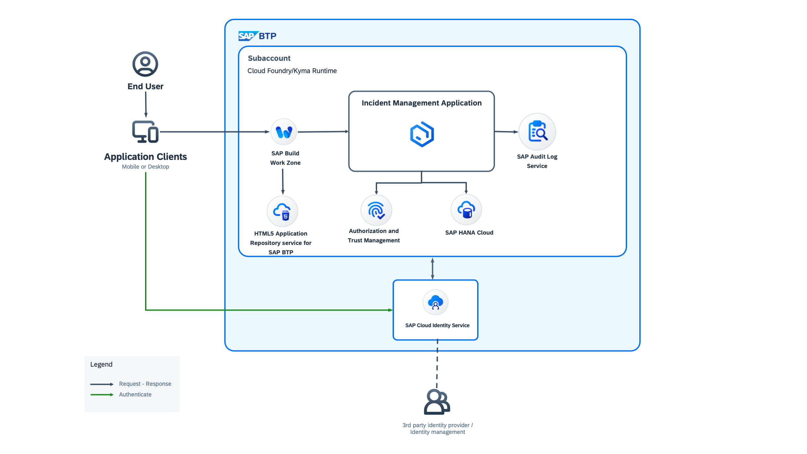

# Audit Logging

Audit logs are security relevant chronological records that provide evidence for system activities, such as system accesses and operations performed in a given period. 


## SAP Audit Log Service

The SAP Audit Log service stores audit logs written by SAP BTP services that represent different actions taken over your account and data.
There are predefined audit categories, which represent the kinds of actions:

- Data protection and privacy related
    - **audit.data-access:** read-access logging records for access to sensitive personal data;

    - **audit.data-modification:** data modification logging records for sensitive personal data.

- Security related
    - **audit.security-events:** logging of general security events like login, logout, and others;

    - **audit.configuration:** logging of security critical configuration changes.



## Annotate Personal Data

In order to automate audit logging, personal data management, and data retention management as much as possible, the first and frequently only task to do as an application developer is to identify entities and elements (potentially) holding personal data using **@PersonalData** annotations.
<br/>
Annotate the domain model in a separate file `srv/data-privacy.cds` and fill it with the following content:

```js
using {sap.capire.incidents as my} from './services';
using {
  cuid,
  managed
} from '@sap/cds/common';


annotate my.Customers with @PersonalData: {
  EntitySemantics: 'DataSubject',
  DataSubjectRole: 'Customer',
} {
  ID         @PersonalData.FieldSemantics : 'DataSubjectID';
  firstName     @PersonalData.IsPotentiallyPersonal;
  lastName      @PersonalData.IsPotentiallyPersonal;
  email         @PersonalData.IsPotentiallyPersonal;
  phone         @PersonalData.IsPotentiallyPersonal;
  creditCardNo @PersonalData.IsPotentiallySensitive;
}

annotate my.Addresses with @PersonalData: {
  EntitySemantics: 'DataSubjectDetails'
} {
  customer      @PersonalData.FieldSemantics: 'DataSubjectID';
  city          @PersonalData.IsPotentiallyPersonal;
  postCode      @PersonalData.IsPotentiallyPersonal;
  streetAddress @PersonalData.IsPotentiallyPersonal;
}


```
## Add the Plugin

1. Add the following plugin package to your project

```sh
npm add @cap-js/audit-logging
```

2. Build the application by executing the below command

```sh
npm i
```

The package is a *cds-plugin* and thereby auto-writes many things so configurations and annotations are reduced to a minimum. 

## Test Locally
The steps above is all you need to automatically log personal data-related events. 

1. Create a file `request.http` with the following content:
   
    ```
    @host = http://localhost:4004

    ### Service

    ### Reading sensitive data (creditCardNo) by default - NOT recommended!
    
    GET {{host}}/odata/v4/processor/Customers
    Authorization: Basic alice:wonderland

    ### Recommendation: Avoid reading sensitive data by explicitly selecting the fields you need
    GET {{host}}/odata/v4/processor/Customers?$select=name
    Authorization: Basic alice:wonderland

    ### AdminService

    ### Creating a customer with personal data
    # @name create_customer
    POST {{host}}/odata/v4/admin/Customers
    Authorization: Basic alice:wonderland
    Content-Type: application/json

    {
      "ID": "{{$guid}}",
      "firstName": "Bob",
      "lastName": "Builder",
      "email": "bob.builder@example.com"
    }

    ### Updating a customer with personal data details
    @customer = {{create_customer.response.body.ID}}
    PATCH {{host}}/odata/v4/admin/Customers('{{customer}}')
    Authorization: Basic alice:wonderland
    Content-Type: application/json

    {
      "addresses": [
        {
          "city": "Walldorf",
          "postCode": "69190",
          "streetAddress": "Dietmar-Hopp-Allee 16"
        }
      ]
    }
    
    ```
    
3. Add `admin` role to  `alice` in `package.json`.
    ```json
    "alice": {
                  "roles": ["support", "admin"]
                }   
    ```
    > User need `admin` role to access `admin` service and modify the customer's details.
4. Start the server.
    ```bash
      cds watch
    ```
5. Send the requests and observe the response having logs from `[audit-log]` with `PersonalDataModified` and `SensitiveDataRead` events.


## Adding Custom Audit Logs
As part of audit logs, there can be cases where you want to genereate custom audit logs. For example if you want to log 403 - Forbidden events when an user is not having roles but is still trying to access certain data. 
This can be achieved by adding custom handlers in a CAP application. 


## Add custom Audit Log into a CAP Application
CAP provides different handlers that can be used to catch events and add custom logic like custom audit logs. To do so add the following:

1. Create a file `server.js` at root of your CAP application.
2. Add the following code: 

    ```javascript
    const cds = require('@sap/cds')

    let audit

    cds.on('served', async () => {
    audit = await cds.connect.to('audit-log')
    })

    const audit_log_403 = (resource, ip) => {
    // we need to start our own tx because the default tx may be burnt
    audit.tx(async () => {
        await audit.log('SecurityEvent', {
        data: {
            user: cds.context.user?.id || 'unknown',
            action: `Attempt to access restricted resource "${resource}" with insufficient authority`
        },
        ip
        })
    })
    }

    // log for non-batch requests
    cds.on('bootstrap', app => {
    app.use((req, res, next) => {
        req.on('close', () => {
        if (res.statusCode == 403) {
            const { originalUrl, ip } = req
            audit_log_403(originalUrl, ip)
        }
        })
        next()
    })
    })

    // log for batch subrequests
    cds.on('serving', srv => {
    if (srv instanceof cds.ApplicationService) {
        srv.on('error', (err, req) => {
        if (err.code == 403) {
            const { originalUrl, ip } = req.http.req
            if (originalUrl.endsWith('/$batch')) audit_log_403(originalUrl.replace('/$batch', req.req.url), ip)
        }
        })
    }
    })

    module.exports = cds.server
    ```

Here in this custom code we are trying to generate `security-events` for  `403` `forbidden` events. This can be modified to include any other events as well.

## Test Locally

Lets try out how the custom audit log works by executing some local rest calls.

1. Take care that your server is up and running. If not, start the server via:

   ```bash
   cds watch
   ```

2. We use the SAP Business Application Studio Rest Extension to run Rest Calls.

   In the file `request.http` update the following request parameters:

   ```md
   # References
   @host = localhost:4004
   
   # Service
   
   ## 
   ### Get all properteis of all Customers will create Audit Log
   curl -X GET 'http://{{host}}/odata/v4/processor/Customers' 
    --user 'a:' // change the username

   ```
  >In the above request we have removed the correct user and hence it should throw 403 error, Generating custom audit logs.

   In the Editor several links `Send Request` are appearing. The response will appear at the right side.
   
Check which port your server is listening on. Update the `@host` reference if necessary.

1. Lets have a close look and send requests and check which audit logs they create.
Run the request to read all Customers. In the Console log you see output like this:

```sh
[error] - 403 > { code: '403', message: 'Forbidden' }
[audit-log] - SecurityEvent: {
  data: {
    user: 's',
    action: 'Attempt to access restricted resource "/odata/v4/processor/Customers" with insufficient authority'
  },
  ip: '::ffff:127.0.0.1',
  uuid: '294608d9-8c60-4a0b-b122-36365c10b8f1',
  tenant: undefined,
  user: 's',
  time: 2024-11-04T05:10:38.441Z
}
```
Here our custom handler is generating these custom `security-events`.

# Summary
Congratulations, you have successfully implemented and tested the Audit Logging feature in your application.