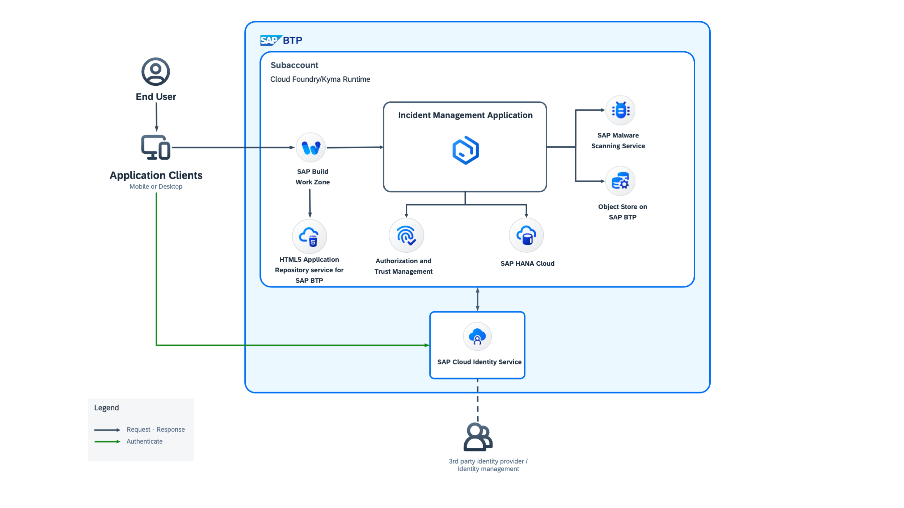
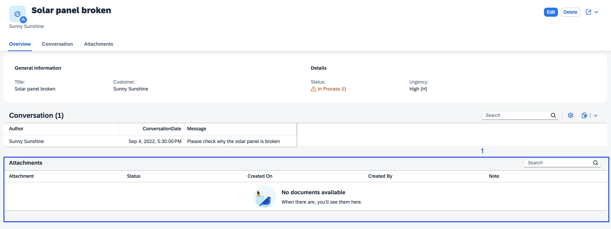

# Attachments

The [@cap-js/attachments](https://github.com/cap-js/attachments) package is a CDS plugin that provides out-of-the box asset storage and handling. To use it, extend a domain model by using the predefined aspect called Attachments. It also provides a CAP-level, easy to use integration of the SAP Object Store.

The Attachments Service in our Incident Management Application streamlines the storage and management of files related to incidents. Integrated with the SAP Object Store Service, it ensures secure, efficient, and scalable storage for incident documentation. Users can seamlessly upload, access, and manage files within the application, enhancing productivity and workflow efficiency. With features like secure storage, efficient retrieval, version control, and seamless integration, the Attachments Service simplifies the incident management process, enabling users to document and resolve incidents effectively.



## Add Attachments Plugin

To enable attachments, add the required dependency to the *package.json*. In the terminal, go to the the Incident Management project's root folder and run the following command:  
   
   ```bash
    npm add @cap-js/attachments
   ```
**Note** - To be able to use the Fiori uploadTable feature, you must ensure that the SAPUI5 version is updated to ^1.121.0 in the application's index.html.


## Use Attachments
1. Create a new file attachments.cds in the db folder.

2. Copy the following snippet to the newly created *attachments.cds* file

   ```cds
   using { sap.capire.incidents as my } from './schema';
   using { Attachments } from '@cap-js/attachments';

   extend my.Incidents with { attachments: Composition of many Attachments }
   ```

## Run and Test the Application Locally

Let's see it in action where the attachments are stored locally, it will work similarly after deployment with a database or S3 bucket for example.


1. Run the application by using this command:

   ```bash
    cds watch
   ```
2. Navigate to the object page of the incident `Solar panel broken`:


3. The `Attachments` type will have generated an Attachments table at the bottom of the Object page:


4. Go into Edit mode and **Upload a file** (use the PDF file [Solar Panel Report.pdf](./Solar_Panel_Report.pdf)) by either using the **Upload** button on the Attachments table or by using drag and drop. Click the **Save** button to store the file:


6. **Delete a file** by going into Edit mode and selecting the file(s) and by clicking on **Delete** in the Attachments table header. Then choose **Save** to have that file deleted from the resource. We demonstrate this by deleting the previously uploaded PDF file: `Solar Panel Report.pdf`


# Summary

Congratulations, you have successfully implemented and tested the Audit Logging feature in your application.