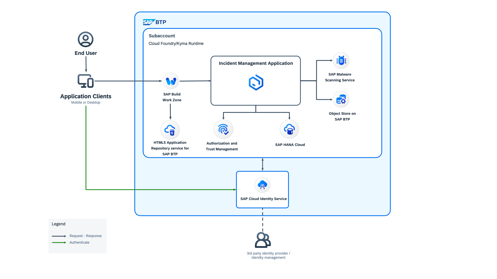

# Introduction
The [@cap-js/attachments](https://github.com/cap-js/attachments) package is a CDS plugin that provides out-of-the box asset storage and handling. To use it, extend a domain model by using the predefined aspect called Attachments. It also provides a CAP-level, easy to use integration of the SAP Object Store.

# Business Scenario

The Attachments Service in our Incident Management Application streamlines the storage and management of files related to incidents. Integrated with the SAP Object Store Service, it ensures secure, efficient, and scalable storage for incident documentation. Users can seamlessly upload, access, and manage files within the application, enhancing productivity and workflow efficiency. With features like secure storage, efficient retrieval, version control, and seamless integration, the Attachments Service simplifies the incident management process, enabling users to document and resolve incidents effectively.

To follow along with this guide, Complete the prerequisites and ensure that all the required systems are in place.

## Solution Diagram

## Next Steps
- [Add attachments service](./extend-app.md)