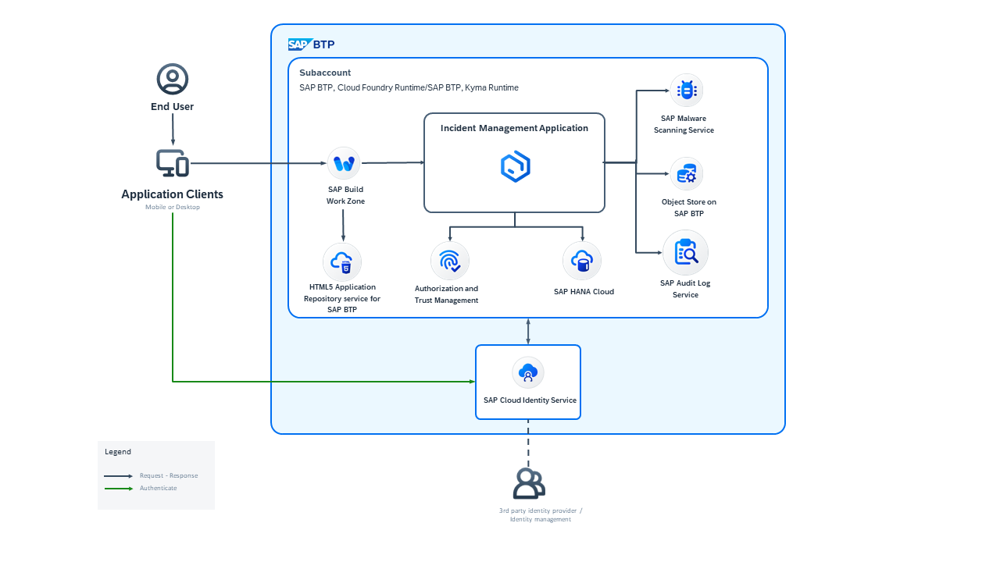

# Develop an Enterprise-Grade CAP Application Following the SAP BTP Developer’s Guide

Using the SAP BTP Developer’s Guide you can implement enterprise-grade SAP Cloud Application Programming Model (CAP) applications on SAP BTP. 

Based on the recommendations from the SAP BTP Developer's Guide, this hands-on offers a sample application called **Incident Management** that can serve as a practical learning tool to integrate enterprise grade capabilities such as tracking changes,audit logging and adding attachments.

# Hands-on Exercise

1. [Set up Project](./Enterprise-Cap-App/1-setup-cap-project.md)

2. [Implement Attachments](./Enterprise-Cap-App/4-add-attachments.md)
3. [Implement Observability](./Enterprise-Cap-App/observability/README.md)