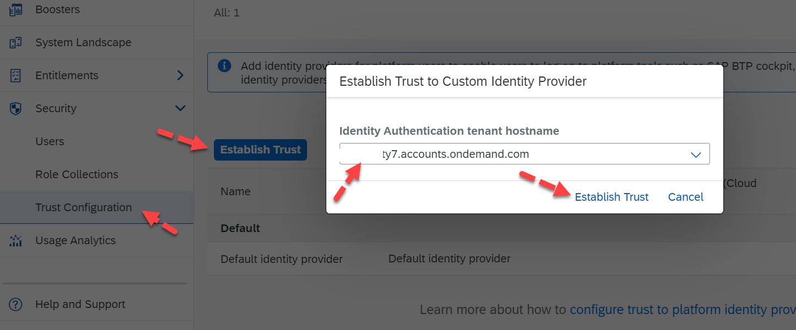
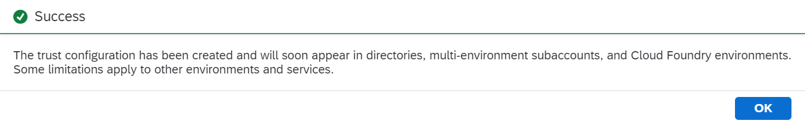
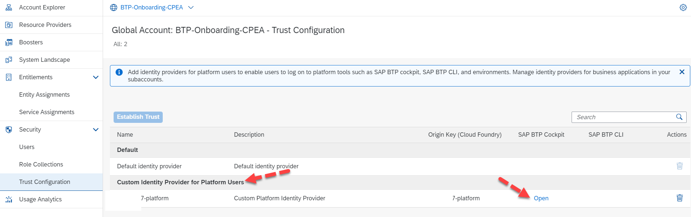
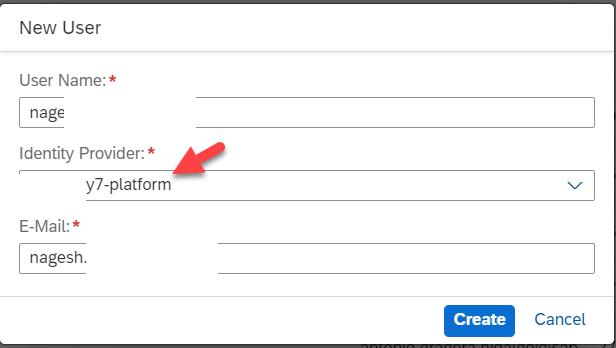
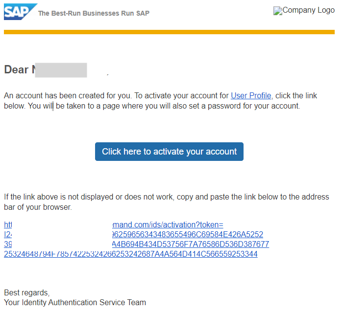
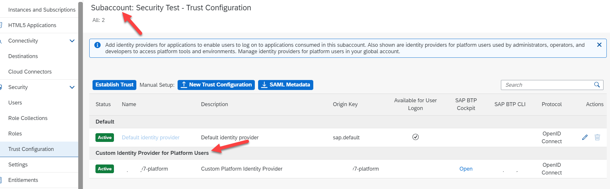
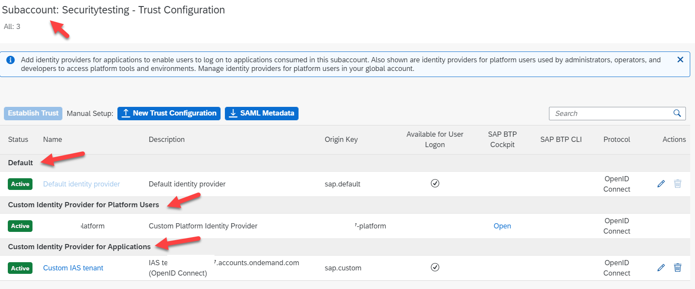

## Establishing Trust in your BTP Global Account and Subaccount 

To manage your SAP Global Account, the user creations can be categorized into [Business Users and Platform Users](https://help.sap.com/docs/btp/sap-business-technology-platform/user-and-member-management). This exercise will help us to understand how to establish Trust within our Global Account to manage your Users.  

First, let us understand the User Types: 

**Business Users** - use the applications deployed on your BTP Accounts. Examples: Mobile Apps, workflow applications, portal applications, integration scenarios, portal apps, etc., can be considered business users.  

**Platform Users** – are the people who access your BTP Platform to manage/develop applications. Examples: administrators, developers, support executives, operators who manage deployments, auditors who look at the licensing and costing, etc., are considered platform users.  

SAP Cloud Identity Services can manage both user types, however, if you wish to use your existing user base (**Corporate Identity Provide**) we recommend using the proxy options.  For Platform Users, if the user base is low, you may still use the **Default Identity Provider** and manage your users. However, we recommend using SAP Cloud Identity Services for its benefits.  

 
**Establishing Trust in Your Global Account**

To establish trust in your Global Account, navigate to your Global Account, Click on **Security** -> click on **Trust Configurations** -> click on **Establish Trust** -> Here you should be able to see our **SAP Cloud Identity Service Tenant** URL, **Select** it and click on **Establish Trust**.

 

 
 

You should be able to see a success message once the trust has been established in your Global Account.  

 

 
 

Once the Trust is established at the Global Account level, the **Custom Identity Provider for Platform Users** will be activated in all your directories, multi-environment subaccounts, and Cloud Foundry environments. Upon successful setup, we would be able to see both Default Identity Provider along with the Cloud Identity Service available for users to log in.  

 

 
 

Note, at Global Account, we will not be able to delete the Default Identity Provider. By using the new Platform Users link as shown in the above image, the authentication can be taken care by your external identity service. 

Now let us look at **Platform User Creation** with the setup. Click on **Security** -> select **Users** -> Click on **Create** -> enter the details for **Username** and by default the new cloud identity services will be selected in the **Identity Provider**, enter your **E-Mail** address, and click on **Create**. Remember to assign the **Role Collection** to this user.  

 

 
 

**Create a User in SAP Cloud Identity Services**

In the previous section, we understood the options in SAP Cloud Identity Services, now let's look at user creation. To get the new users working, and considering this is a new tenant that we have activated, and we do not have any 3rd party IDP (identity provider) connected to our system. Hence, we will create a user manually in the Cloud Identity Services. Login to your Cloud Identity tenant, in **Users & Authorizations**, click on **User Management** -> Click on **Add** -> Enter the details, and Click on **Save**.

 

 
 

You can also notice in the image that, once the user is activated, we have an option to send an **activation email** to let the user know that the user is created. The user can activate the account and set a new password according to the password policy set by the administrator as shown below.  

 

 
 

**Note**: The welcome email can also be modified according to your requirements to share your BTP Cockpit URL after the user activates it to help provide the best experience to the users.  

Now the user can log in to the BTP cockpit based on the role assigned at the Global Account.  

**Platform User Management at Subaccount**

Once the **Trust** is established at **Global Account**, the **Custom Identity Provider for Platform Users** will be set up automatically for all your existing and new Subaccounts and Directories. Although the user authentication will be taken care of by the IDP, we will need to create the users at the subaccount and assign the required roles to give access.  

 

 
 

This completes the process of setting up Platform Users.  

Important Note: This demonstrates how to set up Platform Users and how Cloud Identity Services can help us with consistency. For Business Users, we would need to set up Trust at Subaccount for Application Users. The image below shows all 3 services, Default IDP, Platform Users, and for Applications. 

To setup the Custom Identity Provider for Applications, you can either follow the similar steps above manually in the subaccount or run one of the boosters
- [SAP Build Apps Booster](https://help.sap.com/docs/build-apps/service-guide/booster-automatic-configuration)
- [SAP Build Process Automation Booster](https://developers.sap.com/tutorials/spa-subscribe-booster.html)

 

 
 

 
