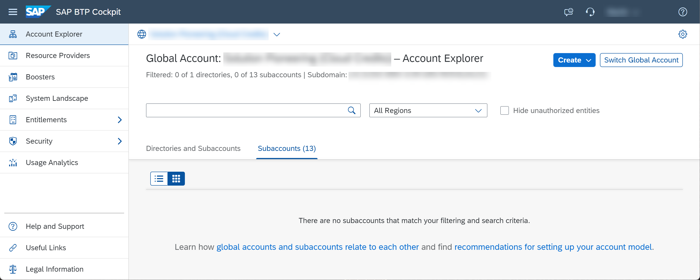
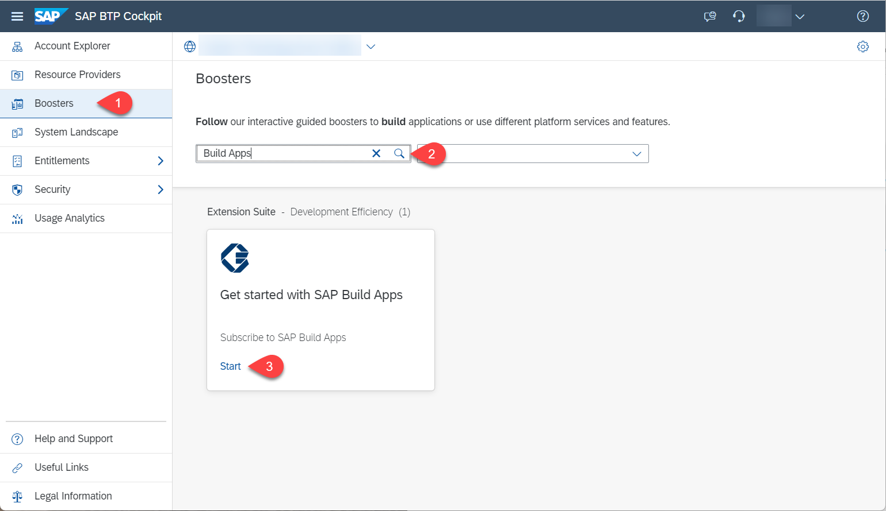
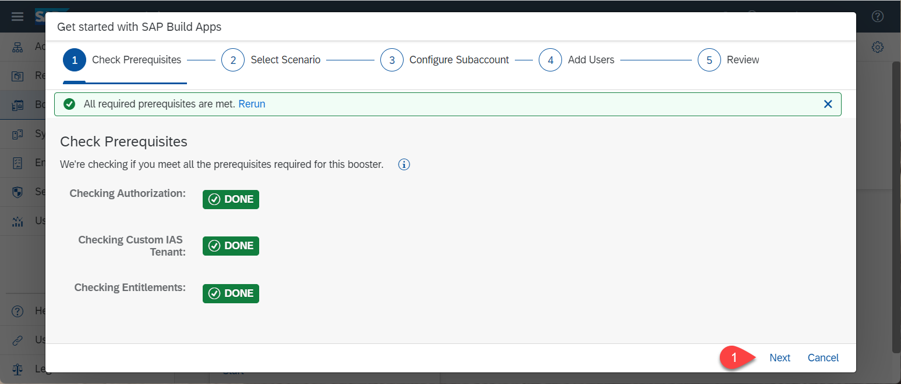
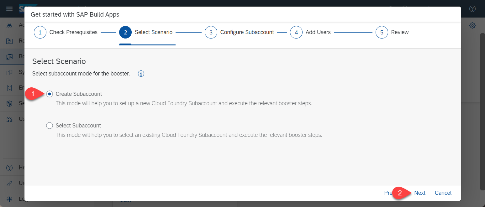
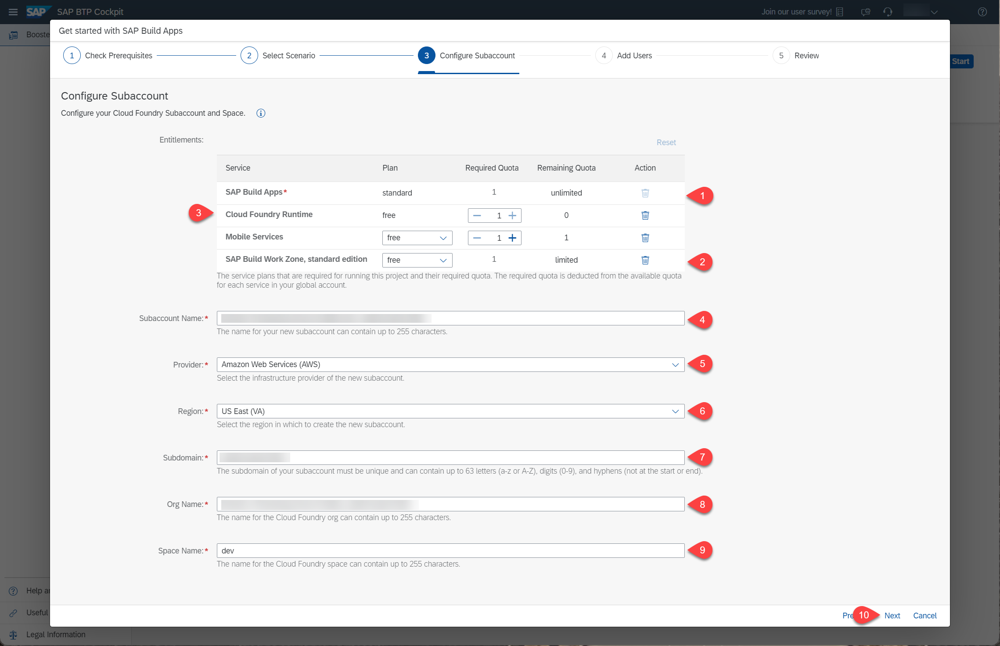
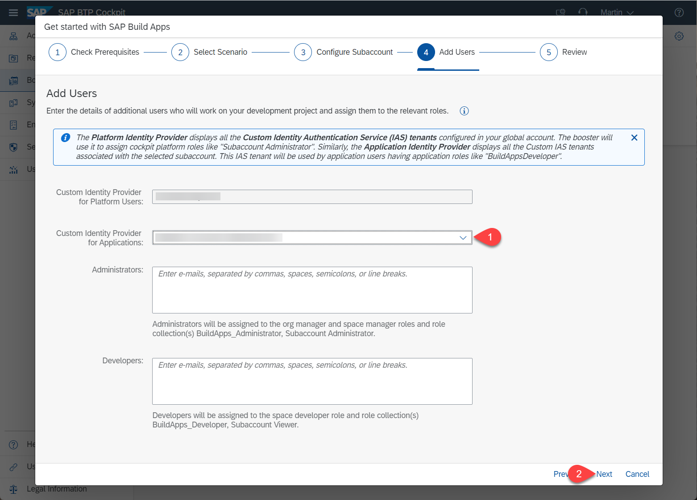
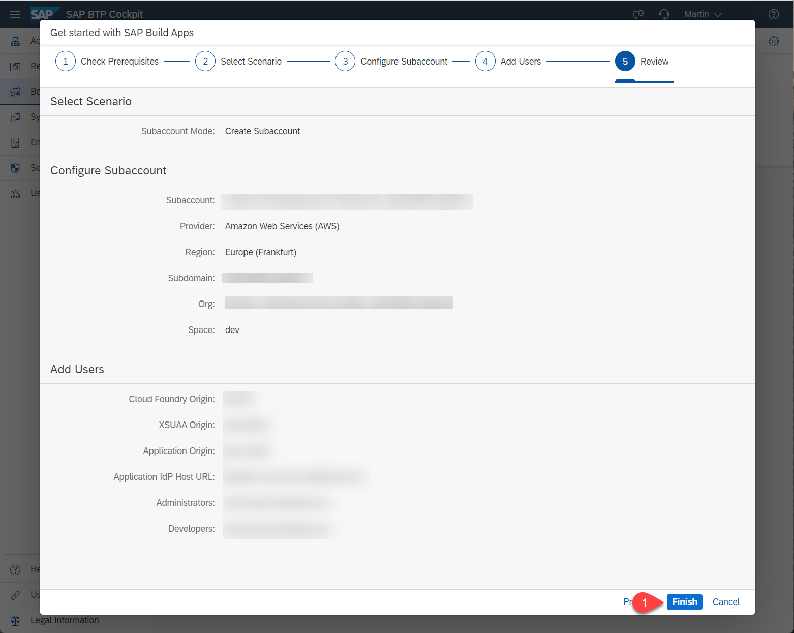
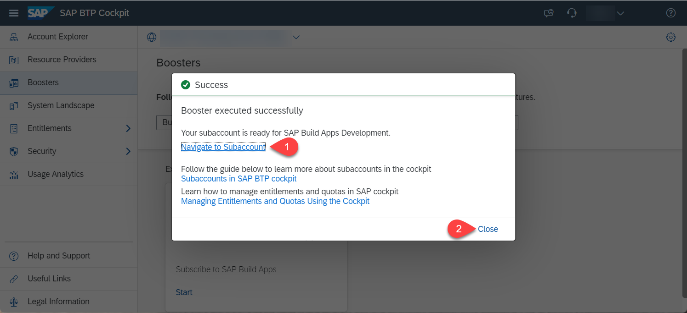
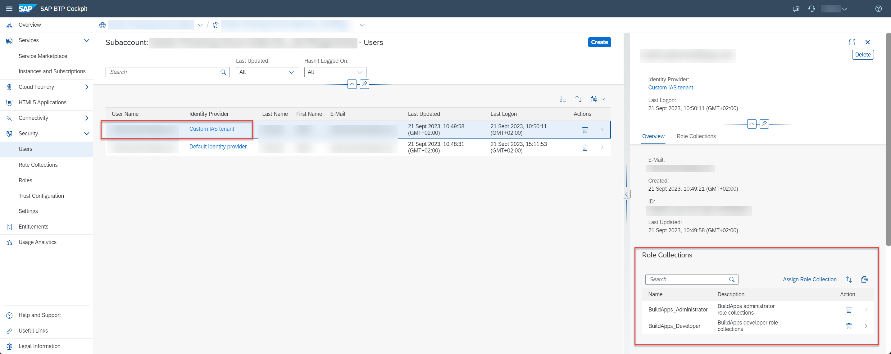

# Setup the SAP Build Apps Service

In this section you will use a booster to setup the landscape for using **SAP Build Apps**. To do this you must be **administrator** of your global SAP BTP account. The process described here will create a new subaccount but you can use the booster to configure an existing subaccount.

Logon to the **SAP BTP Cockpit** and select your global account.

## Run the Booster

Select **Boosters**. Search for SAP Build Apps. Press **Start**.

When the prerequisites are checked successfully, press **Next**.

Select **Create Subaccount** and press **Next**.

You can delete unecessary entitlements but make sure that **SAP Build Apps** and **SAP Build Workzone, standard edition** remain. For testing purpose you can choose the **free** service plan, for productive usage take the **standard** plan. If you are using the mock server in this mission, you also need **Cloud Foundry Runtime**. Adjust the remaining fields as necessery and then press **Next**.

In the section **Custom Identity Provider for Applications**, select the tenant you want to use, then press **Next**.

Check your settings and press **Finish**

Choose **Navigate to subaccount**, which will open the subaccount on another tab. Come back to this tab and press **Close**.

## Result

The subaccount has been configured with a custom IAS tenant and your user has been assigned the relevant role collections.

