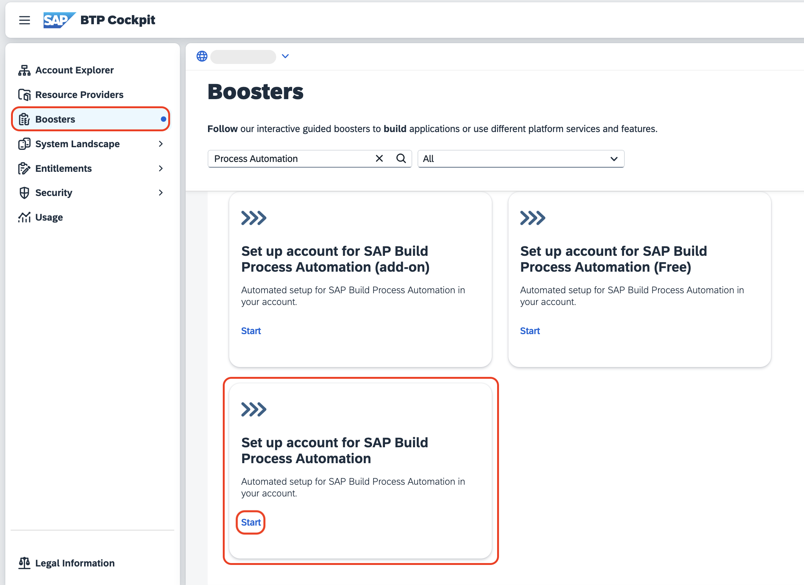
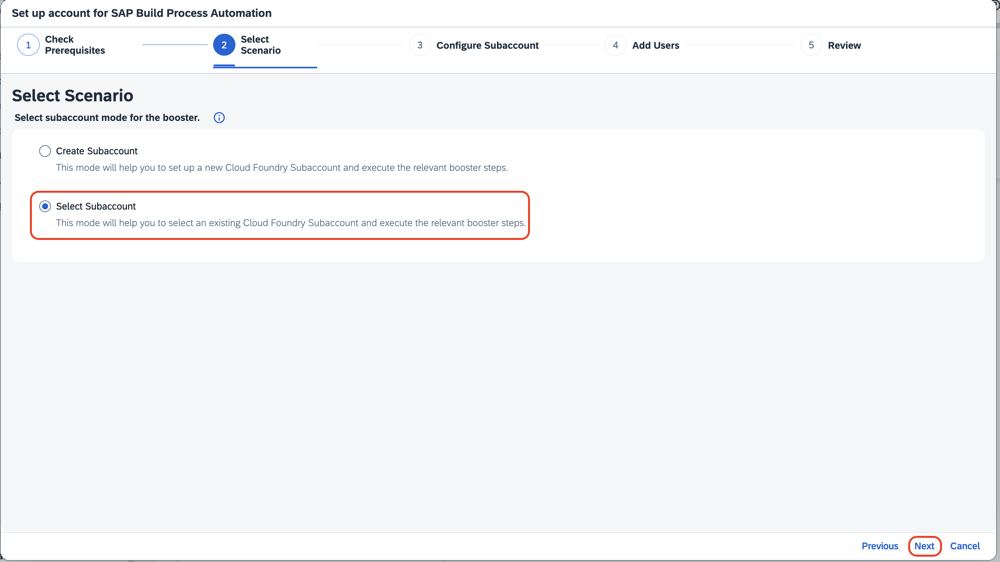
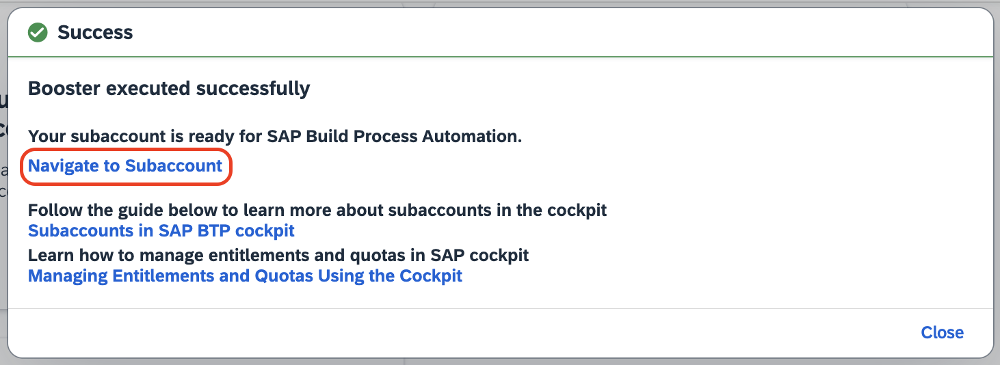

# Setup SAP Build Apps and SAP Build Process Automation

In this section you will use a booster to setup the landscape for using **SAP Build Apps** and **SAP Build Process Automation**. To do this you must be **administrator** of your global SAP BTP account. The process described here will create a new subaccount but you can use the booster to configure an existing subaccount as well.

## Prerequisite

If you do not have an enterprise SAP BTP Global Account, you can set up trial account by following [Get an Account on SAP BTP Trial](https://developers.sap.com/tutorials/hcp-create-trial-account..html)

## Setup SAP Build Apps in SAP BTP using Booster

1. Logon to the **SAP BTP Cockpit** and select your global account.

    

2. Select **Boosters**. Search for SAP Build Apps. Press **Start**.

    

3. When the prerequisites are checked successfully, press **Next**.

    

4. Select **Create Subaccount** and press **Next**.

    

    You can delete unecessary entitlements but make sure that **SAP Build Apps** and **SAP Build Workzone, standard edition** remain. For testing purpose you can choose the **free** service plan, for productive usage take the **standard** plan. If you are using the mock server in this mission, you also need **Cloud Foundry Runtime**. Adjust the remaining fields as necessery and then press **Next**.

    

5. In the section **Custom Identity Provider for Applications**, select the tenant you want to use, then press **Next**.

    

6. Check your settings and press **Finish**

    

7. Choose **Navigate to subaccount**, which will open the subaccount on another tab. Come back to this tab and press **Close**.

    

### Result

The subaccount has been configured with a custom IAS tenant and your user has been assigned the relevant role collections.

## Setup SAP Build Process Automation in SAP BTP using Booster

1. Navigate to the Global Account.

2. Click on **Boosters** in the left menu.

3. Type *Process Automation* in the Search box.

4. Click on **Start** button on the tile **Set up account for SAP Build Process Automation**.

    

5. After **Prerequisites** check is **Done**, click on **Next**.

6. Click on **Select Subaccount**, and click on **Next**.

    

    > If you want to create new Subaccount, choose the other option.

7. In Configure Subaccount section, do the following:

    1. You can delete unnecessary entitlements but make sure that **SAP Build Process Automation** remain. Preferably take the **standard** plan.

    2. Choose the relevant Subaccount, its respective Org and Space.

    3. Choose **Next**.

8. Under **Add Users**, you can add your ID.

9. Review and click on **Finish** to complete the booster.

10. Once the booster is completed, click on **Navigate to Subaccount**, which will open the Subaccount on another tab.

    
