# Setup SAP Build Code in SAP BTP

## Prerequisite 

You should have  an enterprise SAP BTP global account. If you don't have [Get an Account on SAP BTP Trial](https://developers.sap.com/tutorials/hcp-create-trial-account..html)

## Run the SAP Build Code Booster

1. In the SAP BTP cockpit, access your global account. It can be either trial or enterprise account.

2. Navigate to trial global account
    
    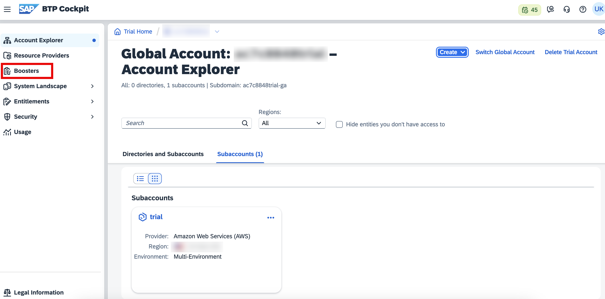

3. Click on booster, select build code to create build code subscription.

    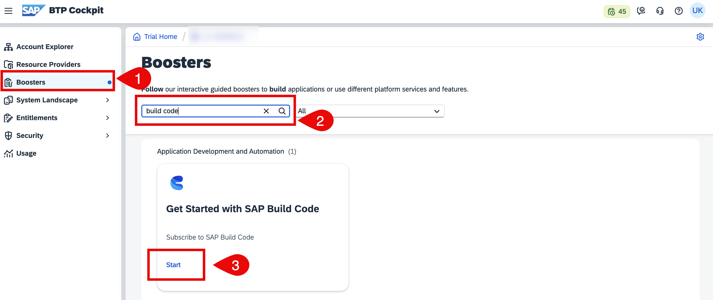

4. After running the booster, in the popup window, choose **Navigate to Subaccount**.

    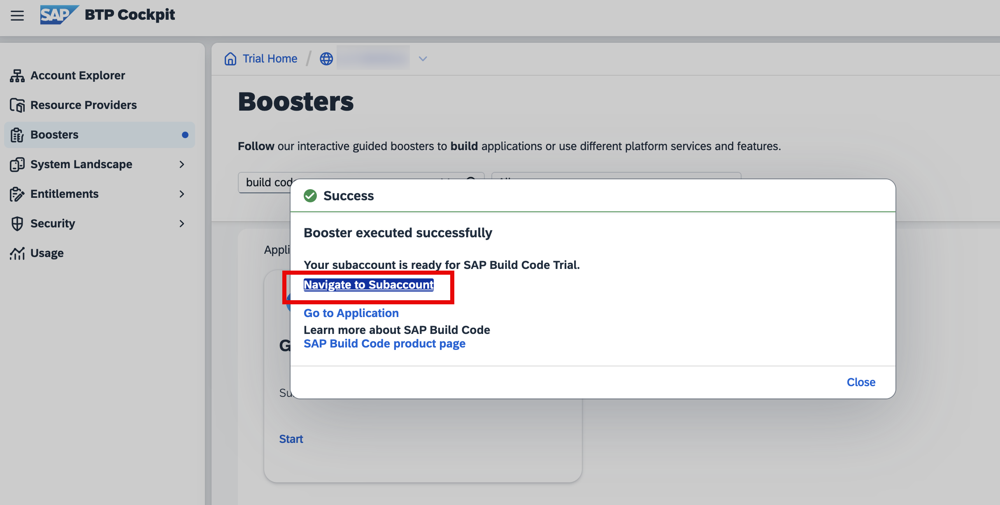

## Additional Entitlements Required

Remote service integration to the developed CAP application requires the following additional entitlements and quotas in the SAP BTP cockpit:

| Service                           | Plan       | Number of Instances |
|-----------------------------------|------------|:-------------------:|
| SAP S/4HANA Cloud Extensibility | api-access | 1 |

See [Entitlements and Quotas](https://help.sap.com/products/BTP/65de2977205c403bbc107264b8eccf4b/00aa2c23479d42568b18882b1ca90d79.html?locale=en-US).

* While adding entitlement **SAP S/4HANA Cloud Extensibility**, please select the appropriate system under **Service Details: SAP S/4HANA Cloud Extensibility** dropdown.
* In the checkbox, check the **api-access** under Available Plans and add the service plans.

## Access Build Code through Subaccount

1. Navigate to global account. Click on **Account Explorer**, Click on **Subaccounts**. Choose your subaccount.

    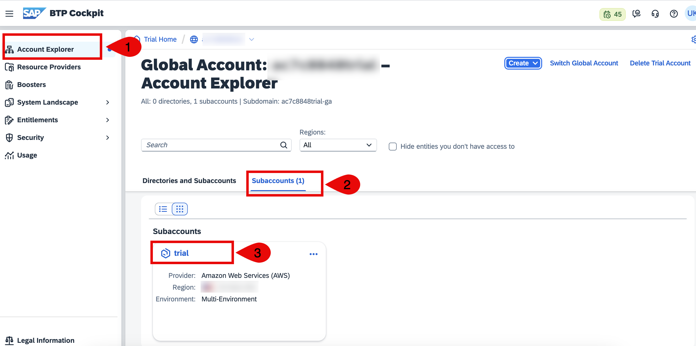

2. Expand **Services**, Click on **Instances and Subscriptions**. Choose on **Subscriptions** tab then click on **SAP Build Code** to open build code lobby.

    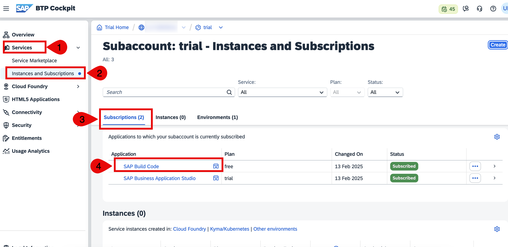

## Create a role collection and add role to access Build Code. 

1. Open the SAP BTP cockpit and navigate to your subaccount.

2. Choose Security → Role Collections, and then choose Create.

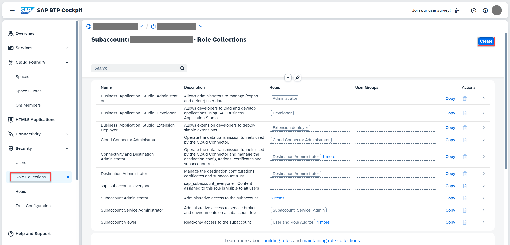

3. In the **Create Role Collection** popup, enter **Build Code role** in the **Name** field and choose **Create**.

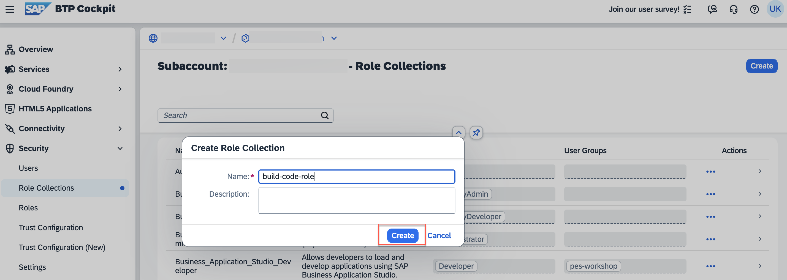

4. Choose the role collection **Build Code role** from the list of role collections. 

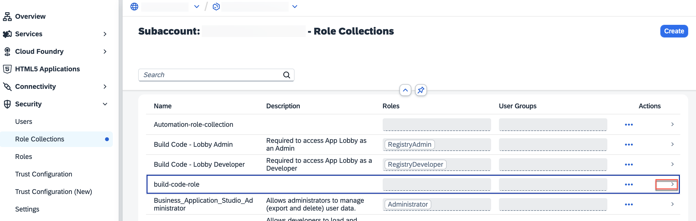

 5. choose **Edit** on the right. 

 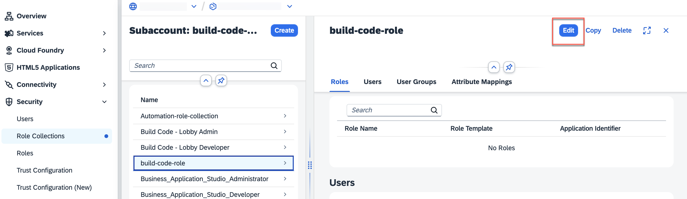

5. Open the value help in the **Role Name** field.

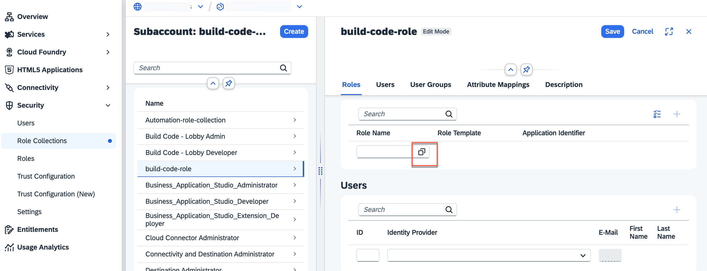

6. Search for the following roles, select it, and choose Add.
- **RegistryAdmin** 
- **RegistryDeveloper**
- **Business_Application_Studio_Administrator**
- **Business_Application_Studio_Developer**
- **Business_Application_Studio_Extension_Deployer**

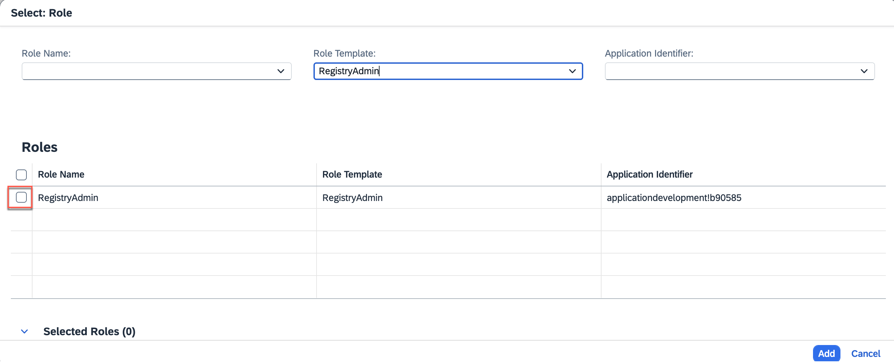

7. You can verify all five roles under *selected Roles* and click add. 

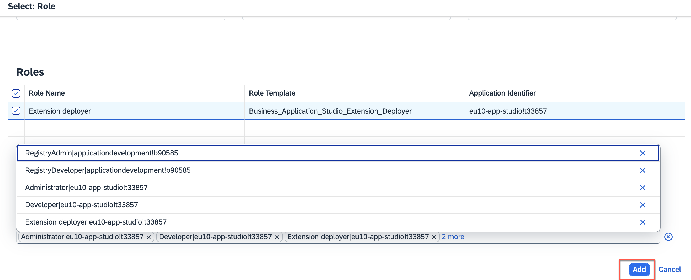

7. Choose Save.

## Add User in Role Collection.

1. Choose Security → Users, and then choose a user from the list.

2. Under Role Collections on the right, choose Assign Role Collection.

3. Search role **build-code-role** you have created in previous step, select it and click **Assign Role Collection**

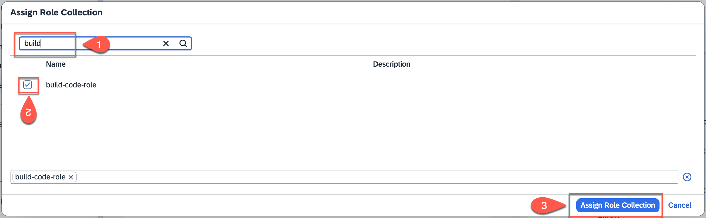

You have assigned the **build-code-role** role collection to your user.